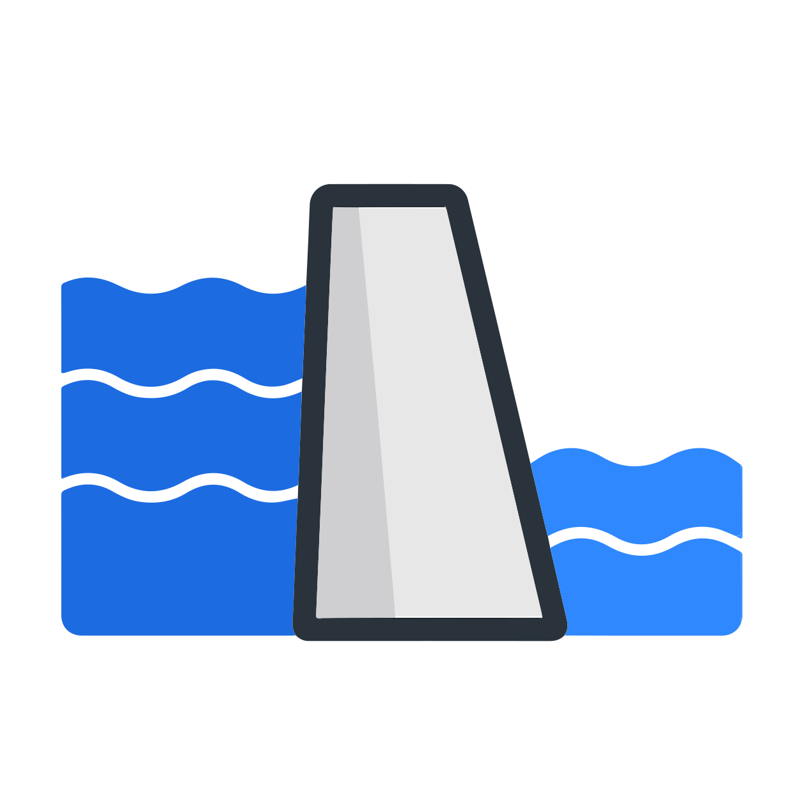

# DAM

<p align="center">
  
</p>
<h3 align="center">
  Run your own background agents on Kubernetes.<br/>
  Isolated by default. Credentialed. Always-on.
</h3>

Keep your coding agents running when you close the lid. Ship them to your team. Sell them to your customers. DAM gives Claude Code, Codex, Gemini CLI, or pi.dev an isolated Kubernetes pod, a credential-injecting proxy, a scheduler, and a Slack channel.

## What you get

- **Isolated by design** — Each agent runs in its own sandbox: separate pod, process, and filesystem. API keys live in a proxy; the agent never sees them. Network access is locked to destinations you've approved. That contains two of the three big agent-security risks structurally. [Security model →](docs/strategy/security-model.md)

- **Built for team collaboration** — Until now, coding agents have been 1:1: you and your copilot. DAM unlocks N people collaborating with 1 or many agents, multi-player from the ground up. [Multiplayer →](docs/strategy/multi-player.md)

- **Always-on scheduling** — Cron lives on the platform, not your laptop. Scheduled tasks look identical to human messages from the agent's perspective. Workspace and conversation history persist across restarts.

- **Slack-native channels** — One Slack app, unlimited agents, per-thread routing. Your agents live where your team already works.

- **Bring your own agent** — Claude Code and [pi.dev](https://pi.dev) ship as built-in templates. Codex, Gemini CLI, or anything that speaks [ACP](https://agentclientprotocol.com/get-started/introduction) works too. No lock-in to one vendor's SDK or cloud.


## Guided Tour

```sh
git clone https://github.com/dam-agents/dam && cd dam
```

Open your favorite AI coding agent in the repo and try:

```
Walk me through how DAM works step by step. I want to do a demo for myself.
Explain how things work on the way. Help me connect a model provider, create
an instance, add a connection to GitHub, and chat with an agent.
```

Once you're comfortable, go deeper:

```
Now show me the advanced stuff. Set up a Slack channel integration, create a
scheduled job, build a long-living agent with a heartbeat, and wire up an
MCP server.
```

Your agent has full context of the codebase, architecture decisions, and cluster commands.

## Quick Start

Prerequisites: [mise](https://mise.jdx.dev), a Docker-compatible runtime (Docker Desktop, Rancher Desktop, etc.), macOS or Linux.

```sh
mise install                # install toolchain + deps
mise run cluster:install    # create local k3s cluster + deploy DAM
```

Open [dam.localhost:4444](http://dam.localhost:4444) (login: `dev` / `dev`), create an instance from a template, and start chatting. See the [configuration guide](docs/configuration.md) for credential setup and Slack integration.

## Learn more

- **[Configuration](docs/configuration.md)** — credential setup, Slack integration, development-mode toggle
- **[Architecture](docs/architecture.md)** — system context, subsystem deep-dives, design decisions
- **[Security model](docs/strategy/security-model.md)** — the three big risks when running AI agents, how DAM handles each, and what's still unsolved
- **[Multiplayer](docs/strategy/multi-player.md)** — DAM's multi-user model: what's private to each player, what's shared when you collaborate, and what's install-wide plumbing
- **[Why DAM exists](PITCH.md)** — the three problems every agent hits in production, how DAM solves each, and a 5-minute walkthrough
