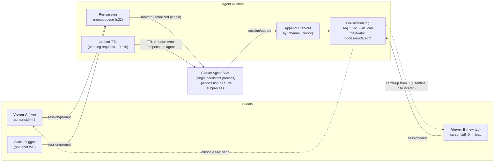
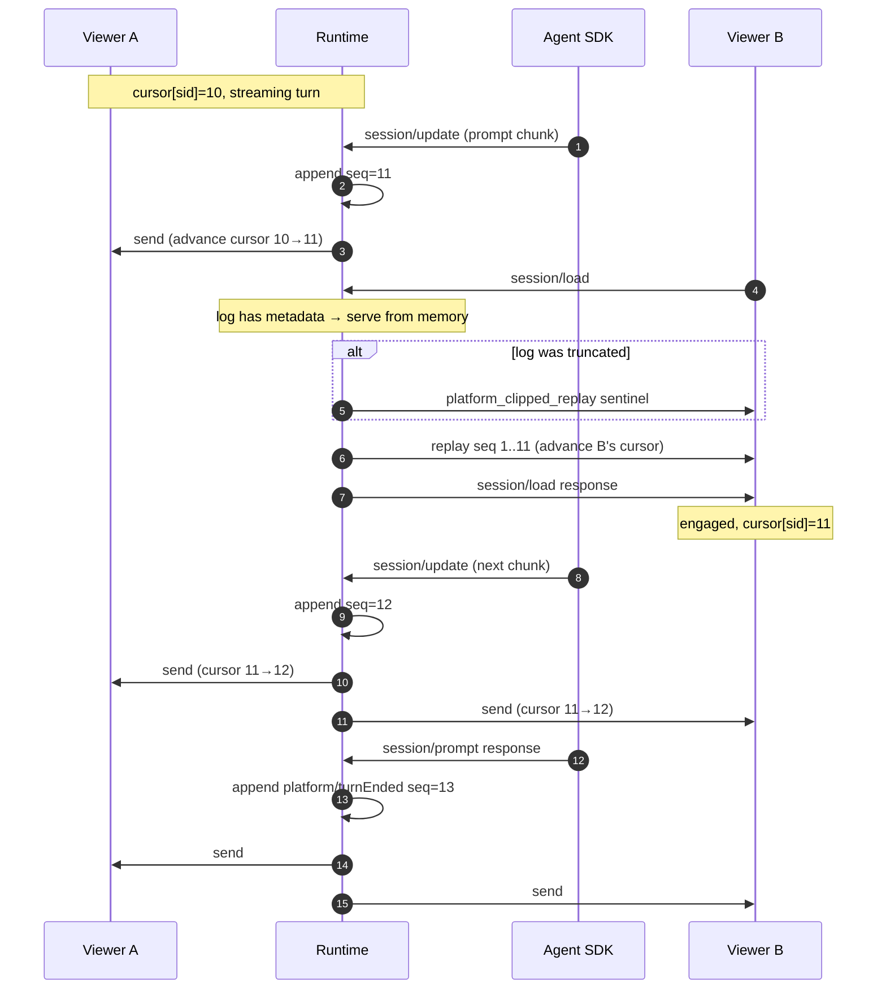

# ADR-026: Persistent ACP sessions via per-session log and cursor fan-out

**Date:** 2026-04-20
**Status:** Accepted
**Owner:** @jezekra1

## Context

The ACP relay originally tied the agent process's lifetime to a single client WebSocket. When the user closed a tab, reloaded the page, or switched networks, the agent died with the socket. Permissions were auto-approved client-side, so unanswered tool prompts never blocked the agent but also meant any human who wasn't actively watching couldn't approve anything — scheduled and Slack-driven sessions effectively ran with no security gate. `session/load` replayed history by having the agent emit `session/update` notifications into the shared stdout, so multiple clients viewing the same session got duplicated history when a second tab loaded, and viewers joining mid-turn missed tool chips they'd never see without a manual reload.

A series of incremental fixes (engagement scoping, content-hash dedup, client-side rehydrate-on-missed-tool_call_update, background-bubble routing) patched the symptoms but didn't fix the underlying shape: the agent's stdio is one bus for live events and history replay, and the runtime was trying to distinguish them after the fact.

## Decision

Treat every session as an **append-only log** inside the runtime. The runtime is now the authoritative source for a session's replay; the agent's on-disk store is the cold-start source only. Every consumer — live viewer, new tab doing `session/load`, reconnecting client — is a tail of the same log at some cursor position.

### 1. Persistent agent, engagement-driven fan-out

The `claude-agent-acp` child process runs for the pod's lifetime, independent of any WebSocket. Multiple WebSockets may attach concurrently. A channel only receives traffic for sessions it has **engaged** with, where engagement is driven implicitly by ACP frame content:

- Sending a request or notification with `params.sessionId` engages that session.
- Receiving a response whose `result.sessionId` identifies a session (from `session/new`, `session/fork`, `session/load`, `session/resume`) engages it.
- A cross-session call like `session/list` carries no `sessionId` and never engages, so operational calls don't leak other sessions' traffic.

### 2. Per-session log, per-channel cursor

The runtime keeps a `Map<sessionId, SessionLog>` where each log is an ordered list of `session/update` lines (including the synthetic `platform/turnEnded`), each with a monotonic `seq`. Every channel has a `Map<sessionId, cursor>` tracking the last seq it has received.

On every incoming `session/update` from the agent:

1. Append to the session's log (assign next seq).
2. For each engaged channel whose cursor < new seq: send the line, advance its cursor.

A consumer cannot receive the same event twice — the cursor is strictly monotonic.

**Agent-initiated JSON-RPC requests are not in the log.** Permission prompts (`session/request_permission`) and fs reads/writes are client-serviceable requests, not notifications. They're tracked in a separate `pendingFromAgent` map keyed by JSON-RPC id. Live fan-out sends them to every currently-engaged channel; when a client responds, the pending entry is cleared. A fresh engager (new tab, reconnect) receives any still-pending request via `engage()`'s replay from `pendingFromAgent`. Logging them would mean `catchUp` replays the raw request on every subsequent load — the client's `requestPermission` handler would fire again and re-open a dialog the user already answered.

### 3. `session/load` served from the log

`session/load` is no longer forwarded to the agent when the runtime already has a log for the session. Instead:

- **Cache hit** (log populated, metadata cached) → synthesize the response from cached metadata, stream the log to the loader (advancing their cursor), engage the channel. The agent is never involved.
- **Cache miss** (cold bootstrap) → forward to the agent. The agent's `replaySessionHistory` emits notifications which flow through the normal append+fan-out path, populating the log. The response metadata is captured for future loads.
- **Concurrent cold loads** → coalesced. A second `session/load` for the same sid while a bootstrap is in flight doesn't double-forward; it's parked as a waiter and served from the populated log once the bootstrap completes.

This eliminates the class of bug where the agent's on-stdio replay interleaves with live prompt chunks. Live events and history are both just log entries; cursors make the correctness trivial.

### 4. Byte-bounded log with truncation sentinel

Each session log has a soft byte cap (2 MB default). When an append would push the log past the cap, the oldest entry is evicted and the log's `truncated` flag is set. A catch-up against a truncated log prepends a synthetic notification with `update.sessionUpdate = "platform_clipped_replay"`; the UI renders this as a dimmed "Older conversation not loaded" divider. Sessions whose conversation exceeds 2 MB of serialized notifications can still be recovered via a forced full reload (planned separate feature — see Consequences).

The log is purged when the session is reaped (`session/close`) or when the agent exits.

### 5. Custom turn-end signal (`platform/turnEnded`)

ACP has no on-wire notification for "turn completed" — clients infer it from a `session/prompt` response. But viewers who didn't originate the prompt never see that response and have no way to close their in-progress assistant bubble. The runtime emits a custom `platform/turnEnded` JSON-RPC notification when a prompt response arrives, scoped to engaged channels via the normal fan-out. Clients that don't implement `extNotification` silently ignore it.

### 6. Idle reap via `session/close`

Each open ACP session pins a `claude` CLI subprocess (~300 MB RSS). The runtime sends a fire-and-forget `session/close` to the agent when a session goes idle: no engaged channel, no active or queued prompt, no agent→client request still pending. Triggered on prompt-response (handles headless/scheduled runs) and on channel detach (handles last-viewer-leaves). The SDK respawns on the next resume/load, so closing trades memory for a brief cold-start when someone comes back.

### 7. Orphan TTL for unanswered permissions

A permission request with no engaged channel to answer it gets a 10-minute TTL per session. On expiry the runtime responds to the agent with an error so it cleanly aborts the tool call instead of hanging until its internal timeout. Answered requests are cleared; the timer resets when a new request lands or the session's engagement state changes.

### 8. Prompt queue per session

Per-session prompt queue (cap 32) with id rewriting (so concurrent clients' id spaces don't collide). When a prompt response arrives, the queue advances and `platform/turnEnded` broadcasts.

## Multi-connection model

### Sequence: second tab opens while first tab is streaming

## Alternatives Considered

**Content-hash dedup on broadcast.** Keep a `Set<line>` per session; during a `session/load` from a second viewer, scope history lines already in the set away from engaged channels. Rejected: fragile because the agent's replay is not guaranteed byte-identical to what was emitted live (e.g. a finalized tool call may replay as `tool_call{status:completed}` instead of the live sequence `tool_call{pending}` + `tool_call_update{completed}`). An empirically-false hash comparison leaks duplicates to engaged viewers. The log-and-cursor model doesn't depend on content equality.

**Spawn a separate `claude-agent-acp` subprocess per `session/load`.** Run the load on its own process so its stdio never interleaves with the live stream. Rejected: ~2 s cold start per load (Node init + SDK + `claude --resume` reading disk), doubles resident memory during the load window, and the replay still reads only the persisted disk store — a second tab opening during an in-progress prompt would *miss* the streaming-not-yet-persisted content. The log model catches in-progress content because the runtime is observing live events as they happen.

**Client-side rehydrate on missed context.** Detect a `tool_call_update` with terminal status for a chip we never opened and trigger a debounced full `loadSession`. Shipped briefly, now removed. Rejected because it only recovered from the missed-tool case, didn't help with missed text chunks, imposed complexity (in-flight-prompt guard, debounce, tri-state ref), and masked rather than fixed the server-side issue.

**ID-based cursor (skip events whose `messageId`/`toolCallId` we've seen).** Looks elegant until you check the emissions: `claude-agent-acp` does not populate `messageId` on any `session/update` — the field is in the schema but unused in this implementation. `toolCallId` is reliably present on tool events but the majority of stream volume is text chunks with no id. No single-id watermark can distinguish what's been seen.

**Always scope replay to the loader when any load is in flight.** Send every `session/update` for that session to the loader only until the load completes. Rejected because it discards live events that interleave during the load — the engaged viewer loses streaming chunks that are never recovered (cursor and log solve this by appending to a shared log instead of routing away).

**Unbounded session log.** Rejected as the general case. A week-long chat could accumulate arbitrary memory. The soft cap plus sentinel gives a predictable worst case (2 MB per active session) and a clear UX for over-sized conversations.

**Store the log in the DB.** Rejected: the log is a cache for the current runtime's lifetime, not a source of truth. On cold start the agent's on-disk session store populates it; between restarts we're happy to re-bootstrap. Adding a DB hop to every append is heavy for what is ultimately recoverable state.

## Consequences

### Positive

- Multi-viewer works correctly: two tabs on the same session see identical state, no duplication, no missed events during concurrent load + streaming prompt.
- Agent survives client disconnects — page reloads, tab closes, network blips don't kill the turn. The runtime replays pending agent-initiated requests (permission prompts) to whatever client attaches next.
- Scheduled and Slack-driven prompts run to completion whether or not a UI is attached, with their `claude` subprocess reaped on the turn-end reap path so memory doesn't leak.
- `session/load` is fast after cold bootstrap — in-memory replay instead of agent disk read.
- Idempotent fan-out: cursors guarantee no duplicate delivery.
- Class of "runtime as dedup filter" bugs is eliminated — the runtime doesn't try to decide what is or isn't duplicate; it's just the log owner.

### Negative / watch-outs

- **Runtime is now session-state-authoritative**, not a dumb relay. This is a meaningful shift from the framing in ADR-007. The on-disk store stays the cold-start source of truth, but during the pod's lifetime the runtime's log is what clients see.
- **Log memory is real**: 2 MB × (active sessions). With 20 active sessions at the cap, ~40 MB. Reaped on `session/close`, so the effective cap tracks "how many sessions are being viewed right now."
- **Truncation is user-visible**: very long conversations get the `<clipped-conversation>` sentinel, and the older history isn't reachable via the memory log. Recovery requires a forced full reload (close live + fresh bootstrap) — planned as a follow-up "Load more" button.
- **Cold bootstrap still goes through the agent's stdio replay** and still inherits whatever format the SDK emits. A second `session/load` during a cold bootstrap is coalesced; a second load *after* bootstrap completes is served from memory.
- **Byte-accounting uses `line.length`** (UTF-16 unit count), not exact memory footprint. Good enough for a soft cap; not a security boundary.
- **Log is per pod**: if the pod restarts, the log is gone and the next `session/load` cold-bootstraps again. Consistent with the agent's `claude` subprocess dying with the pod.

## Follow-ups

- **"Load more" / forced full reload** — UI button that closes all viewers of a session, purges the runtime log, and lets the next viewer cold-bootstrap from disk. Needed for recovering clipped history in very long conversations.
- **Permission forwarding to Slack/headless runs** — today the Slack and trigger ACP clients auto-approve permissions. A better default is to reject with `{ outcome: "cancelled" }` so the agent gets a clean signal; Slack interactive approvals (Block Kit buttons) are a separate feature.
- **Empirical verification on long sessions** — 2 MB cap tuning based on observed conversation sizes in production.
