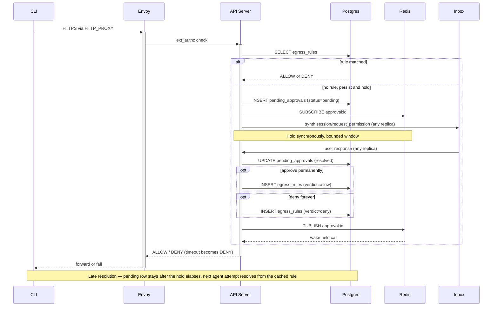
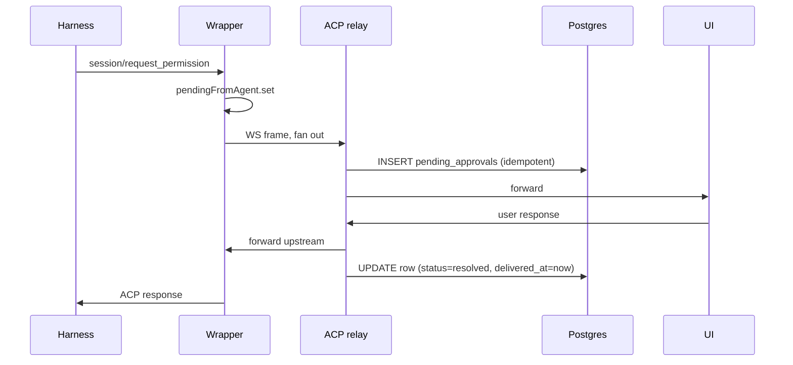
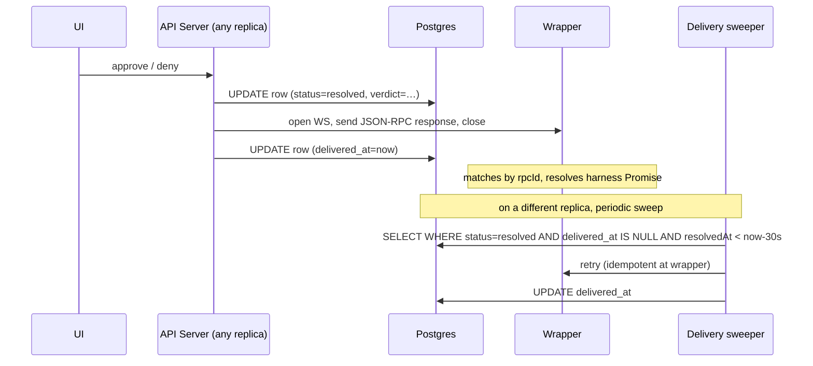

# ADR-035: Unified HITL UX — verdict authority outside the agent pod

**Date:** 2026-04-27
**Status:** Accepted
**Owner:** @jezekra1

## Context

[ADR-033](033-envoy-credential-gateway.md) introduces an Envoy `ext_authz` HITL gate for credential-injected egress. Independently, the platform supports ACP-native permission requests for the harness's own tool calls, parked in the wrapper's `pendingFromAgent` and resolved by the engaged ACP client ([acp-runtime.ts:580](../../packages/agent-runtime/src/modules/acp/services/acp-runtime.ts#L580)).

The two gates protect different things — ACP gates guard the *harness's tool execution*; ext_authz guards *credential injection on outbound HTTP* — and neither layer has the data to pre-empt the other. Both stay. If both ship with their own user surface, the user gets two parallel approval systems for the same shape of decision. That's the user-visible problem this ADR addresses.

A second constraint: the API Server is horizontally scalable ([ADR-007](007-acp-relay.md)). HITL coordinator state pinned to a specific replica — long-lived blocking promises across user think-time — would compound the relay-bottleneck problem. Whatever this ADR commits to has to work with multiple stateless replicas behind a load balancer.

<details>
<summary><strong>Threat model: the wrapper cannot be the verdict authority for ext_authz</strong></summary>

The wrapper runs inside the agent pod. It shares a network namespace with the agent container, so anything bound on the wrapper's localhost is reachable from the agent. The agent runs arbitrary, model-driven code — the platform's whole threat model assumes it is compromisable on every request.

If `pendingFromAgent` were the source of truth for ext_authz verdicts, an attacker (a compromised harness, or a vulnerability in the wrapper's JSON-RPC parser exploited by the agent) could:

- Open a WS to the wrapper's ACP endpoint posing as a UI client and inject a synthetic `RequestPermissionResponse` for the matching JSON-RPC ID.
- Cause the wrapper's `handleClientMessage` ([acp-runtime.ts:716](../../packages/agent-runtime/src/modules/acp/services/acp-runtime.ts#L716)) to record the entry as `resolved/approved`.
- Have the next ext_authz call hit that "approved" verdict and let the credential-injected request through.

The credential gate is a security boundary *outside* the agent's blast radius. That property breaks if the verdict authority lives in the same pod.

ACP-native permissions are different. They guard the *harness's own tool calls*; an attacker who can compromise the wrapper can also patch `canUseTool` directly to skip permission checks. ACP-native HITL is therefore a UX feature, not a security boundary against the agent. Wrapper-local resolution is appropriate there.

</details>

<details>
<summary><strong>Why ACP-native cannot have an asynchronous inbox</strong></summary>

The harness's `canUseTool` callback is invoked synchronously inside the SDK's turn loop while processing a `session/prompt`. The `await this.client.requestPermission(...)` is a JavaScript Promise tied to the harness process's event loop — it cannot be persisted, serialized, or revived by another process. If the harness/pod dies, the entire promise chain vaporizes with it.

ACP `session/resume` ([types.gen.d.ts:2492-2524](../../node_modules/.pnpm/@agentclientprotocol+sdk@0.17.1_zod@4.3.6/node_modules/@agentclientprotocol/sdk/dist/schema/types.gen.d.ts#L2492-L2524)) is marked **UNSTABLE** and explicitly does *not* deliver pending tool-call verdicts; it returns `configOptions / models / modes` only. There is no protocol entry point that says "here's the answer to a permission you asked for in a now-dead turn."

Five candidate workarounds (replay request, synthesize fresh `requestPermission`, fork the SDK to add canUseTool checkpointing, fingerprint-based pre-approval, long-poll across hibernation) all fail for one of two reasons: no harness-side `await` to deliver the response to, or duplicating the harness's own `allow_always` / `addRules` durable-decision system. ACP-native is therefore live-only by protocol design.

</details>

<details>
<summary><strong>Today's reality, made explicit</strong></summary>

Permission prompts only surface to a user when there is a live UI ACP relay attached. Slack, Telegram, scheduled triggers, and harness-API-server probes all drive the agent through [`acp-client.ts`](../../packages/api-server/src/core/acp-client.ts), whose `requestPermission` handler at [acp-client.ts:72-73](../../packages/api-server/src/core/acp-client.ts#L72-L73) auto-selects the first option.

Today's contract: live UI → user answers prompts; everything else → permissions bypassed entirely. This ADR formalizes that for ACP-native and adds a security-grounded ext_authz path alongside.

</details>

## Decision

**ext_authz HITL approvals are emitted as ACP `session/request_permission` frames so the user-visible primitive is exactly one. The verdict authority for ext_authz lives in the API Server backed by Postgres — outside the agent pod's trust boundary. ACP-native permissions stay wrapper-local for resolution because they are not a security boundary against the agent process. A single global inbox surfaces all pending approvals across the user's agents. Network reachability is gated by the same `egress_rules` table that drives ext_authz decisions, evaluated dynamically by the API Server at request time: SNI-only decisions go through L4 (network) ext_authz over gRPC; path-level decisions go through L7 (HTTP) ext_authz on a TLS-terminating chain. The cert SAN list and L7 chains carry only the hosts that need MITM (credentialed or path-rule'd). Adding a host-level allow/deny rule is a DB write; adding a path-level rule promotes the host to L7 and rolls the pod. Rules are written by connection grants, preset seeding, and inbox approvals; users edit them in one table, with edits promoting the row to user-owned in the same shape that connection-injected envs become user-owned.**

### Two-layer architecture, split by trust model

| Gate | Verdict authority | Storage | Why |
|---|---|---|---|
| **ACP-native** (harness asks to run tool) | Wrapper-local | In-memory `pendingFromAgent` (mirrored to DB for inbox visibility) | Harness is in-pod; permission is a UX feature, not a security boundary. Wrapper resolution does not change the agent's effective capability. |
| **ext_authz** (egress credential injection) | API Server | Postgres (`egress_rules` + `pending_approvals`) | Security boundary; verdict authority must be out-of-pod so a compromised wrapper/agent cannot forge approvals. |

UI surface is unified: both kinds appear as `session/request_permission` to UI / Slack / future channels, rendered by the same component. Mechanics underneath differ; the user does not see the difference.

### Storage — Postgres, two new tables

Postgres is already a hard platform dependency ([ADR-017](017-db-backed-sessions.md)). We extend it with:

- **`egress_rules`** — per-agent allow/deny rules. Looked up by ext_authz on every call before any user prompt.
  ```
  agent_id, host, method, path_pattern, verdict (allow|deny),
  decided_by, decided_at, status (active|revoked)
  ```
  v1 stores permanent rules. Time-bounded rules ("approve for an hour") add a `valid_until` column in v1.5; out of scope here.

- **`pending_approvals`** — durable record of every request that needs a user decision. Written instantly when a request enters the system (before any synth-frame delivery), so the inbox sees it from t=0.
  ```
  id, type (ext_authz|acp_native), session_id, agent_id, owner_sub,
  payload (host/method/path | tool name + args), created_at,
  expires_at, resolved_at, delivered_at, verdict, decided_by, status
  ```
  `id` is a UUID for `ext_authz` rows and the deterministic key `acpnative:<instanceId>:<rpcId>` for `acp_native` rows — JSON-RPC ids are unique within a wrapper process so the relay can re-INSERT idempotently on session re-engagement. `session_id` is informational only (used by the inbox UI for grouping); the row id is the matching key. `delivered_at` is the outbox marker for ACP-native rows whose JSON-RPC response has been forwarded upstream; see [ACP-native mechanics](#acp-native-mechanics--wrapper-local-mirrored-to-db).

**Postgres is the source of truth for everything durable** — rules, pending rows, verdicts, delivery state, audit. The inbox query is `SELECT … FROM pending_approvals WHERE owner = ? AND status = 'pending'`; surviving offline / refresh / replica restart is a property of the row existing in Postgres.

**Redis pub/sub** ([ADR-036](036-redis-platform-primitive.md)) is a hard platform dependency — see that ADR for the reasoning. It carries ephemeral wake-up signals: `approval:<id>` channel for held ext_authz calls, and `inject:<instanceId>` channel for synth-frame fan-out to whichever replica is holding the agent's WS. Redis is on the signal path; Postgres remains the truth path. A Redis outage stops new wake-ups and synth deliveries until it recovers; existing pending rows are unaffected and resolve normally on the agent's next retry.

### ext_authz mechanics — out-of-pod authority, synchronous hold

The egress request is initiated by **whatever the agent decided to run** — `gh`, `curl`, `npx some-cli`, a Python SDK. None of those tools understand HITL retry semantics; a `202 + Retry-After` would be treated as an upstream error. So ext_authz holds the call synchronously for a bounded window long enough for a live consumer to respond, while the durable DB row makes any later resolution apply on the agent's next attempt.



The synchronous hold is **a UX optimization, not a security property**. Its only job is to avoid an extra agent-retry roundtrip in the live-user case. A failed mid-hold call (replica restart, hibernation, Envoy timeout) is a normal upstream error to the CLI; the durable pending row is unaffected, and the next agent attempt resolves from it.

### Timeouts

The hold ends for several distinct reasons; the durable pending row is unaffected by all of them.

| Cause | Behavior |
|---|---|
| Envoy ext_authz / CLI HTTP timeout | Hold wakes from cancel; API replies DENY to Envoy. Pending row stays open. |
| Agent pod hibernates | Held TCP closes; same as above. |
| Harness crashed (not platform-detectable) | Fixed `expires_at` on the pending row (default ~10 min); background sweeper marks expired. |
| User takes too long to act | Same — `expires_at` fires; row marked expired. |
| Approve / deny / no-action verdict | Row resolved; verdict applies to current and future calls (rule path). |

Approve-temporarily (time-bounded rule) is **out of scope for v1**; the schema (`valid_until` on `egress_rules`) accommodates it.

### Network access — single rules table, two ext_authz layers

The agent's outbound network is gated by **one table** (`egress_rules`) evaluated by **two ext_authz layers in the API Server**. Envoy is a thin enforcer: it routes connections to L4 or L7 ext_authz based on whether the host has been promoted to MITM, and forwards the verdict. The host list and the decisions live entirely in Postgres; Envoy holds no policy state of its own.

We bolt onto the per-Secret cert/chain machinery the credential gateway already established ([leaf.go:34-46](../../packages/controller/pkg/reconciler/leaf.go#L34-L46), [envoy.go:90](../../packages/controller/pkg/reconciler/envoy.go#L90)) rather than adding xDS, SDS hot-reload, or dynamic per-SNI cert minting. The two new pieces are: (1) a gRPC ext_authz handler in the API Server for L4 decisions, and (2) a single catch-all L4 filter chain in the Envoy bootstrap that hands every non-MITM SNI to that handler.

#### L7 (TLS-terminating) chains — for hosts that need credential injection or path-level rules

A host gets a TLS-terminating filter chain when *either*:
- It has a credentialed connection attached (existing behavior), or
- It has a path-specific rule (`method != *` or `path_pattern != *`) — promoted because the API Server cannot make path-level decisions without seeing the decrypted HTTP.

Two chain flavors share the same shape:

- **Credentialed chain** (existing): rendered from a Secret carrying credential data + `host` annotation. Filter list: `ext_authz (HTTP) + credential_injector + dynamic_forward_proxy + router`.
- **MITM-only chain** (new): rendered when a non-credentialed host has at least one path-specific rule. Filter list: `ext_authz (HTTP) + dynamic_forward_proxy + router` — no `credential_injector`.

Both run the same HTTP `ext_authz` filter against the API Server's existing endpoint, with full method/path/header visibility.

The cert SAN list is the union of (credentialed hosts) ∪ (hosts with path-specific rules). cert-manager re-issues when the list changes; the pod rolls to pick up the new cert and any new filter chains.

#### L4 (network) ext_authz — for everything else

Hosts *not* in the SAN list (the common case for trusted-but-not-credentialed traffic and any allow rule with `method=*, path=*`) hit a single catch-all filter chain in the Envoy bootstrap. That chain runs `envoy.filters.network.ext_authz` over gRPC against a new Authorization service in the API Server. The handler:

1. Reads SNI from the gRPC `tls_session.sni` field. The network ext_authz filter only populates this when `include_tls_session: true` is set on the filter config — without it the gate sees `host = null` and denies every L4 request silently. Listener-level `tls_inspector` is necessary but not sufficient; the filter has to opt in.
2. Resolves the calling pod's instance ID from two independent sources that must agree:
   - **TCP source IP** of the gRPC connection (authoritative). A NetworkPolicy on the api-server restricts ingress on this port to pods carrying `platform.ai/instance` in the agent namespace, and the kernel/CNI prevents source-IP spoofing under the agent's pod security context (no `CAP_NET_RAW`, no `hostNetwork`). Concretely: the api-server keeps a `podIP → instanceId` cache rebuilt from a periodic `LIST pods` (10 s by default) plus an on-miss refresh.
   - **`x-platform-instance` initial_metadata** (defense-in-depth). Envoy renders it into every Check call from the per-instance bootstrap. The header is required and must equal the IP-derived instance ID. Mismatch = forged header or bootstrap drift; missing = someone bypassed Envoy. Both fail closed.
   A compromised agent that bypasses its sidecar can't satisfy either gate alone: it can't spoof the source IP, and even if it could, it'd need to know the right `x-platform-instance` for that IP — and the only winning header is its own instance's, which gives it the identity it already has.
3. Looks up the host in `egress_rules` (matching `(host, *, *)` rules, with the existing wildcard-aware repository).
4. On match: returns `OK` (allow) or `PERMISSION_DENIED` (deny).
5. On miss: takes the same hold path as the L7 handler — inserts a `pending_approvals` row, publishes the synth frame, holds for the bounded window, returns the verdict.

Both ext_authz frontends share the same `ExtAuthzGate` service inside the API Server, so the rule model, hold semantics, inbox flow, and timeouts are identical between L4 and L7. The only difference is what attributes the gate sees: L4 sees `(host)`; L7 sees `(host, method, path)`. The HTTP filter copies `:authority` into `host`, which carries the port for CONNECT (`example.com:443`) and may carry it for proxied plain HTTP — the gate strips trailing `:port` before lookup so rules stored on bare hostnames match either path.

The L4 and L7 ext_authz frontends are served by the same gRPC server in the API Server (single `Check` RPC, two Envoy filters). The earlier draft considered separate HTTP- and gRPC-shaped endpoints; the consolidation removes a second port and ensures the gate's behavior cannot drift between paths.

There is **no static "trusted hosts" list in Envoy**. The L4 chain hands every SNI to the API Server; the API Server decides at request time from `egress_rules`. Adding or removing a host-level allow/deny is a single DB write — no cert churn, no pod roll, takes effect on the next request.

#### Plain HTTP — gated at the outer HCM, not the catch-all

The CONNECT-tunnel-and-internal-listener architecture above only fires for HTTPS. A plain `curl http://example.com` via the proxy sends `GET http://example.com/ HTTP/1.1` to the outer port; without an explicit route this returns 404 and never reaches L4 ext_authz, leaving plain HTTP egress un-gated and silent.

The outer HCM therefore carries an additional `http.ext_authz` filter and a fallthrough route to a `dynamic_forward_proxy_http` cluster (HTTP-only, no TLS upstream). The CONNECT route disables the filter via `ExtAuthzPerRoute { disabled: true }` so the existing tunnel path is unchanged — TLS traffic is still gated downstream by the per-host L7 chain or the SNI-miss L4 chain. Plain HTTP requests are gated once at the outer HCM with full `(host, method, path)` visibility from the request line, then forwarded plaintext to the upstream's port 80.

The trade-off: plain HTTP requests behave like the L7 path (full HTTP attributes available to rule matching) but receive no MITM, no credential injection, and no path-rule promotion mechanics. Hosts that need path-level enforcement should use HTTPS. This matches the de-facto reality that production credentials and APIs run over TLS; plain HTTP is supported as a default-deny-with-inbox-prompt path so unannotated tools (`curl example.com`, `wget …`) surface in the inbox instead of failing inscrutably.

#### L4 → L7 promotion

A host is *promoted* to L7 when the user adds a rule that constrains `method` or `path`. Promotion path:

1. User saves a rule with `path_pattern != '*'` (or non-wildcard method).
2. API Server materializes an "allow-only" Secret for that host (carrying just the `host` annotation, no credential).
3. Controller observes the new Secret on its next reconcile, extends the cert SAN list and renders a new MITM-only filter chain.
4. cert-manager re-issues; pod rolls (~5–15 s).
5. After the roll, traffic to that host hits the L7 chain; the path-level rule is enforced.

Demotion (deleting the last path-level rule for a host) leaves the L7 chain in place — there's no harm in keeping a working chain, and demoting would force another roll for no functional gain. The next time the cert renews naturally, the SAN list is recomputed and the orphaned host drops out.

#### No generic passthrough

There is no SNI-miss passthrough chain in v1. Every connection lands on either a TLS-terminating chain (credentialed or MITM-only) or the L4 catch-all. A request to a host the API Server denies returns `PERMISSION_DENIED` at L4, which Envoy maps to a connection refusal. This is the default-deny boundary, and it lives entirely in the API Server's `egress_rules` evaluation — Envoy's filter chains determine *only* whether the L4 or L7 frontend is consulted, not whether the request is allowed.

The previous `preset = all` "passthrough escape hatch" is replaced by a no-op preset that seeds a single `(*, *, *, allow, source=preset:all)` row. The L4 handler matches it for every SNI and returns allow without prompting. Same effect, same source-of-truth.

#### Single rules table, mirroring the env-injection pattern

`egress_rules` gains a `source` column tracking origin: `manual` | `connection:<id>` | `preset:trusted` | `preset:all` | `inbox`. The lifecycle of a row mirrors the env-injection pattern from connections ([connection-env-helpers.ts](../../packages/ui/src/modules/agents/utils/connection-env-helpers.ts)):

| User action | Rules effect | Envoy/cert effect |
|---|---|---|
| Grant connection | Insert `(host, *, *, allow, source=connection:<id>)` rule + credentialed Secret | Cert SAN extended; credentialed L7 chain rendered; pod rolls |
| Add manual allow/deny rule for a host (no path) | Insert `(host, *, *, verdict, source=manual)` row | None — L4 handler picks up the new row from the next request |
| Add path-level rule for a host (credentialed or not) | Insert `(host, METHOD, /path*, verdict, source=manual)` row + ensure an allow-only Secret exists if no credentialed chain | If host wasn't in SAN: cert SAN extended; MITM-only L7 chain rendered; pod rolls. If host was already in SAN: no roll, L7 ext_authz reads new row live. |
| Edit any non-`manual` rule | Row's `source` flips to `manual` ("(was from …)" annotation in UI) | None unless the edit changes path-specificity (L4↔L7 promotion/demotion rules apply) |
| Revoke a rule | Row deleted | If it was the last path-level rule for a non-credentialed host, the allow-only Secret may be deleted on next renewal cycle. No proactive roll. |
| Revoke a connection | Delete rules with `source=connection:<id>` (keep promoted-to-`manual` ones); delete credentialed Secret | Cert SAN shrinks; pod rolls |
| Re-grant the same connection (after revoke) | If a `manual` rule already covers the host, skip the auto-insert; otherwise insert a fresh `source=connection:<new-id>` row | Same as initial grant when not skipped |

**Editing promotes**: any user edit of a non-`manual` rule re-stamps `source = manual`, with the original origin preserved as a display-only annotation. Revoking the source no longer touches the rule. Mirrors how connection-injected envs become user-owned on edit.

**Granting promotes preset rows.** When a connection grant lands on a host already covered by a `preset:*` row (common case: `preset = trusted` agent + Anthropic API key both targeting `api.anthropic.com`), the existing row's source flips from `preset:*` to `connection:<id>` rather than the insert silently no-op'ing on the active-row uniqueness constraint. Without this, switching the preset later would sweep the row and leave the still-granted connection without an allow rule. This is the same "more-specific intent wins" rule as user edits, applied at grant time. `manual`, `inbox`, and other-`connection:*` rows on the same key are left alone.

**No tombstones, no reconcile loop.** Connection grant is one-shot — there is no recurring sync that could resurrect a deleted rule. The two cases that matter are *narrowing* (user edits a connection-injected rule into a path-specific one — `source` flips to `manual`, revoke leaves it alone) and *re-granting* (covered by the table row above: skip auto-insert when a user-owned rule already covers the host). Outright deletion of the only rule a connection depends on is not a defended case — the connection is non-functional in that state, and the user's expected next action is to disconnect.

**Two flavors of "connection" produce rules.** Both write `source=connection:<id>` rows; they differ in where the host metadata comes from:

- **Secret grants** (Anthropic API Key, generic credentials) — host is the Secret's `hostPattern`. One rule per grant. Triggered by `setAgentAccess`.
- **App-connection grants** (Slack, Google Workspace, GitHub, …) — host comes from an operator-owned `appConnectionEgressHosts: provider → string[]` registry mounted from a Helm ConfigMap, *not* from OneCLI. OneCLI's app registry doesn't carry per-provider host info, and forking it for this would couple a Platform concern to an upstream we don't own. The registry is sourced once at boot, joined by `provider` onto the connection list for the UI's preview, and consulted by `setAgentConnections` to drive the same `connectionRules.syncForAgent` the secrets path uses. Providers without a registry entry contribute zero hosts (grants are rule-less) — a deliberate "make it explicit before granting access" stance for unknown providers.

App-connection grants are typically multi-host (Google Workspace ≈ 6 hosts; Slack ≈ 2). The connection-rules sync is keyed by `(connection_id, host)`, so a single grant inserts multiple rows that share the same `connection:<id>` source; revokes sweep all of them. A `Map<connId, row>` keyed only by source would silently drop duplicates and leave them un-revoked — the canonical key is the pair.

**setAgentAccess and setAgentConnections both invalidate the egress-rules cache** on the client, since the server-side sync runs in the same handler as the access write. The UI never persists rules itself for these flows: it sends the desired secret/connection set, the server reconciles, and the UI refetches.

#### Presets seed rules, not enforcement modes

Three presets are exposed at agent creation. All three are just bulk rule-seeding operations against `egress_rules`; the runtime enforcement model is identical for all of them.

- **`none`** — no seeded rules. Every host hit goes through L4 ext_authz with no match, falls into the inbox.
- **`trusted`** (recommended default) — seeds host-level allow rules for the canonical Anthropic-published default-allowed-domain list (npm, PyPI, GitHub, package mirrors, etc.) with `source = preset:trusted`. All seeded rules are wildcard-method/path, so they stay on the L4 path — no cert work at preset-seed time.
- **`all`** — seeds a single wildcard rule `(*, *, *, allow, source=preset:all)` that L4 ext_authz matches for every SNI. Documented as a development escape hatch with a UI warning.

The trusted-list itself lives in API Server config (Helm-shipped). It is *seed* data, not runtime config — once seeded, the rows are owned by the agent and editable like any other.

#### UI: staging model with cosmetic preview

The Configure dialog stages all network-access edits client-side and commits them on Save. Edits include preset switches, secret toggles, app-connection toggles, manual rule deletes, and manual rule adds. While staged, the editor renders:

- **Preview rows** — virtual rows for what the server *will* produce on Save. For preset switches the rows come from `egressRules.trustedHosts()` (queries the same ConfigMap the seeder reads). For connection grants the rows come from `secret.hostPattern` (1-row) or `app.egressHosts` (n-rows) joined client-side from the picker state.
- **Sweep marks** — existing server rows about to be removed are rendered struck-through. The same visual treatment covers user-initiated trash-icon deletes, preset-switch sweeps (`source LIKE 'preset:%'`), and connection-revoke sweeps (`source = 'connection:<id>'` for ungranted ids). Rows under preset/connection sweep don't show a per-row trash because the only "undo" is to revert the dropdown / picker, not the trash.

Persistence on Save is **intent-shaped, not state-shaped**: the UI sends `egressRules.applyPreset({ preset })`, `setAgentAccess({ secretIds })`, `setAgentConnections({ connectionIds })`, plus per-row `revokeRule` / `createRule` for manual edits. The server walks each handler's existing reconciliation logic to compute the rule diff and apply it atomically. The UI never sends the projected rule list — server-side derivation stays the single source of truth, and races (a parallel inbox approval, another tab) can't be clobbered by a stale projection.

The duplication between server's derivation and UI's preview projection is intentional and minimal: both sides read from the same primitives (the trusted-hosts ConfigMap, `secret.hostPattern`, `app.egressHosts`). The shapes are simple enough that drift is a non-issue at this scale; if the derivation grows complex, the right next step is a server-side preview endpoint (`previewForAgent({intent})`), not moving rule synthesis into the UI.

#### Reload mechanics — most edits don't roll the pod

The L4 path is fully dynamic: the API Server reads `egress_rules` on every request, so any change to a host-level rule (add/delete/edit verdict) takes effect immediately, no Envoy interaction.

Pod restart is required only when the L7 chain set changes:
- A new host gets promoted to L7 (path-level rule added on a host that wasn't already TLS-terminated).
- A connection is granted or revoked.
- An L7-promoted host is demoted (rare; deferred to natural cert renewal).

No debounce. Only the agent's owner edits these rules and rule edits are infrequent; coalescing isn't worth the latency floor it would impose. The UI shows an explicit "saving this will restart the agent (~5–15 s)" warning on the rules editor whenever a change would force an L7 chain-set roll, so the user owns the timing. Disruption: ~5–15 s during the rollout. In-flight credentialed requests fail with an upstream error; the agent's CLI tool retries. The durable pending row mechanism handles "in-flight HITL → mid-restart" correctly.

This is the bolt-on the design constraint asked for: cert-manager + the per-Secret chain rendering already exist for credentialed hosts; we extend `dnsNamesFromRoutes` to include path-rule'd hosts and add one universal L4 catch-all chain. Everything else (xDS, SDS hot-reload, dynamic per-SNI cert minting) is v1.5+.

### Inbox — single point of resolution

The inbox is the global view of `pending_approvals` for the user, on the main UI page. The same row is also surfaced inline in the session UI when the user is in the agent's session. Both surfaces write through the same DB row; first verdict wins; Redis pub/sub closes the loop on whichever replica is holding the relevant WS.

| Item type | Available actions |
|---|---|
| **ext_authz** | Allow once (resolves the held call, no rule written) · Allow permanently (writes `(host, method, path, allow)` rule) · Allow `<host>` (writes `(host, *, *, allow)` host-level rule, the L4 path's primary unit) · Deny forever (writes `(host, method, path, deny)` rule) · Customize… (jumps to the agent's rules tab) |
| **ACP-native** | If active: Approve / Deny — verdict is forwarded to the wrapper via either the live relay WS (in-session) or a fresh outbox WS (any replica). See [ACP-native mechanics](#acp-native-mechanics--wrapper-local-mirrored-to-db). If the row has expired (TTL elapsed without resolution): no action available; row shown as expired. |

"Allow once" is greyed out for `ext_authz` rows whose held call has already timed out — the call is gone, but the user can still pick *Allow permanently* or *Allow `<host>`* so the next agent retry succeeds.

A row's `status` and `expires_at` together define active vs inactive. We deliberately do not maintain a separate wrapper heartbeat: the wrapper re-emits its pending `session/request_permission` on every fresh ACP engagement, which idempotently re-inserts the same row, and the row's TTL bounds how long a stale entry lingers if the wrapper is gone for good.

### ACP-native mechanics — wrapper-local, mirrored to DB

Harness emits `requestPermission` over its ACP channel. Wrapper places it in `pendingFromAgent` and fans out to engaged ACP clients via the existing engage-replay mechanism. The API Server's ACP relay observes the frame in transit and **mirrors it into `pending_approvals` (type=acp_native)** so the inbox can show it. The row id is deterministic (`acpnative:<instanceId>:<rpcId>`), so re-engagement re-inserts idempotently.

There are two resolution paths and they converge on the same DB row:

**1. In-session resolution (live UI tab attached).** User responds in the chat; the relay forwards the JSON-RPC response upstream to the wrapper, which matches by id, removes from `pendingFromAgent`, hands the verdict to the harness. The relay marks the row resolved + delivered in a single CAS:



**2. Outbox resolution (any replica, no live UI tab needed).** User clicks Approve/Deny in the inbox. The handling replica may or may not be the one holding the wrapper WS — and the user may have closed every browser tab since the request was raised. Naive cross-replica forwarding (publish the response on a Redis channel, hope a replica with the upstream WS sees it) drops frames whenever no replica has the upstream attached at publish time. We use an outbox instead:



The wrapper deduplicates by JSON-RPC id (matches against `pendingFromAgent`, drops anything not pending), so a sweep retry that overlaps a successful inline send is harmless. First successful delivery sets `delivered_at`; subsequent sweeps skip the row.

The two paths share Postgres as the consistency point. The CAS update on `status` enforces at-most-once *resolution* — if the in-session response and the inbox click race, only one update wins. Delivery is at-least-once with wrapper-side dedup; we do not attempt to coordinate a single-consumer delivery, because the wrapper already gives us idempotency for free.

Pod death takes the in-flight turn with it; the in-memory Promise vaporizes; the row's `expires_at` (24h TTL) eventually retires it. The harness's `addRules` config (durable across pod restarts via session log) handles "remember this decision" if the user wants that, independent of our DB.

### Multi-replica coordination

API Server replicas are stateless; Postgres is the truth path; Redis pub/sub is the wake-up signal. Three distinct cross-replica events:

- **Held ext_authz wake-up.** Replica A holds the call, subscribed to `approval:<id>`. Replica B handles the user's response, CAS-updates the row, publishes on `approval:<id>`. A reads the verdict from Postgres and replies to Envoy.
- **Synth-frame delivery.** When ext_authz holds and needs the inbox to show a prompt, the holding replica publishes on `inject:<instanceId>`. Whatever replica is holding the agent's relay WS subscribes per-instance and injects the synth frame downstream into the UI. No live WS = no synth delivery; the inbox row covers the offline case.
- **Outbox delivery for ACP-native.** Inbox click on any replica writes the verdict + attempts a fresh upstream WS to the wrapper inline (see [ACP-native mechanics](#acp-native-mechanics--wrapper-local-mirrored-to-db)). A periodic sweep on each replica retries undelivered rows. Wrapper dedups by JSON-RPC id; delivery is at-least-once.

A replica restarting mid-hold drops the in-flight ext_authz call as a normal upstream error to the agent; the pending row is unaffected and the agent's next retry resolves from Postgres.

## Scope — what this ADR explicitly does *not* do

- **No async inbox for ACP-native** beyond the live-active case. ACP protocol semantics block it; documented as a clean boundary.
- **No time-bounded ext_authz approvals (v1).** Schema accommodates `valid_until`; UI/policy is v1.5.
- **No interactive Slack/Telegram by default.** `auto-approve` ([acp-client.ts:72-73](../../packages/api-server/src/core/acp-client.ts#L72-L73)) stays the default; `interactive` is opt-in.
- **No checkpoint/resume of in-flight turns.** ACP-native permissions die with their turn.
- **No cross-agent rule sharing.** Each agent has its own `egress_rules`. Cross-agent reuse (e.g. shared at the owner level) is a v1.5 question.
- **No SDS hot-reload, no xDS.** Pod restart is the reload mechanism for L7 chain set changes (new credentialed connection or new path-promoted host); the existing per-Secret cert/chain machinery is the only Envoy primitive used. Dynamic-config upgrades are v1.5+ if L7 churn proves high.
- **No mitmproxy-style dynamic per-SNI cert minting.** Hosts that need MITM (credentialed or path-rule'd) are enumerated in the cert SAN list. Arbitrary SNIs do not auto-MITM; they are decided at L4 by the API Server.
- **No SNI-miss passthrough.** Every connection lands on either a TLS-terminating chain or the L4 catch-all chain. There is no "if Envoy doesn't recognize the SNI, just forward" path. `preset = all` is a single wildcard rule the L4 handler matches, not a passthrough chain.
- **No inbox pagination (v1).** `listForOwner` / `listForInstance` return a single page capped at 100 rows by default (hard ceiling 500, configurable per-call). Cursor-based pagination is deferred — the live shape only surfaces *pending* rows for an active user, and a user with >100 simultaneous pending HITL prompts is already in a degenerate state. When a "history" tab surfaces resolved/expired rows alongside pending, this becomes load-bearing and gets a `(createdAt DESC, id)` cursor + a background trim of old resolved rows. Orphan reaping today only fires on agent delete; resolved rows for live agents accumulate until that point.

## Alternatives Considered

<details>
<summary>Wrapper-as-verdict-authority for ext_authz</summary>

Rejected on security grounds — see threat model. Wrapper is co-located with the untrusted agent; verdict authority must live outside the agent pod's blast radius.

</details>

<details>
<summary>Two parallel approval UIs (one per gate)</summary>

Rejected — same user faces same shape of decision through two different surfaces; doubles up notification, rendering, replay, history work.

</details>

<details>
<summary>Return <code>202 + Retry-After</code> to Envoy and rely on agent retry</summary>

Rejected — the originator is whatever the agent decided to run (`gh`, `curl`, `npx some-cli`, language SDKs); arbitrary CLIs do not honor HITL retry semantics. Synchronous hold for a bounded window is the only shape that works without per-tool retry coordination.

</details>

<details>
<summary>Indefinite hold across human think-time (hours / overnight)</summary>

Rejected — pins replica activity to human availability, fails on replica restart in a way that loses the user's eventual response, exceeds every reasonable client-side and middlebox timeout. Bounded hold + durable pending row + late-rule-applies pattern covers overnight-scale approvals correctly.

</details>

<details>
<summary>Per-request fingerprint-keyed pre-approval (instead of per-agent rules)</summary>

Considered briefly. Rejected for v1 — the agent is unlikely to re-issue a byte-identical request, so fingerprint-keyed approvals would prompt repeatedly for what the user perceives as "the same operation." Rules keyed on `(host, method, path-prefix)` model user intent ("I trust this agent to call api.github.com") much better than per-byte fingerprints.

</details>

<details>
<summary>Forking Claude Code SDK for canUseTool checkpoint/resume</summary>

Would technically enable ACP-native async inbox. Rejected — harness-specific, multiplies per harness, permanent fork burden. Harness's existing `allow_always` / `addRules` covers the actual use case.

</details>

<details>
<summary>Postgres <code>LISTEN/NOTIFY</code> as the wake-up channel (instead of Redis)</summary>

Considered. Rejected at the platform level by [ADR-036](036-redis-platform-primitive.md), which establishes Redis as the cross-replica signaling primitive going forward. pg LISTEN/NOTIFY duplicates the same notify-from-write pattern without adding anything, and the Redis ADR makes Redis a hard platform dependency, so a separate fallback isn't carried.

</details>

<details>
<summary>L4 ext_authz <em>not</em> in scope (rejected — superseded by current design)</summary>

An earlier revision of this ADR rejected L4 ext_authz, intending to enumerate every reachable host in the cert SAN list and run only HTTP `ext_authz` on TLS-terminated chains. That made every host-level allow/deny a cert reissue + pod roll, which is wrong for trusted-but-not-credentialed traffic (npm, PyPI, GitHub). The current design uses L4 ext_authz for the SNI-only path so host-level rules stay dynamic, and reserves cert SAN entries for hosts that genuinely need MITM (credentialed connections + path-specific rules).

</details>

<details>
<summary>Dynamic per-SNI cert minting via custom SDS server (mitmproxy-style MITM)</summary>

Considered as the path to mitmproxy-style "MITM any SNI without enumeration." A small gRPC SDS server holds the platform CA private key, mints leaf certs on demand for whatever SNI Envoy hands it. Eliminates `dnsNames` entirely; Envoy can TLS-terminate any host. Rejected for v1 because: (a) it adds a new service holding the CA private key, materially expanding the in-cluster attack surface; (b) it duplicates work cert-manager already does; (c) the user-visible model would be the same — rules in `egress_rules`, ext_authz at the gate. The current SAN-list approach extends one existing function (`dnsNamesFromRoutes`) and reuses every other moving part. Pod-roll latency on SAN-list change is the cost; if it becomes painful in practice the SDS minter is the natural v1.5 upgrade.

</details>

## Consequences

- **One approval primitive in the UI**, one rendering component, one inbox.
- **API Server is stateless for HITL.** All HITL state is in Postgres. HPA-friendly, restart-tolerant.
- **Verdict authority for ext_authz lives outside the agent pod.** A compromised wrapper or agent cannot forge approvals.
- **Permanent egress rules** mean the cron / scheduled-trigger case works end-to-end after a single one-time approval: first run fails closed, inbox notification fires, user approves, all future runs go through.
- **Inbox is genuinely offline-friendly.** Pending row exists from t=0; Slack/email push delivery works without the user holding a WS.
- **ACP-native HITL stays wrapper-local.** No security degradation, no behavior change vs today; gains visibility in the global inbox via the relay's mirror write.
- **API Server additions.** ext_authz HITL handler (HTTP for L7, gRPC for L4 — both behind one gate service), two new Postgres tables, synth-frame injection in the ACP relay, ACP-native mirror writes in the relay, outbox-delivery WS sender + periodic sweep, Redis pub/sub for cross-replica wake-ups. All stateless code.
- **Wrapper additions: none.** The wrapper continues to re-emit `pendingFromAgent` entries on engage; that's already today's behavior and we rely on it for idempotent row recreation rather than adding a heartbeat.
- **Frontend renders an additional permission kind + the inbox view.** ACP `RequestPermissionRequest.toolCall` accommodates ext_authz items; new description template per kind, same component.
- **Pod restart / hibernation:** ACP-native pending dies with the turn (today's behavior, marked inactive in DB); ext_authz pending survives in DB and is resolved on agent retry from any future pod incarnation.
- **Network reachability is rule-derived, evaluated dynamically.** Two ext_authz layers in the API Server share `egress_rules`: L4 (gRPC, SNI-only) for the common allow/deny case, L7 (HTTP, full method/path) for credentialed hosts and path-specific rules. Most rule edits are pure DB writes — no Envoy interaction. Pod roll is reserved for L7 chain-set changes (new connection or first path-rule on a host); the rules editor warns the owner before any save that triggers a roll, so timing is user-owned rather than debounced server-side.
- **One `source` field for rule lifecycle.** `connection:<id>`, `preset:trusted`, `preset:all`, `inbox`, `manual`. Edit promotes to `manual` while preserving an "(was from …)" annotation. Re-granting a connection skips auto-insert when a user-owned rule already covers the host. No tombstones and no reconciliation loop — connection grant is a one-shot insert. Mirrors the env-injection-from-connections pattern.
- **Three presets at agent creation.** `none` (strict default-deny), `trusted` (recommended; seeds the canonical Anthropic-published default-allowed list as L4 host-level rows), `all` (single wildcard rule the L4 handler matches for every SNI — escape hatch with UI warning).
- **Two layers, one gate logic.** The same `ExtAuthzGate` service implements both L4 and L7 frontends, so hold semantics, inbox flow, and timeout behavior are identical regardless of how the request arrived. The only difference is the attribute set the gate sees.
- **One alternative explicitly considered and rejected** for v1: dynamic per-SNI cert minting via custom SDS server (extra service + CA-key surface, not justified by current churn). L4 ext_authz was reconsidered and adopted — see the network-access section.

## Related ADRs

- [ADR-033 — Envoy-based credential gateway with ext_authz HITL](033-envoy-credential-gateway.md) — establishes the ext_authz HITL gate this ADR resolves. The `egress_rules` table here is the v1 implementation of that ADR's "stored decision" concept, reshaped from per-request fingerprint to per-agent rule.
- [ADR-007 — ACP traffic always proxied through the API Server](007-acp-relay.md) — the relay this ADR extends with synth-frame injection and ACP-native mirror writes.
- [ADR-017 — DB-backed sessions](017-db-backed-sessions.md) — the platform Postgres this ADR extends with `egress_rules` and `pending_approvals`.
- [ADR-018 — Slack integration](018-slack-integration.md) — first-class HITL consumer in `interactive` mode.
- [ADR-027 — Slack per-turn user impersonation](027-slack-user-impersonation.md) — fork-Job pods inherit this same ext_authz authority shape (the parent instance's API Server is the authority; fork-Job pods don't change the trust model).
- [ADR-036](036-redis-platform-primitive.md) — establishes Redis as the platform's pub/sub / queue / cache primitive. Cross-replica wake-ups in this ADR are the first consumer.
