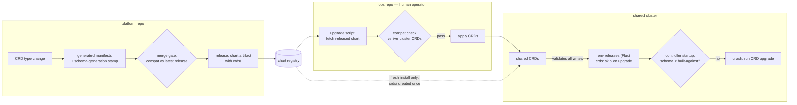

# ADR-068: Frozen shared CRDs — operator-applied schema upgrades

**Date:** 2026-06-11
**Status:** Accepted
**Owner:** @jezekra1

## Context

ADR-065 has the release tracking the newest chart version install the shared CRDs through a chart toggle. That makes a schema rewrite a side effect of an environment deploy: any release with the toggle on — including a deploy of an unmerged branch the merge-time gate never examined — rewrites the schema every co-located environment writes through, and "exactly one release enables it" is enforced by nothing but convention across the Flux-managed releases.

## Decision

Environment deploys never change the shared CRD schema; upgrading it is an explicit, human-run operation. CRDs ship in the chart's `crds/` directory — created on first install, never touched on upgrade by either the Helm CLI or Flux's default policies — and schema upgrades happen only through an operator-run script in the ops repository that fetches a released chart, verifies the new schema is backwards-compatible with the CRDs live in the cluster, and applies it.

Rules:

- Schema leads code: a release whose controllers need new fields must not deploy to a shared cluster until the operator has applied the matching schema.
- Stale schema fails loud: the generated manifests carry a schema-generation stamp, and every controller asserts at startup that the live CRD is at least the generation it was built against — crashing with a named remedy instead of letting admission silently prune its writes.
- The apply-time compatibility check compares against the live cluster — the strong form ADR-065 explicitly left to the repository that knows the deployed pins.
- Environment releases keep Flux's CRD upgrade policy at its skip default; turning it on re-opens deploy-time schema rewrites.
- ADR-065's expand/contract discipline and merge-time compatibility gate remain in force; this supersedes only its ownership and installation mechanism (the chart toggle, which is removed).
- Carried over from ADR-065: no tooling ever deletes the CRDs; full cluster cleanup stays a documented manual step.

## Alternatives Considered

- **Newest release owns via chart toggle (ADR-065)** — schema rewrite rides any environment deploy, including unmerged branches the merge gate never checked.
- **Dedicated Flux Kustomization over manifests vendored into the ops repo** — strongest audit (the schema diff is the reviewed PR), but adds a cross-repo vendoring pipeline and a second Flux object to sequence for an operation that is rare and already double-gated.
- **One environment's release with CRD upgrade policy enabled** — no correct owner exists: dev-owned reintroduces deploy-time rewrites; prod-owned makes the schema trail the newest code.
- **Bare manual `kubectl apply` runbook** — no compatibility check at apply time and no versioned procedure to audit.

## Consequences

- **Easier:** no environment deploy can change the shared schema — the freeze rests on Helm-CLI and Flux *defaults* for `crds/`, not per-release configuration that can be got wrong; a stale-schema deploy fails at controller startup with the remedy in the error instead of silently losing fields at admission (structural-schema pruning is silent by design).
- **Harder:** shipping a feature that adds CRD fields now has a human in the loop — the operator must apply the schema before the deploy, including for dev environments on shared clusters; warm local clusters need the same explicit apply, since `helm upgrade` never touches `crds/`; the audit trail of an upgrade is the operator's action plus the registry version, weaker than a reviewed GitOps diff.
- **Committed-to:** the schema-generation stamp and startup assert must ship with every controller — the freeze is only safe while running ahead of the schema fails loud; the merge-time gate and the apply-time live-cluster check are now both load-bearing — the first keeps releases compatible, the second protects the cluster from a bad or stale artifact.
