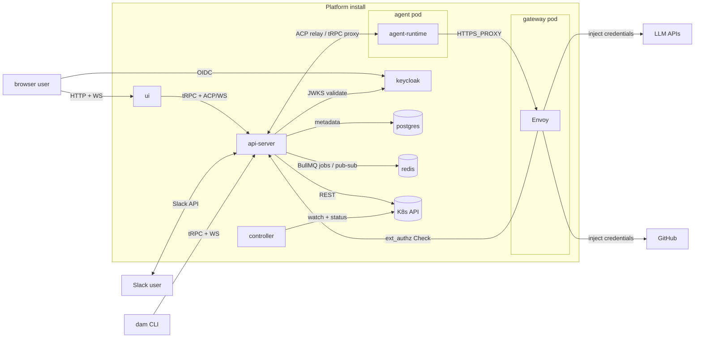

# Architecture

Last verified: 2026-07-01

## System context

The cluster boundary is the trust boundary. Browsers and Slack users reach Platform through the api-server; LLM and GitHub traffic from the agent always exits through the paired gateway pod, where Envoy injects credentials from K8s Secrets mounted on the gateway only. The agent pod's NetworkPolicy admits no path to TCP 80/443 other than the paired gateway, so credential injection is enforced by Kubernetes — not by the agent honoring `HTTPS_PROXY`. The agent pod has no service-account credentials and no upstream tokens of its own.

## Subsystems

Each page is the authoritative, self-contained description of its subsystem — what it looks like today and why it is shaped that way.

- [platform-topology](architecture/platform-topology.md) — the four long-lived components (controller, api-server, agent-runtime, ui), the protocols between them, and the K8s resource model.
- [agent-lifecycle](architecture/agent-lifecycle.md) — create → wake → trigger → hibernate → delete; per-schedule sessions and forks.
- [persistence](architecture/persistence.md) — the three substrates (Postgres, ConfigMap spec/status, per-Agent PVC) and what survives each lifecycle event.
- [security-and-credentials](architecture/security-and-credentials.md) — Keycloak identity, Envoy sidecar credential gateway, K8s-Secret credential storage, ext_authz HITL, network boundary.
- [channels](architecture/channels.md) — Slack and Telegram adapters inside the api-server, inbound relay, outbound MCP tool, identity linking.
- [cli](architecture/cli.md) — `dam` command-line client, an npm-distributed Node package that points at a configured Platform deployment.
- [skills](architecture/skills.md) — connectable git-based skill sources, install onto the per-Agent PVC, REST-only publish back as a PR, Envoy sidecar credential injection for GitHub.
- [connections](architecture/connections.md) — unified Connection / Contribution model, runtime channel between api-server and agent-runtime, transactional outbox + worker delivery, agent-side driver model.
- [experiments](architecture/experiments.md) — group competing agent sessions under one goal as arms, and collect the scores and downloadable artifacts each reports for comparison.
- [usage-tracking](architecture/usage-tracking.md) — append-only activity log in Postgres, SQL views as the read interface, HMAC-pseudonymized identifiers, inspector-role gating.
- [logging](architecture/logging.md) — Pino structured logging to stdout, and the real-identity security audit trail built on it (the forensic counterpart to pseudonymized usage-tracking).
- [observability](architecture/observability.md) — the optional, bundled agent-telemetry backend: an OTLP collector writing OpenTelemetry signals into a columnar store with an exploration UI, gated by the mesh rather than ingestion tokens.
- [supply-chain](security/supply-chain.md) — how each external dependency type is scanned for CVEs and defended against supply-chain attacks.
- [code](security/code.md) — CodeQL SAST and pre-commit hardening.
- [secrets](security/secrets.md) — GitHub secret storage, scanning, and push protection.
- [gaps](security/gaps.md) — known security gaps tracked as future work.

## Strategy

Higher-level documents that frame *what* Platform is trying to be, separate from how the current system is built:

- [Multiplayer model](strategy/multi-player.md) — what's private to each user, what's shared via channels, and what's install-wide plumbing.
- [Security model](strategy/security-model.md) — the three structural risks of running AI agents, and which ones Platform addresses today.

