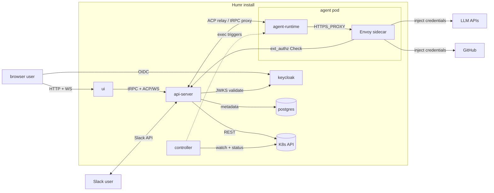

# Architecture

Last verified: 2026-05-04

## System context

The cluster boundary is the trust boundary. Browsers and Slack users reach Humr through the api-server; LLM and GitHub traffic from the agent always exits through the in-pod Envoy sidecar, which injects credentials from K8s Secrets mounted into the sidecar only. The agent container has no direct path to anything outside the cluster, no service-account credentials, and no upstream tokens of its own.

## Subsystems

Each page describes how the accepted ADRs are realized in the current system. ADRs own *why*; these pages own *how*.

- [platform-topology](architecture/platform-topology.md) — the four long-lived components (controller, api-server, agent-runtime, ui), the protocols between them, and the K8s resource model.
- [agent-lifecycle](architecture/agent-lifecycle.md) — create → wake → trigger → hibernate → delete; per-schedule sessions and forks.
- [persistence](architecture/persistence.md) — the three substrates (Postgres, ConfigMap spec/status, per-instance PVC) and what survives each lifecycle event.
- [security-and-credentials](architecture/security-and-credentials.md) — Keycloak identity, Envoy sidecar credential gateway, K8s-Secret credential storage, ext_authz HITL, network boundary.
- [channels](architecture/channels.md) — Slack and Telegram adapters inside the api-server, inbound relay, outbound MCP tool, identity linking.
- [skills](architecture/skills.md) — connectable git-based skill sources, install onto the per-instance PVC, REST-only publish back as a PR, Envoy sidecar credential injection for GitHub.

## Strategy

Higher-level documents that frame *what* Humr is trying to be, separate from how the current system is built:

- [Multiplayer model](strategy/multi-player.md) — what's private to each user, what's shared via channels, and what's install-wide plumbing.
- [Security model](strategy/security-model.md) — the three structural risks of running AI agents, and which ones Humr addresses today.

## Decisions

[ADR index](adrs/index.md) — every accepted, draft, and superseded architecture decision, owner-tagged. The subsystem pages above link to the ADRs that motivated each design.
