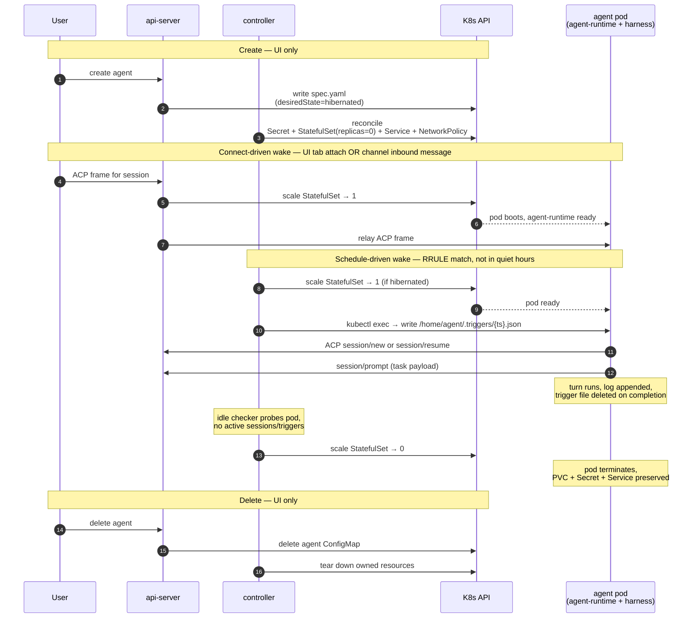

# Agent lifecycle

Last verified: 2026-06-01

## Motivated by

- [ADR-008 — Controller-owned cron with exec-based trigger delivery](../adrs/008-trigger-files.md) — schedules fire by writing JSON files into the running pod
- [ADR-012 — Runtime lifetime: single-use Jobs](../adrs/012-runtime-lifetime.md) — target model; the current prototype runs a persistent pod and migrates incrementally
- [ADR-019 — Scheduled session identity and lifecycle](../adrs/019-session-identity.md) — session-per-schedule with `session/resume` on each fire
- [ADR-023 — Harness-agnostic agent base image](../adrs/023-harness-agnostic-base-image.md) — the harness ships two scripts (`harness-chat`, `harness-terminal`) at fixed paths; the platform spawns whichever fits the session mode
- [ADR-037 — Remote terminal: split chat and terminal session modes](../adrs/037-remote-terminal.md) — sessions carry a mode; chat runs the harness over ACP, terminal runs it attached to a PTY
- [ADR-024 — Connector-declared envs and per-agent overrides](../adrs/024-connector-declared-envs.md) — env composition at pod start, restart-to-apply
- [ADR-026 — Persistent ACP sessions via per-session log](../adrs/026-session-log-replay.md) — the runtime owns the live replay log; the agent's on-disk store is the cold-start source
- [ADR-027 — Slack user impersonation](../adrs/027-slack-user-impersonation.md) — channel-driven sessions carry per-user identity; channels never reach management endpoints
- [ADR-031 — Schedules use RRULE for includes and quiet hours for exclusions](../adrs/031-schedule-rrule-quiet-hours.md) — recurrence semantics and suppression model
- [ADR-032 — Centralized pod-reachability primitive](../adrs/032-pod-reachability-primitive.md) — observed pod `Ready` is the source of truth; every wake path routes through one primitive
- [ADR-046 — Eliminate Instance, collapse into Agent](../adrs/046-eliminate-instance.md) — Agent is the durable runnable resource; there is no separate Instance concept

## Overview

An **Agent** is the durable, owned, runnable resource ([ADR-046](../adrs/046-eliminate-instance.md)). A single `agent` ConfigMap holds both definition and runtime state, and its StatefulSet scales between zero and one replica as the Agent hibernates and wakes. **Sessions** live inside a running pod: each ACP session is a short-lived conversation that the pod's persistent agent process serves. The lifecycle is driven by three actors:

- **Users** drive both management and sessions, but along different paths. The **UI** is the only management surface — creating, configuring, hibernating, and deleting Agents all flow through tRPC on the api-server's public port, which is the sole writer of `spec.yaml`. Sessions can be driven from the UI **or** from a connected channel (Slack, Telegram). Channels never hit management endpoints; they dial the api-server's ACP relay only, with identity scoped per [ADR-027](../adrs/027-slack-user-impersonation.md). Channel internals live on [channels](channels.md).
- The **controller's schedule loop** fires triggers on RRULE occurrences and waking the pod as needed.
- The **controller's idle checker** hibernates running Agents that go quiet.

## Diagram

## Phases

### Create

The api-server writes a new `agent` ConfigMap with `spec.yaml` carrying the Agent's image / mount declarations (copied from a Template at create time, if any), env, secret refs, allowed users, and a `desiredState` of `running` or `hibernated`. The controller reconciles a paired set of owned resources: two StatefulSets (the agent and its paired gateway, each tracking `desiredState`), two headless Services (the agent's ACP and the gateway's `<agent>-gateway` proxy DNS), two role-scoped NetworkPolicies, and a per-Agent Envoy bootstrap ConfigMap + leaf TLS Certificate ([ADR-033](../adrs/033-envoy-credential-gateway.md), [ADR-038](../adrs/038-paired-gateway-pod.md)).

The pod image is built from `platform-base` plus a harness-specific layer ([ADR-023](../adrs/023-harness-agnostic-base-image.md)). The platform contract is two executables at fixed paths: `/usr/local/bin/harness-chat` (spawned as the ACP subprocess for chat-mode sessions) and `/usr/local/bin/harness-terminal` (spawned attached to a PTY for terminal-mode sessions, with `HARNESS_SESSION_ID` exported so the harness can pick up the right resumable session). agent-runtime otherwise treats the harness as opaque. The workspace PVC is provisioned on first wake and survives subsequent hibernations.

Pod env at start is the composition of **three** layers — last occurrence wins, with `PORT` server-enforced ([ADR-024](../adrs/024-connector-declared-envs.md), [ADR-046](../adrs/046-eliminate-instance.md)):

1. **platform envs** — proxy + auth wiring rendered by the controller (`HTTPS_PROXY`, harness URL, ext-authz routing, etc.).
2. **`credentialEnvVars`** — env contributions derived from the Agent's mounted credential Secrets (e.g. `GH_TOKEN` from a GitHub PAT half).
3. **`agent.env`** — the single env list on the Agent's `spec.yaml`. The api-server is its sole writer.

Template env contributes at *create time only*: when an Agent is created from a Template, the api-server's `assembleSpecFromTemplate` step copies template env into `agent.env`. The controller never reads the Template again at pod start, so editing a Template never re-flows into a running Agent — there is no "template envs" runtime layer. Editing `agent.env` takes effect on the next pod restart.

Connector state that doesn't fit the env model (per-host CLI configs, allowlists, and similar) is materialized as files directly under HOME by `agent-runtime` itself, which holds an SSE connection to the api-server and merges declarative file fragments without restarting the pod. Image-baked content under the same paths participates in the merge — `agent-runtime` writes to the real PVC path, not a shadowing `emptyDir`.

### Wake

Every caller that sends work to a pod — the controller's schedule loop, the api-server's ACP relay, channel adapters — routes through a single reachability primitive ([ADR-032](../adrs/032-pod-reachability-primitive.md)). The primitive's contract: **observed pod `Ready` is the authoritative answer to "can I call this pod?"** `spec.desiredState` is user intent (running vs. hibernated) and continues to drive the reconciler, but it is no longer read as a reachability signal by callers. The primitive flips `desiredState` to `running` if needed, single-flights concurrent waits per Agent, bumps the `platform.ai/last-activity` annotation on every successful call (so any caller implicitly keeps the pod warm), and is implemented in parallel in Go (controller) and TypeScript (api-server).

Two paths trigger a wake:

- **Connect-driven** — the api-server is about to forward an ACP frame to a hibernated Agent and ensures readiness before the relay completes. The frame can originate from a UI tab attaching to a session or from a channel worker (Slack / Telegram) routing an inbound message to its bound session.
- **Schedule-driven** — the controller's schedule loop is about to deliver a trigger and `kubectl exec` requires the pod to be running ([ADR-008](../adrs/008-trigger-files.md)).

Wake is bounded — the primitive polls pod readiness with backoff and gives up after two minutes, surfacing a loud error to its caller (schedule status, WS close code, or channel log).

### Trigger fire

Each `agent-schedule` runs as a per-schedule goroutine in the controller. It computes the next RRULE occurrence in the schedule's `TZID`, walks past any occurrence that falls inside an enabled quiet-hours window, and sleeps directly to the first surviving occurrence ([ADR-031](../adrs/031-schedule-rrule-quiet-hours.md)). Suppressed fires are dropped, not deferred — quiet hours mean "skip these," not "queue for later."

When a fire is due:

1. Controller wakes the Agent if it is hibernated and waits for readiness.
2. Controller writes `/home/agent/.triggers/{ts}.json` via `kubectl exec`. The write uses temp-file + rename so the watcher never reads a partial file.
3. The trigger watcher inside agent-runtime picks up the file, tracks it in an in-process inflight set, and opens an ACP session against the harness.
4. On completion the watcher deletes the trigger file.

Because the file is deleted on completion (not on pickup), trigger delivery is durable at-least-once: a pod crash mid-processing leaves the file on the PVC for the next boot to find ([ADR-019](../adrs/019-session-identity.md)).

#### Session continuity per schedule

The session model differs by schedule mode:

- **Fresh schedule** — every fire creates a new session via `session/new`. The schedule accumulates a list of sessions over time, browseable under the schedules tab.
- **Continuous schedule** — the first fire creates a session via `session/new`; every subsequent fire calls `session/resume` against the same session id. One schedule, one session, history retained across fires.

Schedule sessions are typed (`schedule_cron`) in the sessions DB, which is the source of truth for the schedule↔session link. The trigger watcher is just another sessions-API client over the cluster network. Triggers serialize within a schedule — if a fire arrives while the previous one is still running, the file stays on disk and is picked up on completion. Cross-schedule concurrency is unaffected.

### Session inside the pod

The harness child process runs for the pod's lifetime, not per-connection. Multiple ACP WebSocket channels (UI tabs, Slack worker, trigger watcher) attach to the same runtime concurrently and engage with sessions implicitly through the `sessionId` they carry on each frame ([ADR-026](../adrs/026-session-log-replay.md)).

Each session is an append-only in-memory log (≤2 MB soft cap, with a truncation sentinel for older history). Every channel keeps a per-session cursor; new events are appended to the log and fanned out to engaged channels at or behind the new sequence number. `session/load` is served from the log on cache hit and falls through to the agent's on-disk store on cold start.

`session/resume` is mediated entirely by the runtime — the frame never reaches the harness. On the hot path (cached metadata) the runtime engages the channel, advances its cursor to the log tail, and returns a synthetic response with no replay. On the cold path (no metadata, e.g. after the pod restarts) the runtime parks the request as a waiter and issues its own `session/load` to rehydrate the harness; replay events populate the log without reaching any client, and on completion every parked resume waiter is served from memory. This shields the UI from per-harness capability differences (some harnesses, like `pi-agent`, don't implement `unstable_resumeSession` at all) and from the cold-subprocess problem on which even resume-capable harnesses would fail.

When a session goes idle — no engaged channel, no active or queued prompt, no agent-initiated request still pending — the runtime sends `session/close` to the harness. The per-session subprocess is reaped, freeing memory; the next attach respawns it. Permission requests with no engaged channel time out after ten minutes and the runtime responds to the agent with an error so the tool call aborts cleanly.

Terminal-mode sessions ([ADR-037](../adrs/037-remote-terminal.md)) follow a different model from the chat path above. agent-runtime accepts at most one WebSocket per `sessionId` on `/api/terminal`, allocates a PTY, spawns `harness-terminal` attached to it, and pipes raw bytes both ways through a small binary frame protocol (`OP_INPUT` / `OP_OUTPUT` / `OP_RESIZE` / `OP_EXIT`). A headless xterm tracks scrollback so that a tab refresh within 30 seconds of disconnect reattaches to the same PTY and replays the serialized buffer; after the grace window, the PTY is killed. There is no append-only log, no fan-out, and no `session/resume` — terminal sessions belong to one viewer at a time, and the harness's own on-disk session store is the only durable record (e.g. `~/.claude/projects/.../<HARNESS_SESSION_ID>.jsonl`).

Switching a session's mode (e.g. chat → terminal) is metadata-only ([ADR-055](../adrs/055-agent-owned-session-metadata.md)): the switching client persists the new mode over ACP (`session/resume` carrying `_meta.platform.mode`), which the runtime merges into its session-metadata store. The running harness is unaffected — mode is a UI hint about which surface (chat vs. terminal PTY) to render. There is no cross-client notification; other clients reflect the change on their next `session/list`. The `--reset` / terminal-reset path is independent: it closes the terminal WebSocket and calls agent-runtime's `resetSession`, which sends `session/close` to the harness and clears the in-memory log and cursors.

Beyond ACP frames, agent-runtime also serves a Bearer-authenticated tRPC surface on the harness port for skill install / uninstall / scan / publish / listLocal. The api-server is the sole caller; skill files land on the PVC under the configured Skill Paths and are picked up by the harness on the next session start (no hot-reload). See [skills](skills.md).

[ADR-012](../adrs/012-runtime-lifetime.md) is the **target** lifetime model — single-use Kubernetes Jobs per turn, with a Redis-backed read cache for lightweight queries and a two-tier PVC layout (per-session + shared). Migration is on a parallel track and not blocking. The current prototype uses the persistent runtime described above.

### Hibernate

The controller's idle checker periodically scans running Agents. For each, it probes the agent-runtime over the cluster network: any active sessions, any inflight triggers? If the answer is no for long enough (and the probe doesn't error), the checker flips `spec.desiredState` to `hibernated`. The reconciler then scales the StatefulSet to zero.

The pod terminates; the PVC, Secret, Service, and NetworkPolicy persist. Workspace state survives — the git checkout, `node_modules`, `.venv`, mise cache, and `$HOME` are all on the PVC and rejoin on the next wake. Anything written to the container's ephemeral filesystem (OS-level changes, tools installed outside `$HOME`) is lost; this is a deliberate constraint of the lifetime model ([ADR-012](../adrs/012-runtime-lifetime.md)).

### Delete

The api-server deletes the `agent` ConfigMap. The controller's reconciler tears down the owned StatefulSet, Service, NetworkPolicy, and Secret. Sessions tied to this Agent in the DB are cleaned via cascade or periodic reconciliation. PVC handling follows the cluster's reclaim policy.

Schedule ConfigMaps (`agent-schedule`) are independent resources and survive Agent deletion as orphans unless the deletion path explicitly cascades. The UI offers a checkbox to delete a schedule's accumulated sessions alongside the schedule itself ([ADR-019](../adrs/019-session-identity.md)).

## Forks

Forks survive [ADR-046](../adrs/046-eliminate-instance.md) as the third durable concept in the bounded context (alongside Template and Agent). An `agent-fork` ConfigMap runs a derivative of an existing Agent with credential and env overrides. Unlike Agents, forks reconcile to a **Kubernetes Job** rather than a StatefulSet — they run to completion and are not woken, hibernated, or kept warm. This already matches the run-to-completion shape that [ADR-012](../adrs/012-runtime-lifetime.md) targets for Agents. The interesting machinery is which secrets the fork can see and how its identity propagates upstream; see [security-and-credentials](security-and-credentials.md).

