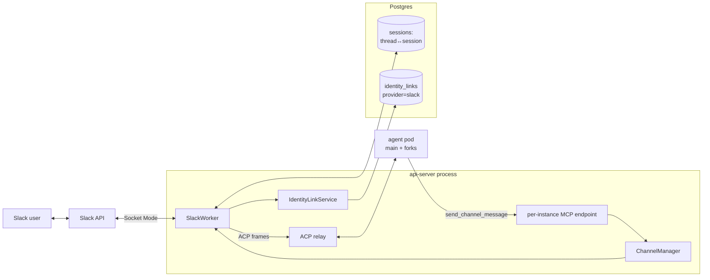
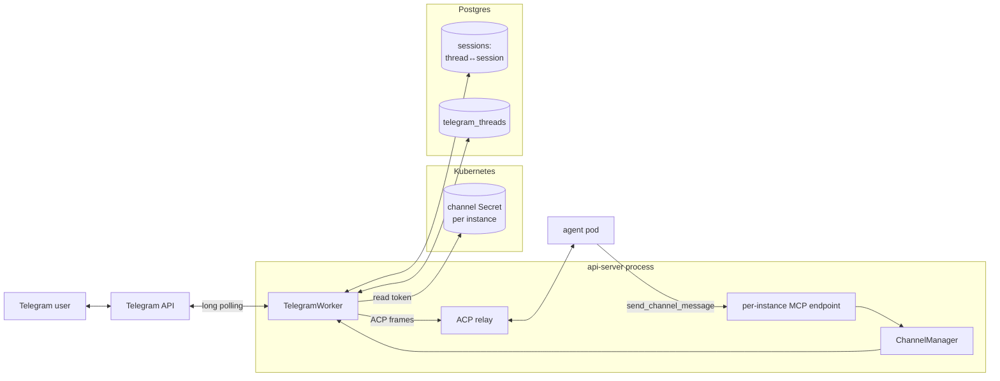
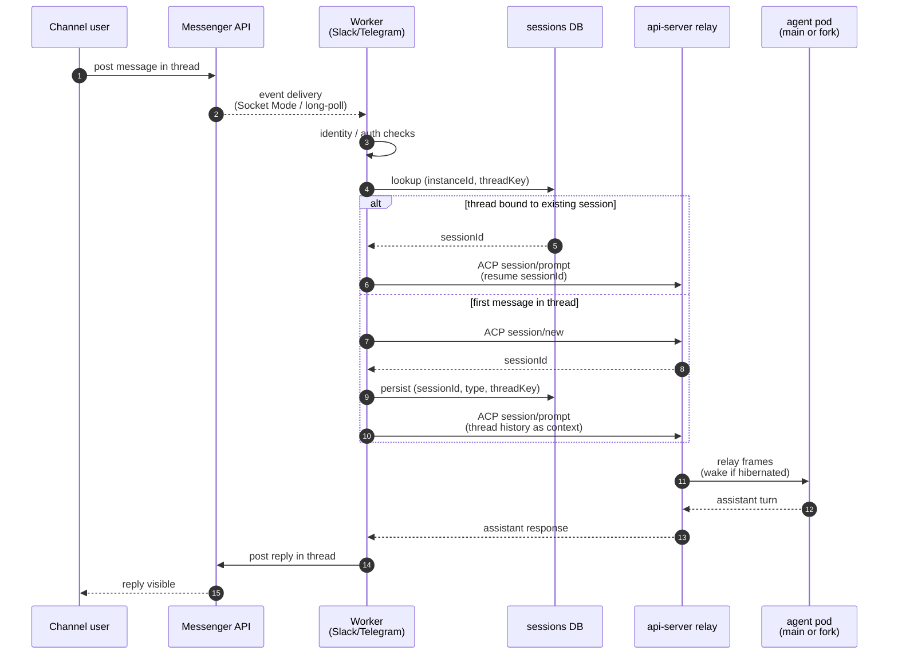

# Channels

Last verified: 2026-04-27

## Motivated by

- [ADR-016 — Messenger integration handled by API Server](../adrs/016-messenger-integration.md) — channels are pluggable adapters owned by the api-server; no new Deployment per messenger
- [ADR-018 — Slack integration: Socket Mode, channel-based routing, identity linking](../adrs/018-slack-integration.md) — the platform-channel pattern: one Slack app per install, workspace-wide identity linking
- [ADR-021 — Slack outbound messaging via MCP tool](../adrs/021-slack-outbound.md) — agents post by calling an MCP tool; the api-server hosts a per-instance MCP endpoint
- [ADR-025 — Persistent ACP session per Slack thread](../adrs/025-thread-session.md) — one thread maps to one resumable session; the agent gets real conversational continuity
- [ADR-027 — Slack per-turn user impersonation](../adrs/027-slack-user-impersonation.md) — owner replies hit the main pod, foreign replies fork into a per-turn Job (covered in depth on [security-and-credentials](security-and-credentials.md))
- [ADR-029 — Per-instance messenger channels](../adrs/029-per-instance-channels.md) — Telegram-style channels where the instance owner brings the bot; secrets in k8s Secrets, authorization per-thread

## Overview

A **channel** is a messenger surface (Slack, Telegram) that lets users drive an instance from outside the UI. Channels are pluggable adapters that live inside the api-server process — no separate Deployment, no sidecar in the agent pod ([ADR-016](../adrs/016-messenger-integration.md)). Each adapter (the *worker*) owns its inbound socket, its outbound API, and its thread-to-session bookkeeping; a `ChannelManager` service composes the workers and reacts to lifecycle events on the in-process event bus.

Channels split along a structural axis that has real consequences for secrets and identity ([ADR-029](../adrs/029-per-instance-channels.md)):

- **Platform channel** — one app serves the whole install. The operator configures it once via Helm values; per-instance config is just *which conversation this instance listens to*. Identity linking ties messenger users to Keycloak subs at the workspace level. Slack is the platform channel today.
- **Per-instance channel** — each instance brings its own bot, created by the instance owner. The platform learns the bot token from the UI at connect time and stores it in a per-(instance, channel-type) k8s Secret. Authorization is per-thread, not per-user, because there is no workspace to anchor identity in. Telegram is the per-instance channel today.

Inbound traffic and outbound traffic take different paths. Inbound is push from the messenger into the api-server worker, which routes the message to the agent pod over ACP. Outbound is pull initiated by the agent: the harness calls a tool on the api-server's per-instance MCP endpoint, and the api-server delegates to the right worker.

Two cross-cutting concerns are owned elsewhere and only summarized here:

- **Foreign replier fork.** Slack's two-tier access (channel membership + per-instance allowed users) admits multiple authorized users into one thread. Owner replies relay to the main pod; replies from any other authorized user fork into a per-turn Kubernetes Job whose Envoy sidecar mounts the replier's K8s credential Secrets ([ADR-027](../adrs/027-slack-user-impersonation.md)). The Job spec, the foreign-credential selection, and the shared-PVC mechanics are covered on [security-and-credentials](security-and-credentials.md). Channels just see "main pod or fork pod" at the relay step.
- **Thread-session binding substrate.** The thread-to-session map lives in the sessions DB ([ADR-025](../adrs/025-thread-session.md)); see [persistence](persistence.md) for the storage shape.

## Topology

Both adapters share the same shape inside the api-server — a worker that owns the messenger socket, the `ChannelManager` that supervises lifecycle, the ACP relay for inbound, and the per-instance MCP endpoint for outbound. The interesting parts are where the two diverge: Slack hangs off Helm-supplied platform credentials and a workspace-wide identity link table; Telegram hangs off a per-instance k8s Secret and a per-conversation authorization table.

### Slack — platform channel



Bot and App-Level Tokens come from Helm values and live in api-server env — no per-instance Secret. The workspace-wide identity-link table backs the `/platform login` flow, and the relay path branches between the main pod and a per-turn fork pod by replier identity ([security-and-credentials](security-and-credentials.md)).

### Telegram — per-instance channel



The bot token lives in a per-instance k8s Secret (`platform-channel-telegram-<instanceId>`); there is no workspace identity to link, so authorization is per-conversation in `telegram_threads`. The relay path is single-track — the main pod handles every turn, no foreign-replier fork.

## Adapters

Both workers implement the same internal contract — `start`, `stop`, `stopAll`, `listConversations`, `postMessage` — keyed by instance id. The differences are transport, identity model, and where the bot token comes from.

### Slack — platform channel

- **Transport.** Socket Mode, one workspace-level WebSocket from the api-server to Slack. The api-server has no inbound network access requirement; events arrive over the socket the api-server itself opened. Slack caps Socket Mode at ten concurrent connections per app, which is the install-level scale ceiling for Slack ([ADR-018](../adrs/018-slack-integration.md)).
- **Token provenance.** App-Level Token (`xapp-…`) and Bot Token come from Helm values, set at install time. Not stored per-instance.
- **Identity linking.** A `/platform login` slash command starts a Keycloak OAuth flow; on callback the api-server stores `slack_user_id ↔ keycloak_sub`. All subsequent interactions require a linked identity; unlinked users get an ephemeral prompt to log in. The link table is the source of truth for "who is this Slack user in Platform terms."
- **Access control.** Two tiers ([ADR-018 §3](../adrs/018-slack-integration.md)). Channel membership is the coarse gate — users must be in the Slack channel to see the bot's interactions. Per-instance allowed users is the fine gate — each instance optionally declares the subs that may *trigger* work; non-listed users in the channel still see responses but cannot drive a session. Combined with foreign-replier forking ([ADR-027](../adrs/027-slack-user-impersonation.md)), this lets a thread have multiple authorized drivers whose actions land under their own identities.
- **Instance selection per thread.** When a user posts in a channel, the worker checks which instances they have access to in that channel. One match → route directly. Multiple matches → emit an `external_select` block that lazy-loads from the api-server. The selected instance is stored as `thread_ts → instance_id` in memory; once a thread is bound to an instance, every subsequent message in the thread goes to the same instance.

### Telegram — per-instance channel

- **Transport.** Long-poll `getUpdates`. Each instance has its own bot, so the api-server runs one Telegram client per active Telegram-connected instance.
- **Token provenance.** The instance owner creates a bot via `@BotFather` and pastes the token in the UI. The api-server writes it to a k8s Secret named `platform-channel-telegram-<instanceId>` with `platform.ai/type=channel-secret` ([ADR-029](../adrs/029-per-instance-channels.md)). The token never round-trips to the UI on read paths and never traverses the in-process event bus — `TelegramConnected` carries only `instanceId`, and the worker reads the token from the Secret store at start time.
- **Identity model — there is none.** Telegram has no workspace to anchor a user-to-Keycloak link against. Authorization shifts from user to *conversation*: a thread (DM or group) is unauthorized until someone runs `/login` and completes a Keycloak OAuth flow, which records the thread in `telegram_threads`. `/logout` revokes. In groups, only chat admins may `/login` (verified via `getChatMember`); unauthorized groups stay silent so the bot does not spam every chat it has been added to.
- **Lifecycle.** Connect = create Secret + emit `TelegramConnected`; the `ChannelManager`'s subscription reads the token from the Secret store and starts the worker for that instance. Disconnect = stop worker + delete Secret. Instance deletion cascades via label selector. No bot token at rest in Postgres.

The two adapters share the same lifecycle plumbing in `ChannelManager`: `SlackConnected` / `SlackDisconnected` / `TelegramConnected` / `TelegramDisconnected` / `InstanceDeleted` events on the rxjs bus drive `start` / `stop` calls on the appropriate worker. Bootstrap on api-server startup walks the per-instance channel config and calls `start` for each enabled channel.

## Inbound — channel message to ACP session



A few observations the diagram glosses over:

- **Identity gates differ per adapter.** Slack runs the linked-identity check, the per-instance allowed-users check, and the owner-vs-foreign decision (the latter selects whether the relay targets the main pod or a fork Job per [ADR-027](../adrs/027-slack-user-impersonation.md)). Telegram runs the per-thread `/login` check; there is no foreign fork because there is no workspace identity to fork under.
- **Wake is implicit.** The relay step is the same `ACP relay → wake-if-hibernated → forward` path used by the UI. Channels do not call lifecycle endpoints directly; routing an ACP frame is what wakes the pod ([agent-lifecycle](agent-lifecycle.md), §Wake).
- **Resume vs. new is decided by the DB lookup, not by ADR-018's original "every message is new" rule.** [ADR-025](../adrs/025-thread-session.md) supersedes [ADR-018 §6](../adrs/018-slack-integration.md): the worker always tries to resume on a thread it has seen before. If `unstable_resumeSession` fails (PVC lost, session expired), the worker falls back to creating a new session with thread history injected from the messenger API — degrading to pre-feature behavior for that thread, no regression.
- **`threadKey` is adapter-specific.** Slack uses `thread_ts`; Telegram uses chat id. The sessions DB keys on `(instanceId, threadKey)` with a partial unique index ([persistence](persistence.md)).

## Outbound — agent to channel

Outbound is initiated by the agent process. The harness calls a tool on the api-server's per-instance MCP endpoint, the endpoint authenticates the call, and the channel manager routes the message back through the right worker ([ADR-021](../adrs/021-slack-outbound.md)).

```mermaid
sequenceDiagram
  autonumber
  participant H as Harness<br/>(in agent pod)
  participant MCP as api-server<br/>MCP endpoint
  participant K as K8s API
  participant CM as ChannelManager
  participant W as Worker
  participant M as Messenger API

  H->>MCP: POST /api/instances/{id}/mcp<br/>tool: send_channel_message
  MCP->>K: resolve source pod IP → instance label
  K-->>MCP: instance + owner
  MCP->>MCP: verify caller IP belongs to {id};<br/>agent.owner == instance.owner
  alt verification fails
    MCP-->>H: 401 / 404
  else verified
    MCP->>CM: postMessage(instanceId, channel, text, chatId?)
    CM->>W: postMessage(instanceId, text, chatId?)
    W->>M: post (top-level or threaded)
    M-->>W: ack / error
    W-->>CM: { ok } | { error }
    CM-->>MCP: result
    MCP-->>H: tool result
  end
```

What the agent sees:

- **Two tools** are registered on the per-instance MCP server: `describe_channel` returns the authorized chats (DMs / threads / groups) for a given channel type, and `send_channel_message` posts text to a chat. The agent picks the channel by argument (`slack` or `telegram`); `chatId` addresses a specific chat, or omitting it uses the worker's last-active chat.
- **Tools are always registered.** Calls are rejected at invocation time when no channel is connected for the instance — no dynamic tool list, no per-session toggle ([ADR-021 §1](../adrs/021-slack-outbound.md)).
- **Bidirectional channel.** If a channel is connected to an instance, every session on that instance can post — interactive sessions and scheduled sessions alike. There is no per-session outbound flag.

Why the dedicated MCP endpoint:

- **Network isolation.** The MCP port is the only api-server port the agent's NetworkPolicy admits. The agent cannot reach the admin API (tRPC, OAuth, instance management) — only this one endpoint.
- **Auth without an admin login.** Caller identity is derived from the source pod IP, mapped to a `platform.ai/instance` label via the api-server's `podIpResolver` cache. The agent does not present a Bearer token — a compromised harness can't claim to be a different instance because the kernel-verified source IP is the source of truth. Owner match (agent.owner == instance.owner) is the second check.
- **Direct path to channel infra.** The MCP endpoint dispatches into the same `ChannelManager.postMessage` that workers use internally — no agent-runtime round-trip, no second relay hop.

### Threading model

Outbound posts are **fire-and-forget at the thread level** ([ADR-021 §3](../adrs/021-slack-outbound.md)). The agent posts a top-level message; the worker does not store any `threadTs → sessionId` mapping for proactive posts. If a user replies to the resulting thread, the inbound path treats it as a new mention — a fresh session. Continuity from the originating session does not carry over. This is the deliberate trade-off: keep outbound simple and stateless at the cost of session bridging on Slack-side replies.

The two messengers diverge slightly on what a top-level post means:

- **Slack:** the worker posts to the channel id (or the last-active channel for the instance) with no `thread_ts`, producing a new top-level message. A reply from a Slack user is a new mention.
- **Telegram:** there is no thread primitive in DMs and only weak threading in groups. The worker posts to the chat id; if the agent's prompt was triggered by a previous message in the same chat, that chat is still the conversation.

## Per-instance vs. shared channel

See [ADR-029](../adrs/029-per-instance-channels.md). The short version is that platform channels (Slack today) and per-instance channels (Telegram today) differ in token provenance, identity model, and access-control surface, and the channel module models the difference explicitly so future per-instance channels (WhatsApp Business, Discord, SMS) follow the Telegram pattern mechanically.

## Persistence touchpoints

Channels touch three stores; the substrate details live on [persistence](persistence.md):

- **`sessions` (Postgres).** Thread-to-session mapping with `(instanceId, threadKey, sessionType)`. Slack and Telegram both write here; the relay reads here on every inbound message to decide resume-vs-new.
- **Identity-link tables (Postgres).** `identity_links` keyed on `(provider, external_user_id)` mapping to `keycloak_sub` — Slack populates it today, but the `provider` column makes the table reusable for any future workspace channel ([ADR-018 §2](../adrs/018-slack-integration.md)). `telegram_threads` records per-conversation authorization for Telegram ([ADR-029](../adrs/029-per-instance-channels.md)). Different shapes by design — Slack has a workspace, Telegram does not.
- **Channel Secrets (k8s).** `platform-channel-telegram-<instanceId>` per Telegram-connected instance. Slack has none — its tokens live in api-server env from Helm values.

Channels do **not** participate in the agent ConfigMap spec/status split. The "channel config in instance ConfigMap" pattern from [ADR-016](../adrs/016-messenger-integration.md) was superseded by [ADR-029](../adrs/029-per-instance-channels.md): channel routing metadata lives in Postgres, secrets in k8s Secrets, agent ConfigMaps stay channel-free.
