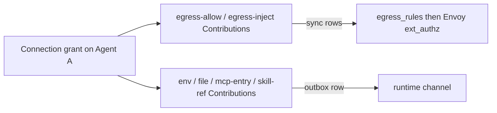
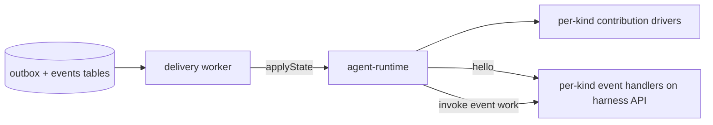
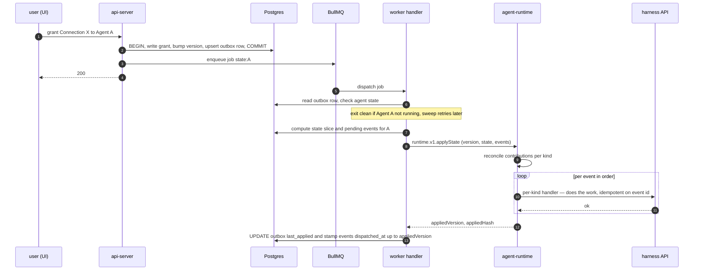
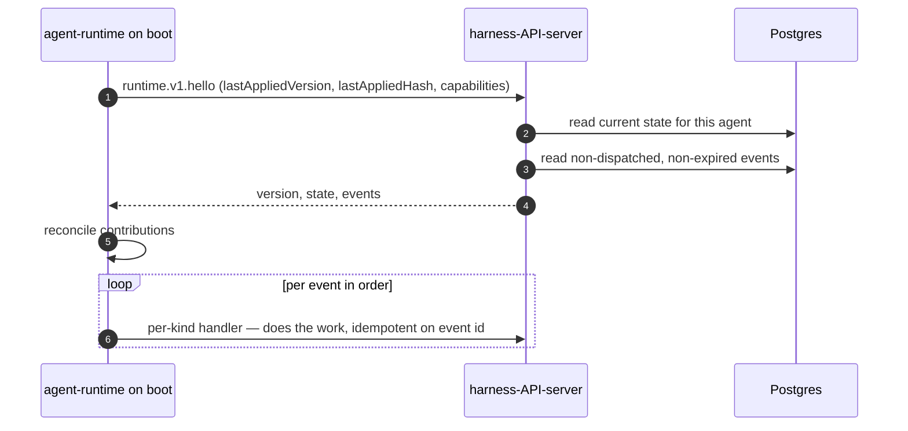
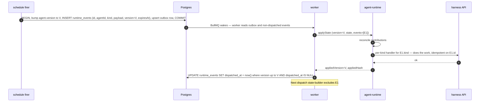
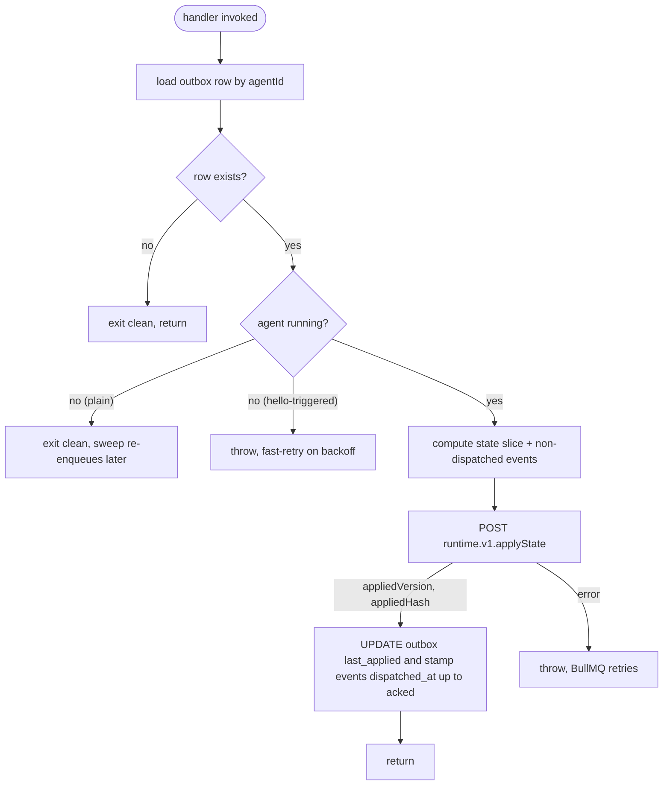

# Connections, Contributions, and the Runtime Channel

Last verified: 2026-06-11

## Motivated by

- [ADR-051 — Connections, Connection Templates, and Contributions: unified configuration model](../adrs/051-connections-and-contributions.md) — the domain shape that replaces the parallel OAuth-app and provider-preset registries
- [ADR-052 — Unified runtime channel](../adrs/052-runtime-channel.md) — the wire protocol between api-server and agent-runtime; supersedes pod-files SSE (ADR-034) and trigger files (ADR-008)
- [ADR-053 — Transactional outbox + worker](../adrs/053-runtime-outbox-worker.md) — how mutations decouple from agent reachability
- [ADR-036 — Redis as a platform primitive](../adrs/036-redis-platform-primitive.md) — the signal-path substrate the worker wakes on
- [ADR-022 — Harness API server](../adrs/022-harness-api-server.md) — the restricted port the agent reaches; per-kind event handlers live here
- [ADR-040 — Unified secret contributions](../adrs/040-unified-secret-contributions.md) — established the `env` Contribution and user-wins precedence; its render-into-pod delivery is superseded below
- [ADR-069 — Credential env via the runtime channel](../adrs/069-runtime-env-injection.md) — moves `env` delivery off the pod spec onto the runtime channel, injected at harness spawn; a grant change no longer rolls the agent pod

## Overview

A Connection is everything an agent needs to talk to one external integration — credentials, hosts to reach, config files to author, MCP entries to expose, skills to install. Connection Templates are code-level catalog entries that ship defaults; granting a Connection to an Agent materializes its Contributions into the right destinations.

The subsystem cuts cleanly across three bounded contexts:

- **api-server — Connections context** owns Connection Templates, Connections, grants. Computes per-agent Contribution sets. Routes Contributions to the right rail per kind.
- **api-server — Runtime Delivery context** owns the outbox table, the events table, the delivery worker, the `runtime.applyState` call into agents, the `runtime.hello` callback from agents, and the per-kind event handlers on the harness API.
- **agent-runtime — Runtime Channel context** receives `applyState`, dispatches Contributions to per-kind drivers, processes events in order through per-kind event handlers, reconciles on-disk state to match the snapshot, calls back to `hello` on boot.

A grant of one Connection produces Contributions of several kinds. They don't all travel the same rail:



After [ADR-069](../adrs/069-runtime-env-injection.md) there are two rails. `egress-allow` and `egress-inject` Contributions sync into Postgres `egress_rules` and are read live by Envoy ([ADR-035](../adrs/035-unified-hitl-ux.md)) — unchanged; `egress-inject` additionally carries a credential the gateway injects on the wire (mechanics in [security and credentials](security-and-credentials.md)). Everything else — `env` (formerly a controller-render/pod-roll rail, [ADR-040](../adrs/040-unified-secret-contributions.md)), `file`, `mcp-entry`, `skill-ref` — now travels the runtime channel and is what the rest of this page is about.

The runtime channel is two routes between api-server and agent-runtime, plus per-kind event handlers on the harness API:



The wire payload carries:

- **`version`** (top-level) — per-agent monotonic counter, the single ack cursor for the payload. Bumped on any contribution edit or event insert.
- **`state`** — the agent's full desired configuration (Contributions). Reconciled by diff. `hash` short-circuits no-op pushes.
- **`events`** — ordered one-shot directives the agent must execute (trigger fires today; more kinds later). Processed in order through per-kind handlers on the harness API.

State changes write to the outbox, the worker reads and dispatches a fresh payload, the agent receives state + events and reconciles contributions + invokes event handlers, and the agent calls back on boot/wake to catch up.

## Concepts

### Connection Template

A code-level catalog entry. Premade templates (GitHub, Anthropic, Spotify, Linear MCP, …) ship with full defaults — auth flow, hosts, scopes, recommended contributions. Custom templates (Custom MCP, Custom OAuth, Custom Header) ship the *shape* but leave the integration's identity for the user to fill in.

Two display-axis attributes drive UI grouping:

| `category` | `isCustom` | Where the user encounters it |
|---|---|---|
| `app` | `false` | Apps section: GitHub, Spotify, Anthropic, OpenAI, Google services, GitHub Enterprise, … |
| `mcp` | `false` | MCP servers section: Linear MCP, Atlassian MCP, … (as added) |
| `mcp` | `true` | Custom Connection → "Add MCP server" |
| `other` | `true` | Custom Connection → "Add OAuth credential" / "Add Header credential" |

Templates are registered in code; adding a new integration is one entry. Schemas validate user input; the template's `build()` function projects inputs into the concrete `auth` + `contributions[]` of the Connection record.

### Connection

A uniform shape — every Connection looks the same regardless of category or auth mode:

```ts
interface Connection {
  id: string;
  ownerId: string;            // K8s sub
  templateId: string;         // which Template this was built from
  name: string;               // user-visible label
  inputs: Record<string, unknown>;   // raw user-typed values, for re-render
  auth: AuthConfig;
  contributions: Contribution[];
}

type AuthConfig =
  | { kind: "oauth"; clientId: string; refreshTokenRef: SecretRef; accessToken: SecretRef; scopes: string[]; ... }
  | { kind: "header"; valueRef: SecretRef; headerName: string; valueFormat: string }
  | { kind: "none" };
```

The auth field carries credential-acquisition state (tokens, refresh schedules) separately from contributions, because credentials have their own lifecycle.

### Contribution

A typed unit a Connection emits when granted to an Agent. Discriminated union, extensible per [ADR-052's evolution rule](../adrs/052-runtime-channel.md):

```ts
type Contribution =
  | { kind: "env";           name: string; placeholder: string }
  | { kind: "egress-allow";  host: string; pathPattern?: string }
  | { kind: "egress-inject"; host: string; pathPattern?: string; headerName: string; valueFormat: string; encoding?: "basic-x-access-token" }
  | { kind: "file";          path: string; format: "yaml"|"json"|"text"|"ini"; mergeMode: MergeMode; content: unknown }
  | { kind: "mcp-entry";     name: string; url: string; headers?: Record<string,string> }
  | { kind: "skill-ref";     sourceUrl: string; name: string; version: string };
```

Kinds are added by extending the union and gating on agent capabilities (see [Versioning](#versioning)).

### Event

A one-shot directive the agent executes through a per-kind handler on the harness API. Each event carries an `id` (stable across redeliveries), a `kind`, a `payload` (kind-specific), the agent-monotonic `version` slot it occupies, and an `expiresAt` ttl.

```ts
type Event =
  | { id: string; version: number; kind: "trigger";
      scheduleId: string; task: string;
      sessionMode?: "continuous" | "fresh"; mcpServers?: unknown[]; expiresAt: string };
```

The `id` is the dedupe key. Each event kind's handler on the harness API holds a unique constraint on its side-effect table joining back to the event id, so a redelivered event finds the existing side-effect row and returns it without firing twice.

The `trigger` kind is built-in to every agent. Future kinds (`rotate`, `rescan`, …) opt-in per agent via the manifest's capabilities.

## Example Connections

### App preset: GitHub Enterprise

```jsonc
{
  "id": "conn-7a8b",
  "templateId": "github-enterprise",
  "name": "GHE (ghe.acme.com)",
  "inputs": { "host": "ghe.acme.com", "clientId": "…", "clientSecret": "…" },
  "auth": {
    "kind": "oauth",
    "clientId": "Iv1.…",
    "refreshTokenRef": { "secretName": "platform-secret-conn-7a8b", "key": "refresh_token" },
    "accessToken":     { "secretName": "platform-secret-conn-7a8b", "key": "access_token" },
    "scopes": ["repo", "read:user", "user:email"]
  },
  "contributions": [
    { "kind": "egress-allow", "host": "ghe.acme.com" },
    { "kind": "env",          "name": "GH_TOKEN", "placeholder": "dummy-placeholder" },
    { "kind": "env",          "name": "GH_HOST",  "placeholder": "ghe.acme.com" },
    { "kind": "file",
      "path": "$HOME/.config/gh/hosts.yml",
      "format": "yaml",
      "mergeMode": "key-targeted",
      "content": { "ghe.acme.com": { "oauth_token": "dummy-placeholder", "git_protocol": "https" } } }
  ]
}
```

### Custom MCP server

```jsonc
{
  "id": "conn-1d2e",
  "templateId": "custom-mcp",
  "name": "Acme internal MCP",
  "inputs": { "url": "https://mcp.acme.internal/sse", "authMode": "oauth" },
  "auth": { "kind": "oauth", "clientId": "…", "scopes": [], "…": "…" },
  "contributions": [
    { "kind": "egress-allow", "host": "mcp.acme.internal" },
    { "kind": "mcp-entry",    "name": "acme",
      "url": "https://mcp.acme.internal/sse",
      "headers": { "Authorization": "Bearer dummy-placeholder" } }
  ]
}
```

### Custom Header credential

```jsonc
{
  "id": "conn-3f4a",
  "templateId": "custom-header",
  "name": "Internal billing API",
  "inputs": { "host": "billing.acme.internal", "headerName": "X-API-Key", "value": "…" },
  "auth": {
    "kind": "header",
    "valueRef":   { "secretName": "platform-secret-conn-3f4a", "key": "value" },
    "headerName": "X-API-Key",
    "valueFormat": "{value}"
  },
  "contributions": [
    { "kind": "egress-inject", "host": "billing.acme.internal",
      "headerName": "X-API-Key", "valueFormat": "{value}" }
  ]
}
```

## Contribution fan-out

The api-server's contribution-fanout layer routes each Contribution kind to the rail that delivers it. Different rails because the kinds have genuinely different delivery semantics:

| Kind | Rail | Delivery semantics | Note |
|---|---|---|---|
| `env` | Runtime channel `applyState` (state slice) | Sub-second push; applied at next harness spawn | Written to a JSON file on the PV; the harness spawn path merges it into the process env (user env wins). A change recycles the harness at an idle turn boundary — no pod roll. |
| `egress-allow` | Postgres `egress_rules` → Envoy `ext_authz` | Live read; no pod involvement | Joined per-grant; revoke sweeps rows. Agent never sees these. |
| `egress-inject` | Postgres `egress_rules` → Envoy `ext_authz`, plus a wire-injected credential at the gateway | Live read; no pod involvement | Same `egress_rules` row as `egress-allow`; the gateway also injects `headerName`/`valueFormat` on the wire (mechanics in [security and credentials](security-and-credentials.md)). Agent never sees these. |
| `file` | Runtime channel `applyState` (state slice) | Sub-second push; idempotent reconciliation | Per-format + per-mergeMode driver materializes. |
| `mcp-entry` | Runtime channel `applyState` (state slice) | Sub-second push; idempotent reconciliation | Driver dispatches to harness-specific path. |
| `skill-ref` | Runtime channel `applyState` (state slice) | Sub-second push; per-version installer | Driver wraps existing skill-fetch helpers. |

The rail choice is a property of the kind, not of the Connection. A single grant of GitHub Enterprise produces Contributions on both rails: `egress-allow` (egress_rules → Envoy live), and `env` + `file` (runtime channel push). They flow independently.

## The runtime channel

Two tRPC routes, prefixed by protocol-major version (`runtime.v1.*`). Adding a new contribution kind, event kind, or optional payload field stays on `v1` — capability flags carry the gate; new majors only on semantic break.



### `applyState` — state and events delivery (server → agent)

Carries `version`, the **full desired state** in `state`, and the **currently pending events** in `events`. The agent reconciles contributions per kind by diff and processes events in order through per-kind handlers on the harness API.

```ts
runtime.v1.applyState({
  version: number;                  // top-level cursor — per-agent monotonic
  state: {
    contributions: Contribution[];  // full snapshot, post-capability-filter
    hash: string;                   // deterministic hash over contributions
  };
  events: Event[];                  // ordered; each carries its own version
}) => {
  appliedVersion: number;           // single ack marker for the whole payload
  appliedHash: string;
}
```

Concurrent dispatches from different replicas race naturally; the agent's `lastAppliedVersion` rejects older versions, last-version-wins. The hash is recorded on the agent's outbox row for the periodic sweep to compare against.

### `hello` — agent → api-server catch-up

Called on boot, on wake from hibernation, and on any agent-side reconnect. Returns the same envelope as `applyState` if anything diverged.

```ts
runtime.v1.hello({
  lastAppliedVersion?: number;
  lastAppliedHash?: string;
  protocolVersion: "v1";
  agentRuntimeVersion: string;
  capabilities: { contributions: ContributionKind[]; events: EventKind[] };
}) => {
  version?: number;
  state?: { contributions: Contribution[]; hash: string };
  events: Event[];
}
```



`hello` is read-only with respect to the outbox — the worker's next dispatch (which fires because `last_applied_version` is still behind `version`) is what stamps `dispatched_at`. In practice an event delivered via `hello` is immediately followed by an applyState that empties it from the next snapshot.

### Per-kind event handlers (harness API)

Each event kind has a corresponding handler endpoint on the harness API server. The kind determines which endpoint; the request shape, the side effect, and the idempotency key are all kind-specific. The common contract:

- The handler accepts the event's `id` and `payload` fields.
- It is idempotent on `id` — a unique constraint on its side-effect table catches duplicates and returns the existing row.
- It does the work (e.g. start a session for `trigger`); it does NOT touch `runtime_events`.

The worker is the only writer to `runtime_events.dispatched_at` (it stamps in the apply-ack transaction). Splitting responsibilities this way means a new event kind adds a handler with a uniqueness constraint and doesn't have to know about the outbox at all.

## Event lifecycle

Idempotency lives in two places: the work-doing handler's uniqueness constraint (prevents double side effect) and the worker's cursor stamp (prevents redelivery once the agent acknowledged).



### Crash between dispatch and ack

If the agent calls the work handler but crashes before sending the apply response, the worker doesn't get an `appliedVersion` — no rows are stamped. The event reappears in the next snapshot; the agent re-invokes the handler; the handler's unique constraint on `id` catches the duplicate side effect; the next ack stamps `dispatched_at`. Net: at-most-once.

If the work handler call succeeds at the server but the response is lost, same path — the agent re-invokes on next push, the unique constraint dedupes, the cursor advances.

If the work handler succeeds and the agent acks but then crashes before doing anything else, that's fine — events are already marked dispatched.

### Server-side `dispatched_at` stamping

Owned by the worker, set in the apply-ack transaction using the cursor. The per-kind work handler does not touch the outbox — its job is the side effect plus the side-effect-table uniqueness key.

### Expiry

Each event row carries `expires_at`. The state-builder filters `expires_at > now() AND dispatched_at IS NULL`. The cron sweep deletes rows past expiry that were never dispatched, counted as `dropped-expired`. The agent applies the same TTL check on incoming events as defense in depth.

## Outbox + events

One outbox surface in Postgres, plus the events table that feeds the payload:

| Table | Shape | Why |
|---|---|---|
| `runtime_state_outbox` | One row per agent | Delivery is per-agent and last-write-wins. Coalesce-by-agent. Carries `version`, `last_enqueued_at`, `last_applied_version`, `last_applied_hash`, `last_applied_at`. |
| `runtime_events` | One row per pending event | Each carries its own `version` (the slot in the agent's monotonic sequence), `expires_at`, and `dispatched_at`. The state-builder reads non-dispatched, non-expired rows when constructing `events[]`. |

### Mutation transaction

Every state-affecting handler commits the domain mutation, bumps the agent's version, and upserts the outbox row atomically, then enqueues a BullMQ job:

```ts
await db.transaction(async (tx) => {
  const v = await tx.bumpAgentVersion(agentId);
  await tx.connections.grant(agentId, connectionId);
  await tx.runtime_state_outbox.upsert({ agentId, version: v, lastEnqueuedAt: now() });
});
await stateQueue.add(
  "state",
  { agentId },
  { jobId: `state:${agentId}` },   // stable id → natural coalescing
);
return ok();   // user-facing response returns immediately
```

For a schedule firing:

```ts
await db.transaction(async (tx) => {
  const v = await tx.bumpAgentVersion(agentId);
  await tx.runtime_events.insert({
    id, agentId, kind: "trigger", payload: { scheduleId, task, … }, version: v, expiresAt,
  });
  await tx.runtime_state_outbox.upsert({ agentId, version: v, lastEnqueuedAt: now() });
});
await stateQueue.add("state", { agentId }, { jobId: `state:${agentId}` });
```

The user-facing response does not depend on agent reachability. If BullMQ's enqueue fails or Redis drops the pending job, the cron sweep re-enqueues the row.

### Worker

A BullMQ Worker on every api-server replica consumes from the single `state` queue. BullMQ owns the dispatch loop, retry-with-backoff, stalled-job recovery, and the dashboard surface; the platform code is the *handler*:



BullMQ retries cover transport failures (network blip, agent crash mid-call) and the boot window: a `hello`-triggered dispatch whose agent is a heartbeat short of Ready throws to fast-retry on the backoff, so fresh config lands in ~a second instead of waiting a full sweep tick. A plain dispatch to an agent that isn't running exits clean — the cron sweep re-enqueues on its next tick, and `hello` picks up the payload when the agent eventually wakes.

### Cron sweep

A scheduled job runs every minute and does two things:

1. **Outbox staleness check.** Scan rows where `last_enqueued_at > last_applied_at AND last_enqueued_at < now() - sweepInterval`. For each, re-enqueue with the row's stable id. This is the load-bearing path for surviving any BullMQ / Redis loss: rows in Postgres are the truth.
2. **Expired-event drop.** Delete `runtime_events` rows where `expires_at <= now() AND dispatched_at IS NULL`; emit `dropped-expired` count.

### Agent-state cache

The worker handler reads agent running-state from an in-memory cache fed by the existing ConfigMap watch in the agents service — never from a direct K8s API call. When the agent is not running a plain dispatch exits clean and the outbox row waits for the cron sweep to re-enqueue once it transitions back to running. A `hello`-triggered dispatch instead fast-retries on the queue backoff: `hello` means the agent is up and Ready is imminent, so the brief miss resolves in ~a second rather than at the next sweep tick.

### Redis-down behavior

Per ADR-036, Redis is the signal path; BullMQ stores job state in Redis with relaxed durability. A Redis outage may drop pending jobs; in-flight handlers see Redis errors and fail. The cron sweep is the recovery path: any outbox row whose enqueue was lost gets re-enqueued on the next sweep tick. Delivery latency degrades from sub-second to ≤ sweep-interval; no events are lost because the outbox + events tables are in Postgres.

## Agent-side: drivers, manifest, event handlers

### The manifest

Every agent image ships a `runtime-manifest.yaml` declaring (1) which impl handles each Contribution kind, (2) capabilities for advertisement on `hello`, (3) any custom impls registered by harness-specific code. Validated against a versioned schema at agent-runtime boot — fail-fast on malformed manifest.

```yaml
# packages/agents/example-agent/runtime-manifest.yaml
manifestVersion: 1

drivers:
  mcp-entry:
    impl: file                                # built-in
    path: "$HOME/.claude/.mcp.json"
    format: json
    mergeMode: key-targeted
    keyPath: "mcpServers"
  skill-ref:
    impl: skill-install                       # built-in
    paths: ["$HOME/.claude/skills"]
  file:
    impl: file                                # built-in; per-Contribution params on the wire

capabilities:
  contributions: [file, mcp-entry, skill-ref]
  events: [trigger]
```

A harness that needs custom code declares it explicitly in the manifest under `extensions.impls`:

```yaml
# packages/agents/codex-agent/runtime-manifest.yaml
manifestVersion: 1

drivers:
  mcp-entry:
    impl: codex-mcp-with-sighup               # custom (must be declared below)
    path: "$HOME/.codex/mcp.json"

extensions:
  impls:
    - name: codex-mcp-with-sighup
      module: "/usr/local/share/dam-runtime/codex-overrides.mjs"
      export: "codexMcpReloadImpl"

capabilities:
  contributions: [file, mcp-entry, skill-ref]
  events: [trigger]
```

Custom contribution impl names may not collide with built-in names (`file`, `skill-install`, …) — registration rejects collision; runtime-channel boot fails loud. Event handlers are built-in per kind and not user-pluggable.

### Built-in contribution impls

| Impl | Used by | Behavior |
|---|---|---|
| `file` | `file` kind directly, and `mcp-entry` via composition | Format (`yaml`/`json`/`text`/`ini`) × MergeMode (`overwrite`/`section-marker`/`key-targeted`/`yaml-fill-if-missing`). The matrix is the substrate for all file-shaped writes. |
| `skill-install` | `skill-ref` kind | Wraps the existing skill-fetch helpers; resolves source URL, fetches at version through the gateway, materializes into configured skill paths, removes vanished skills on snapshot reconciliation. |

### Driver reconciliation

`applyState` delivers the full Contribution snapshot. The driver dispatcher groups contributions by kind and calls each driver's `apply(contributions, ctx)`:

1. Driver compares the desired set with what's on disk (or in its own state file under `$HOME/.platform/<kind>.json`).
2. Adds new contributions, updates changed ones, removes anything no longer in the snapshot.
3. Returns per-driver outcome.

Removal semantics depend on the kind and merge mode. For `file` contributions: `overwrite` and `section-marker` and `key-targeted` modes remove cleanly; `yaml-fill-if-missing` is the legacy carve-out — additive only, removal leaves stale entries until the user edits the file. New file producers must pick a remove-safe mode.

### Event handler loop

After contribution reconciliation, the agent processes events in order:

```
for each event E in payload.events:
  if E.expiresAt <= now():         # defense in depth — server may have raced
    continue
  POST to harness API: per-kind handler for E.kind, with E.id and E.payload
```

The handler call is what commits the event server-side. There is no agent-side state for "have I processed this event?" — a redelivered event hits the unique constraint at the harness handler and returns the existing side-effect row.

## Versioning

| Version | Where it lives | Bumps on |
|---|---|---|
| **`protocolVersion`** | hello payload + route prefix | Wire-incompatible break (field removed, semantic changed). Routes coexist for one release; agents on the old major continue to function via their existing route prefix. |
| **`manifestVersion`** | top of `runtime-manifest.yaml` | Manifest schema break. Independent of protocolVersion. |
| **`agentRuntimeVersion`** | hello payload | Image build identity. Diagnostic only — never used for routing. |
| **`version`** (per-agent) | applyState payload (top-level), outbox row, event row | Monotonic per agent; bumped on every contribution edit or event insert. The single ack cursor. |

### Forward-compat is the supported direction

Older agent on newer server is the common case. The server keeps every `runtime.v1.*` route operational across an additive minor change; the server's outbound payloads include only fields the agent's protocolVersion defines plus optional additions (agent parses leniently, ignores unknown fields).

Newer agent on older server is rare (images are pinned). The agent calls `runtime.v1.hello`; on 404 (server doesn't speak v1 anymore), the agent fails loud rather than silently degrading.

### Capability negotiation

The agent's `hello` declares which Contribution kinds and which Event kinds it supports. The api-server filters outbound payloads: unsupported items are dropped at send time (logged + counted with a `dropped-unsupported` metric).

The UI surfaces the gap at grant time: connecting GitHub to a Claude-Code agent that doesn't support `skill-ref` shows "Agent doesn't support skills; this connection grants envs + hosts but not skill installation."

## Persistence touchpoints

| Substrate | What lives there | Notes |
|---|---|---|
| Postgres `connections` | Connection records (template id, auth, contributions[], inputs, owner) | New table for the unified model. |
| Postgres `runtime_state_outbox` | One row per agent | `agent_id`, `version`, `last_enqueued_at`, `last_applied_version`, `last_applied_hash`, `last_applied_at`. |
| Postgres `runtime_events` | One row per pending event | `id`, `agent_id`, `kind`, `payload`, `version`, `created_at`, `expires_at`, `dispatched_at`. Read by the state-builder; stamped by the worker in the apply-ack transaction. |
| Per-kind side-effect table column | New column joining the kind's side-effect row back to `runtime_events.id`, with a unique constraint | The dedupe key for per-kind redelivery. Each event kind's harness handler owns one. |
| Redis (BullMQ queues) | Pending BullMQ jobs referencing outbox row ids | Relaxed durability per ADR-036; Postgres outbox + cron sweep is the recovery path. |
| Postgres `egress_rules` | `egress-allow` and `egress-inject` Contributions joined per grant | Existing table; same as today (ADR-035). Both kinds produce the same allow row; `egress-inject`'s credential rides a separate gateway-side rail. |
| K8s Secret per Connection | Auth credentials (refresh tokens, api-keys) | Owner-label-scoped; mounted into the paired gateway pod, never into the agent pod. |
| Per-agent PVC `$HOME/.platform/runtime-env.json` | Reconciled credential-placeholder env | Written by the `env` driver from the channel snapshot; read by the harness/terminal spawn paths. |
| `agents` table — new columns | `runtime_protocol_version`, `runtime_capabilities`, `runtime_last_hello_at`, `runtime_agent_version` | Populated on every `hello`. |
| Per-Agent PVC | Materialized files, MCP config, installed skills | Driver-written via runtime channel. No event-dedupe log — events dedupe server-side. |
| Per-agent state file under `$HOME/.platform/<kind>.json` | Driver's tracking of what it has previously written | Per-contribution-driver, opt-in. Section-marker file driver doesn't need it; key-targeted does. |

## Invariants

- **Mutation handlers never wait on agent reachability.** The user-facing response returns after the local transaction + BullMQ enqueue; delivery is the worker's concern. A hibernated, restarting, or unreachable agent does not delay or fail user actions.
- **Postgres is the source of truth.** Every agent-bound change has a durable representation (a Connection grant, an outbox row, an event row) before any wire activity. BullMQ jobs and runtime-channel calls are signal/delivery paths only; either may fail or be replayed without correctness loss, with the cron sweep as the recovery path.
- **State snapshots are idempotent; reapplying the latest snapshot is safe.** Drivers tolerate repeated apply. The agent's `lastAppliedVersion` rejects older state pushes; replay during disconnect/reconnect cannot regress state.
- **Events fire at most once per id.** The unique constraint on each event kind's side-effect table is the single dedupe key, owned by the harness handler. The agent has no persistent dedupe state to keep in sync.
- **One cursor for both slices.** The worker stamps `dispatched_at` for events with `version <= appliedVersion` in the same transaction that bumps `last_applied_version`. State and events share one ack marker.
- **The api-server is the only caller of `applyState` from the cluster.** The harness port admits ingress only from api-server pods; the agent's only outbound channel is the paired gateway, which routes back to the harness-API-server's `hello` and per-kind event handlers.
- **Every Contribution kind has exactly one rail.** The api-server's fan-out determines which rail per kind; drivers, controller-render, and Envoy never overlap responsibilities on the same kind.
- **Capabilities are honored end-to-end.** A Contribution or Event kind not in the agent's advertised set is dropped at send time, never silently delivered. A grant that requires unsupported kinds succeeds with a UI warning; the unsupported parts simply don't appear in the agent's payload.
