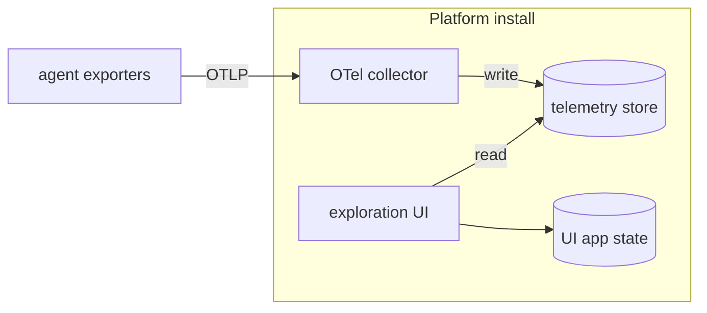

# Observability (agent telemetry)

Last verified: 2026-07-08

## Overview

The telemetry backend is an **optional, bundled subsystem** that receives and stores the OpenTelemetry signals (logs, traces, metrics) agents emit — the substrate for answering *how agents run*: token consumption, cost, per-sub-agent breakdown. This page covers the backend (receiving and storage) and the agent **export** path that feeds it (see [Agent export](#agent-export)); the user-facing read path is a separate concern.

It is implemented with **ClickStack**: a columnar telemetry store (ClickHouse) fronted by an exploration UI (HyperDX), plus a separate document store backing that UI's own application state. Installing or upgrading the platform brings the stack up when it is enabled, but it is **disabled by default** — it is a heavy, multi-pod stack, and until agents are wired to export it would receive nothing, so operators opt in per install.

## Topology and roles

- **Collector** — an OpenTelemetry collector that receives OTLP and writes the signals into the telemetry store. It is platform-owned (deliberately not the collector ClickStack bundles — see *Access control*) and holds no upstream credentials; it only ingests telemetry.
- **Telemetry store** — a columnar analytical database built for high-volume, high-cardinality, time-series telemetry. It is the only place telemetry lives.
- **Exploration UI** — reads the telemetry store directly so an operator can explore signals. Its own application state (dashboards, sources, saved views) lives in a separate document store that holds no telemetry.

The whole stack sits inside the cluster trust boundary.

## Operators are install-time infrastructure

The telemetry store and the UI's app-state store are managed by Kubernetes **operators** driven by custom resources. Like the service mesh and the certificate manager, those operators and their CRDs are installed out-of-band at cluster-install time rather than by the platform chart: Helm never upgrades a chart's CRDs on an existing release, so CRD-owning infrastructure stays outside the chart. The chart ships only the custom resources and the platform-owned collector, which roll with an ordinary platform upgrade.

## Access control: the mesh, not ingestion tokens

ClickStack's default posture secures the collector with an ingestion key the UI issues and manages — application-layer, token-based access control. The platform deliberately does **not** rely on that. The collector is gated the same way as the rest of the platform: by the **service mesh**, through an authorization policy that admits only the platform's own namespaces — the release namespace and the agent namespace — and denies everything else. This keeps telemetry access on the same SPIFFE-principal model as the rest of the system (see [security-and-credentials](security-and-credentials.md)) rather than introducing a parallel token scheme.

Making the mesh the sole gate is why the collector is platform-owned. ClickStack's bundled collector takes its configuration — including the ingestion-key check — dynamically from the exploration UI, so that configuration cannot be the access boundary here. The platform instead runs its own collector with a fixed configuration and no key enforcement. The UI is unaffected: it reads the telemetry store directly, not the collector.

## Agent export

Harnesses produce telemetry by exporting it themselves over OTLP — the platform does not scrape or tap it. Export turns on with the backend: enabling `clickstack.enabled` stands up the collector, the gateway's collector egress chain, and the [trusted attribution](#trusted-attribution) below, and configures the harness to export to the collector. It is wired for the **Claude Code harness only** for now; a per-template `telemetry` flag opts a harness in, so others follow by flipping that flag.

- **Rides the agent's ordinary egress.** The exporter honours the agent's `HTTPS_PROXY`, so telemetry leaves through the paired gateway pod over HTTPS to the bundled collector — the same dedicated, MITM-terminating chain that performs the trusted attribution below. No new network path, and no credential is injected into the export.
- **Config travels the harness env rail.** The OTLP environment (enable flag, per-signal exporters, endpoint, protocol, flush intervals) reaches the harness through the same runtime channel that carries connection env — not a pod-level Secret or env.
- **Signals.** Metrics, logs, and traces (the last via the enhanced-telemetry beta) over OTLP/HTTP. **Content bodies are not exported** — prompt text, tool arguments, and raw API bodies stay off; only structural telemetry (durations, model/tool names, token and cost counters, span shape) leaves the agent.
- **Self-declared identity for exploration.** The export env names the OTel service after the agent's **template** (so a nous agent reads as `nous`, not as the underlying Claude Code CLI's default), and seeds the user-declared agent name as a `platform.agent.name` resource attribute, kept current on rename. Both are exported by the harness itself and exist for finding an instance in the exploration UI — they are **display-only**; attribution rests solely on the gateway-stamped `platform.agent.id` below.
- **Trace-context propagation stays on.** The harness keeps W3C trace-context propagation on even when it fronts a custom model upstream — a case where it would otherwise switch it off — so its subprocesses inherit the session's trace context and its requests carry the `traceparent` header. The gateway's TLS-intercepting chains that see the decrypted header join their spans — and the egress-approval check's api-server spans — to that same trace, so a model request reads as one trace across harness, gateway, and api-server. See [logging — gateway telemetry](logging.md#gateway-telemetry) for which chains are traced and what never reaches a span.

## Platform-service export

The platform's own services emit their operational telemetry through an in-process OpenTelemetry SDK apiece. Enabling the backend sets the standard OTLP endpoint environment on each deployment, pointing straight at the bundled collector over plain HTTP inside the mesh (ztunnel supplies mTLS, and the collector's authorization policy already admits the release namespace); without that endpoint the SDK never activates. Unlike agent telemetry, this export does not ride a gateway: it arrives without the trusted attribution header, so it carries no `platform.agent.id` and is never attributed to a user — which is exactly how the read path distinguishes platform telemetry from agent telemetry.

- The **controller** emits one trace per reconcile pass and background sweep (with spans for each Kubernetes API call), reconcile and workqueue metrics, and its structured logs with trace correlation.
- The **api-server** emits one trace per incoming request with a child span per tRPC procedure (and spans for outbound calls: agents, Keycloak, channels, Redis, the ext-authz gRPC checks), per-procedure duration/outcome metrics plus Node runtime health (event loop, GC, heap), and its structured logs with trace correlation. Health-probe requests are not traced. The primary Postgres pool is not yet instrumented (no driver instrumentation exists for it); that gap is tracked as follow-up work.

## Trusted attribution

Telemetry only answers *whose agents ran, and how* if each record is reliably tied to the agent that produced it — and agents run untrusted code, so the attribution cannot be taken from what the agent put in its own telemetry. It comes instead from the platform-controlled path the telemetry already travels.

Every agent's egress, telemetry included, leaves through its **paired gateway pod**: the agent has no other admitted route (see [security-and-credentials](security-and-credentials.md)), and the gateway proxy's configuration is controller-rendered, not agent-writable. When the telemetry backend is enabled, that gateway proxy intercepts any agent OTLP bound for the collector and stamps a trusted `platform.agent.id` identifying the producing agent — **overwriting** anything the agent set, since the value is fixed in this gateway's own per-agent configuration. The collector then promotes that value to a `platform.agent.id` resource attribute on every signal in the request, and **drops any agent-supplied `platform.agent.id` that did not arrive from the gateway**, so a forged value can never survive.

The guarantee is **attribution, not content integrity**: an agent can still misreport its own numbers (inflate a token count), but it can only ever pollute *its own* telemetry — never make its telemetry appear under another agent or user. The owner-scoped read path resolves `platform.agent.id` to the owning user; telemetry that carries no `platform.agent.id` (the platform's own components) is not agent telemetry and is never attributed to a user. The attribute is namespaced under the permanent `platform` codename so it never collides with OpenTelemetry semantic-convention or agent-self-reported `agent.*` attributes.

## Persistence

The telemetry store is a **fourth durable substrate** beyond the three in [persistence](persistence.md) (Postgres, the Agent/Fork custom resources, the per-Agent PVC), and it sits outside that platform/agent split — neither the agent nor the controller touches it. Both the telemetry data and the UI's app-state persist on operator-managed volumes that survive pod restarts and a chart uninstall; losing those volumes loses telemetry history and nothing else depends on them for correctness. When the subsystem is disabled, none of it exists.

## Relationship to logging and usage-tracking

This subsystem is distinct from two neighbours and does not overlap them:

- [logging](logging.md) owns structured operational logs and the real-identity security audit trail, emitted to stdout.
- [usage-tracking](usage-tracking.md) owns pseudonymized usage analytics in Postgres — an append-only activity log read through SQL views.

Telemetry here is the OpenTelemetry-native, explorable signal pipeline: a different store (columnar, not Postgres), a different shape (OTLP logs/traces/metrics), and a different read surface (the exploration UI). Postgres remains the right home for coarse usage analytics; it cannot serve high-volume telemetry, which is the reason this subsystem exists at all.

See [`deploy/helm/platform/`](../../deploy/helm/platform/) for the chart shape — the `clickstack` values block, and the collector and authorization policy under `templates/clickstack/`.
