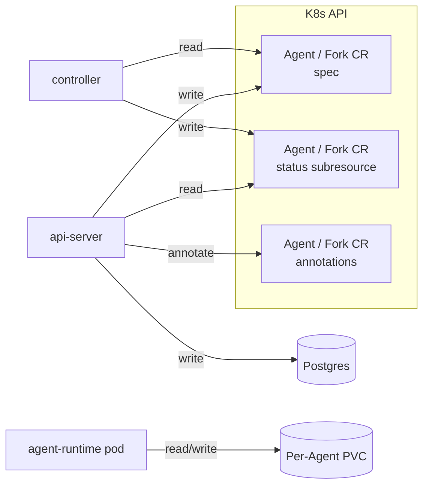

# Persistence

Last verified: 2026-06-22

## Overview

Platform persists state on three durable substrates, split cleanly between the platform and the agent:

**Platform-owned** (the agent never touches these):

- **Postgres** — application state the api-server owns end-to-end. Sole writer: api-server; the controller never reads from or writes to Postgres. Holds anything that has to be queryable when no agent pod is running (channel bindings, identity links, allow-listed users, schedules) plus any other api-server-only domain resource. Session metadata is *not* here — it is agent-owned. The bundled instance runs under three roles — one NOSUPERUSER owner per service (`platform_apiserver`, `platform_keycloak`) plus the bootstrap superuser `platform`, kept as a separate statement-logged role for DBA work — so the api-server's connection credential cannot reach Keycloak's database or escalate.
- **Custom resources** — resource state the controller reconciles into running infrastructure (Agents, Forks), as CRDs with a `spec` / `status` ownership split enforced by the status subresource. Sole writer of `spec`: api-server. Sole writer of `status`: controller.

**Agent-owned**:

- **Per-Agent PVCs** — the workspace and `$HOME` mounted into the agent pod. The agent process reads and writes here freely; it has no direct access to Postgres or to the custom resources that describe it. Persists across hibernation; reclaimed when the Agent is deleted.

**Choosing between Postgres and the K8s API.** A new resource belongs on a CRD iff the controller reconciles it. If only the api-server reads and writes it, it belongs in Postgres. The spec/status single-writer split exists to coordinate api-server and controller; without a controller reader, it has no purpose, and putting api-server-only state on the K8s API is using it as a generic key-value store. An earlier "K8s is the database" framing predates Postgres landing in the platform — the rule above is the refinement that replaced it, carried forward unchanged through the CRD migration. This is why schedules live in Postgres and templates never became a CRD.

The controller and api-server never write the same surface — the status subresource makes the split structural, not conventional. The agent's only durable surface is the PVC; everything the platform knows *about* the agent is mirrored onto Postgres or the Agent CR by the api-server or controller, not by the agent itself.

## Diagram

## Substrates

### Postgres

Postgres carries application state the api-server owns end-to-end — anything that has to be queryable when no agent pod is running, plus any domain resource the controller does not reconcile.

- **channel routing** — bindings between external chat surfaces and the Agent/session they map to. Owned by [channels](channels.md).
- **identity and auth** — links between channel-side identities and platform users, the auth allow-list, and API keys for headless CLI use. Owned by [security-and-credentials](security-and-credentials.md).
- **skills catalog** — connected sources, per-Agent install records, and publish history. Owned by [skills](skills.md).
- **activity log + agent mirror** — append-only event log (`activity_events`), per-sub role flags (`actor_roles`), and the K8s↔Postgres agent ownership mirror (`agents`). Pseudonymized `actor_sub` and `owner_sub` columns at the write boundary. Owned by [usage-tracking](usage-tracking.md).
- **schedules** — RRULE, quiet hours, task payload, session mode, and firing bookkeeping (`schedules`). The api-server's schedule loop fires them; the controller plays no part. Owned by [agent-lifecycle](agent-lifecycle.md).

The api-server is the sole writer for all of it. The controller does not touch Postgres — its bookkeeping lives on the `status` subresource of the custom resources it owns. The authoritative schema and migrations live in [`packages/db/`](../../packages/db/): migrations run automatically on api-server startup — table/index/enum changes generated from the schema, the reporting views hand-written — with the original history squashed to a baseline that fresh installs run and existing deployments skip, and a no-database guard asserting every schema change was generated (workflow in [`packages/db/README.md`](../../packages/db/README.md)).

### Custom resources

Resources the controller reconciles are Kubernetes CRDs under the `agent-platform.ai/v1` API group, each with a status subresource:

| Kind | What it declares | `spec` writer | `status` writer |
|---|---|---|---|
| `Agent` | Agent definition and runtime state: image, mount declarations, env, secret refs, image-pull secret ref, granted secret and connection IDs. The sole resource per Agent — the former template/instance pair was collapsed into it | api-server | controller |
| `Fork` | Forked run: parent Agent ref + overrides | api-server | controller |

Each CR carries strict single-writer ownership, made structural by the status subresource rather than held by convention:

- **`spec`** — user intent. Written exclusively by the api-server and validated by the K8s API server at admission against the CRD schema; the controller consumes typed objects without re-validating shape. Cross-field and referential rules stay application logic.
- **`status`** — observed state, written exclusively by the controller through the status subresource. Conditions are the source of truth (`Ready`, `AgentPodReady`, `GatewayPodReady`, `Reconciled`); `Ready` is the agent-and-gateway pod intersection and the api-server's sole routing signal.

There is no stored desired state — the former `desiredState` latch is eliminated. Wake is a one-off activity poke, the controller hibernates on idleness, and running-vs-hibernated is recorded as observed status; see [agent-lifecycle](agent-lifecycle.md).

High-frequency, out-of-band signals live on **annotations** rather than `status`, so they are independently patchable without a spec or status write: the last-activity timestamp and active-session marker that drive hibernation, and the roll trigger the api-server bumps to force a rolling restart of the pair. Connection and secret grants are intent and moved from annotations into `spec`. (Credential `env` rides the runtime channel; see [connections.md](connections.md).)

Two domain resources are deliberately not CRDs:

- **Templates** stay ConfigMaps — chart-rendered, read-only blueprints copied into an Agent at create time, never reconciled, loaded by the api-server at boot.
- **Schedules** live in Postgres — only the api-server reads and writes them (see the Postgres/K8s rule above).

### Per-Agent PVCs

Each `agent` reconciles into a StatefulSet whose `volumeClaimTemplates` are derived from the Agent's declared mounts. A mount marked `persist: true` becomes a PVC; a non-persisted mount becomes an `emptyDir` that dies with the pod. PVCs are `ReadWriteMany` so the workspace can be shared concurrently between the Agent's original owner and a foreign user running a fork against it — both pods mount the same volume at the same time.

The default Claude Code template persists the workspace and `$HOME`. Together these hold:

- the **workspace** itself — git checkouts, tool caches (`node_modules`, `.venv`, mise), and any artifacts the agent has produced.
- **`$HOME`** — agent memory, skills, MCP server caches, and the harness's on-disk session store. The session store is the cold-start source for `session/load` after a pod restart. The agent-runtime's `.platform/` directory lives here too, holding the **session-metadata state file** — the platform's sole source of truth for per-session mode, type, `scheduleId`, `threadTs`, and `createdAt`, surfaced over ACP `_meta.platform` — alongside the trigger-binding and runtime-channel state files.
- **`.import-staging-*/`** — transient extraction directories used by the bundled file-import path before entries are merged into `<homeDir>/work`. Orphaned staging dirs from crashed imports are reclaimed by an agent-runtime boot sweeper; see [platform-topology](platform-topology.md).

PVCs survive hibernation — when a StatefulSet scales to zero replicas, the volume detaches but is retained. The controller explicitly deletes PVCs on Agent deletion (the standard StatefulSet behavior is to retain them to prevent data loss; Platform opts back into reclamation because Agent deletion is intentional).

What does **not** survive hibernation: anything written to the container's ephemeral filesystem outside the persisted mounts — OS-level changes, packages installed at runtime, files in `/tmp`. Tools and dependencies the agent relies on must be baked into the image at build time.

### Warm PVC pool

First-start provisioning of a workspace PVC is slow on production storage — tens of seconds to minutes — because the volume is allocated on demand when the first pod mounts it. To hide that latency the controller can keep a **warm pool**: a background buffer of pre-provisioned, already-bound spare PVCs, organized into per-workspace-size pools, that a newly created Agent claims instantly instead of waiting. The buffer refills in the background and is operator-tunable; it is disabled by default.

A spare only helps if it holds real storage while idle, so pool PVCs use an **immediate-binding** StorageClass — the agents' own class defers allocation until mount, which would leave a pre-created spare empty. At create time, for each persisted mount whose size matches a configured pool, the controller claims one spare and mounts it by name rather than through the StatefulSet's `volumeClaimTemplate`; a mount with no matching pool, or an exhausted pool, falls back to on-demand provisioning so Agent creation never blocks.

Claimed-versus-spare is tracked entirely by labels: an unclaimed spare carries a pool label but **no owning-agent label**, so the orphan-PVC sweep — which acts only on agent-labeled PVCs — leaves it untouched. On claim the controller stamps the agent label and removes the available marker in one atomic update; from that point the volume is an ordinary per-Agent PVC, reclaimed on Agent deletion and reattached on wake. The claim decision is made once at create and reconstructed from the live StatefulSet on every later reconcile, so it survives hibernate/wake without ever re-rendering the pod's volumes — even if the claimed volume is deleted out-of-band, the agent keeps referencing it by name rather than degrading to a mount with no backing volume.

## Lifetime

| Event | Postgres | Agent CR (spec/status) | PVC |
|---|---|---|---|
| Pod restart | survives | survives | survives |
| Hibernate (replicas → 0) | survives | survives | survives |
| Wake (replicas → 1) | survives | survives | survives |
| api-server restart | survives | survives | survives |
| Controller restart | survives | survives | survives |
| Agent delete | agent row marked deleted by api-server | CR removed | PVCs removed by controller |
| Schedule delete | schedule row removed | n/a | n/a |

Schedules are independent Postgres rows and survive Agent deletion as orphans unless the deletion path explicitly cascades. Sessions are agent-owned files on the PVC, not Postgres rows — they follow the PVC column, not this one.

Unclaimed warm-pool spares are not tied to any Agent and so are absent from this table — the pool manager reclaims them when it trims a pool below its inventory or when their size pool is removed, never via Agent deletion. Once claimed, a spare follows the PVC column above.

An Agent created on a private custom image carries an agent-scoped image-pull Secret that follows the Agent itself: the api-server writes it at create and removes it on delete (a delete-time cleanup hook, with a label-scoped orphan sweep as backstop). This is the opposite of the owner-scoped credential Secrets the gateway injects for egress, which are reusable across an owner's Agents and outlive any single one. The mechanism and trust boundary live on [security-and-credentials](security-and-credentials.md#image-pull-credentials).

## Security boundary

The PVC is a **shared mutable surface across every session, trigger, fork, and channel-driven prompt that runs on the same Agent.** Anything written into the workspace by one turn — model output saved to disk, tool output, files fetched from upstream — is plain context for the next turn. Treat workspace contents as adversarial input. A scheduled job can plant a file that prompt-injects a later user-driven session; a Slack-driven prompt can leak its instructions through residue left on disk.

The platform does not sandbox writes within the workspace. Mitigations live elsewhere: NetworkPolicy restricts which upstreams the agent can reach (the agent pod can only dial its paired gateway pod, never an upstream directly), the gateway pod gates credentialed egress, and forks let you run with a narrowed credential set without polluting the parent's workspace. The threat model and credential isolation are detailed on [security-and-credentials](security-and-credentials.md).
