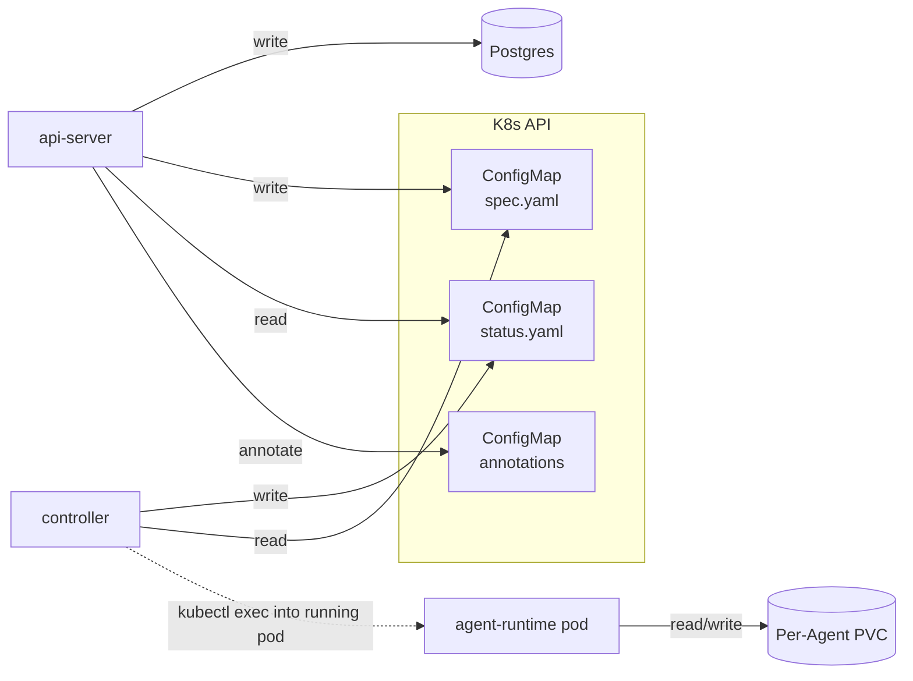

# Persistence

Last verified: 2026-06-09

## Motivated by

- [ADR-001 — Ephemeral containers + persistent workspace volumes](../adrs/001-ephemeral-containers.md) — agents are stateless processes; their state lives on PVCs that outlive the pod
- [ADR-006 — ConfigMaps over CRDs](../adrs/006-configmaps-over-crds.md) — domain resources are namespace-scoped ConfigMaps with a single-writer-per-key split
- [ADR-055 — Agent-owned session metadata](../adrs/055-agent-owned-session-metadata.md) — sessions are owned by the agent and carried over ACP `_meta.platform`; Postgres holds no session state (supersedes [ADR-017](../adrs/017-db-backed-sessions.md))
- [ADR-046 — Eliminate Instance, collapse into Agent](../adrs/046-eliminate-instance.md) — the merged `agent` ConfigMap is the sole resource per Agent and carries both `spec.yaml` and `status.yaml`
- [ADR-8 — Usage tracking with pseudonymized identifiers](../adrs/048-usage-tracking.md) — append-only activity log + agent mirror table, with HMAC-pseudonymized `sub` values at the write boundary
- [ADR-061 — Warm PVC pool](../adrs/061-warm-pvc-pool.md) — pre-provisioned, size-keyed spare workspace volumes claimed at create time to skip first-start provisioning latency
- [ADR-063 — Generated table migrations, hand-written views, squashed baseline](../adrs/063-hand-written-migrations.md) — table changes are generated from the schema, the reporting views are hand-written; the history is squashed to a baseline that existing deployments skip, with a no-database guard asserting every schema change was generated

## Overview

Platform persists state on three durable substrates, split cleanly between the platform and the agent:

**Platform-owned** (the agent never touches these):

- **Postgres** — application state the api-server owns end-to-end. Sole writer: api-server; the controller never reads from or writes to Postgres. Holds anything that has to be queryable when no agent pod is running (channel bindings, identity links, allow-listed users) plus any other api-server-only domain resource. Session metadata is *not* here — it is agent-owned ([ADR-055](../adrs/055-agent-owned-session-metadata.md)).
- **ConfigMaps** — resource state the controller reconciles into running infrastructure (templates, agents, schedules, forks), with a `spec.yaml` / `status.yaml` ownership split. Sole writer of `spec.yaml`: api-server. Sole writer of `status.yaml`: controller.

**Agent-owned**:

- **Per-Agent PVCs** — the workspace and `$HOME` mounted into the agent pod. The agent process reads and writes here freely; it has no direct access to Postgres or to the ConfigMaps that describe it. Persists across hibernation; reclaimed when the Agent is deleted.

**Choosing between Postgres and ConfigMaps.** A new resource belongs on a ConfigMap iff the controller reconciles it. If only the api-server reads and writes it, it belongs in Postgres. The spec/status single-writer split exists to coordinate api-server and controller; without a controller reader, it has no purpose, and putting api-server-only state on a ConfigMap is using the K8s API as a generic key-value store. ADR-006's "K8s is the database" framing predates Postgres landing in the platform — the rule above is the post-[ADR-017](../adrs/017-db-backed-sessions.md) refinement.

The controller and api-server never share writes on the same key — write contention is impossible by convention rather than by lock. The agent's only durable surface is the PVC; everything the platform knows *about* the agent is mirrored onto Postgres or a ConfigMap by the api-server or controller, not by the agent itself.

## Diagram

## Substrates

### Postgres

Postgres carries application state the api-server owns end-to-end — anything that has to be queryable when no agent pod is running, plus any domain resource the controller does not reconcile.

- **channel routing** — bindings between external chat surfaces and the Agent/session they map to. Owned by [channels](channels.md).
- **identity and auth** — links between channel-side identities and platform users, plus the auth allow-list. Owned by [security-and-credentials](security-and-credentials.md).
- **skills catalog** — connected sources, per-Agent install records, and publish history. Owned by [skills](skills.md).
- **activity log + agent mirror** — append-only event log (`activity_events`), per-sub role flags (`actor_roles`), and the K8s↔Postgres agent ownership mirror (`agents`). Pseudonymized `actor_sub` and `owner_sub` columns at the write boundary. Owned by [usage-tracking](usage-tracking.md).

The api-server is the sole writer for all of it. The controller does not touch Postgres — its bookkeeping lives on `status.yaml` of the ConfigMap it owns. The authoritative schema and migrations live in [`packages/db/`](../../packages/db/): migrations run automatically on api-server startup — table/index/enum changes generated from the schema, the reporting views hand-written — with the original history squashed to a baseline that fresh installs run and existing deployments skip, and a no-database guard asserting every schema change was generated ([ADR-063](../adrs/063-hand-written-migrations.md); workflow in [`packages/db/README.md`](../../packages/db/README.md)).

### ConfigMaps

Resources the controller reconciles are labeled ConfigMaps ([ADR-006](../adrs/006-configmaps-over-crds.md)). Four types after [ADR-046](../adrs/046-eliminate-instance.md) collapsed the former `agent` (template) + `agent-instance` (instance) pair into a single `agent` CM that owns both definition and runtime state, distinguished by `platform.ai/type`:

| Type | What it declares | `spec.yaml` writer | `status.yaml` writer |
|---|---|---|---|
| `template` | Template: image, command, default env, mount declarations, injection rules (read-only blueprint copied into an Agent at create time) | api-server | (no status — templates are not reconciled) |
| `agent` | Agent: image / mount declarations, env, secret refs, allowed users, `desiredState`. **Both** `spec.yaml` (api-server) **and** `status.yaml` (controller) live on this single CM — there is no longer a separate "instance" CM where status lives | api-server | controller |
| `agent-schedule` | Schedule: RRULE, quiet hours, task payload, session mode | api-server | controller |
| `agent-fork` | Forked run: parent Agent ref + overrides | api-server | controller |

The single-writer split for the merged `agent` CM is the same `spec.yaml` / `status.yaml` pattern used elsewhere — what changed in ADR-046 is that the runtime state (`status.yaml`, plus the high-frequency annotations) now lives on the **same** ConfigMap as the definition, rather than on a paired `agent-instance` CM. The `inst-` ID prefix retires; the merged Agent uses `agent-` as the sole ID prefix.

Each reconciled ConfigMap carries two `data` keys with strict single-writer ownership:

- **`spec.yaml`** — user intent. Written exclusively by the api-server.
- **`status.yaml`** — observed state and scheduler bookkeeping (next fire, last fire, error). Written exclusively by the controller.

High-frequency, lightweight metadata (heartbeats, activity timestamps, `granted-secret-ids`, `granted-connection-ids`, `last-activity`) lives on **annotations** rather than `status.yaml` to avoid rewriting the spec/status payload on every update. (Credential `env` no longer has a `secrets-rev` annotation — it rides the runtime channel; see [connections.md](connections.md) and ADR-DRAFT.)

ConfigMaps were chosen over CRDs so that Platform installs without cluster-admin — the schema maps directly onto a CRD spec if the constraint ever lifts. There is no schema validation at the K8s API layer; both the api-server (on write) and the controller (on read) validate in application code.

### Per-Agent PVCs

Each `agent` reconciles into a StatefulSet whose `volumeClaimTemplates` are derived from the Agent's declared mounts ([ADR-001](../adrs/001-ephemeral-containers.md)). A mount marked `persist: true` becomes a PVC; a non-persisted mount becomes an `emptyDir` that dies with the pod. PVCs are `ReadWriteMany` so the workspace can be shared concurrently between the Agent's original owner and a foreign user running a fork against it — both pods mount the same volume at the same time.

The default Claude Code template persists the workspace and `$HOME`. Together these hold:

- the **workspace** itself — git checkouts, tool caches (`node_modules`, `.venv`, mise), and any artifacts the agent has produced.
- **`$HOME`** — agent memory, skills, MCP server caches, and the harness's on-disk session store. The session store is the cold-start source for `session/load` after a pod restart. The agent-runtime's `.platform/` directory lives here too, holding the **session-metadata state file** — the platform's sole source of truth for per-session mode, type, `scheduleId`, `threadTs`, and `createdAt`, surfaced over ACP `_meta.platform` ([ADR-055](../adrs/055-agent-owned-session-metadata.md)) — alongside the trigger-binding and runtime-channel state files.
- **`.triggers/`** — pending trigger payloads. The controller delivers each payload via `kubectl exec` into the *running* pod, which writes the file onto its mounted PVC; the controller itself never mounts the volume. The pod must therefore be awake before delivery, and the schedule loop wakes it first if it is hibernated (see [agent-lifecycle](agent-lifecycle.md)).
- **`.import-staging-*/`** — transient extraction directories used by the bundled file-import path before entries are merged into `<homeDir>/work`. Orphaned staging dirs from crashed imports are reclaimed by an agent-runtime boot sweeper; see [platform-topology](platform-topology.md).

PVCs survive hibernation — when a StatefulSet scales to zero replicas, the volume detaches but is retained. The controller explicitly deletes PVCs on Agent deletion (the standard StatefulSet behavior is to retain them to prevent data loss; Platform opts back into reclamation because Agent deletion is intentional).

What does **not** survive hibernation: anything written to the container's ephemeral filesystem outside the persisted mounts — OS-level changes, packages installed at runtime, files in `/tmp`. Tools and dependencies the agent relies on must be baked into the image at build time.

### Warm PVC pool

First-start provisioning of a workspace PVC is slow on production storage — tens of seconds to minutes — because the volume is allocated on demand when the first pod mounts it. To hide that latency the controller can keep a **warm pool**: a background buffer of pre-provisioned, already-bound spare PVCs, organized into per-workspace-size pools, that a newly created Agent claims instantly instead of waiting ([ADR-061](../adrs/061-warm-pvc-pool.md)). The buffer refills in the background and is operator-tunable; it is disabled by default.

A spare only helps if it holds real storage while idle, so pool PVCs use an **immediate-binding** StorageClass — the agents' own class defers allocation until mount, which would leave a pre-created spare empty. At create time, for each persisted mount whose size matches a configured pool, the controller claims one spare and mounts it by name rather than through the StatefulSet's `volumeClaimTemplate`; a mount with no matching pool, or an exhausted pool, falls back to on-demand provisioning so Agent creation never blocks.

Claimed-versus-spare is tracked entirely by labels: an unclaimed spare carries a pool label but **no owning-agent label**, so the orphan-PVC sweep — which acts only on agent-labeled PVCs — leaves it untouched. On claim the controller stamps the agent label and removes the available marker in one atomic update; from that point the volume is an ordinary per-Agent PVC, reclaimed on Agent deletion and reattached on wake. The claim decision is made once at create and reconstructed from the live StatefulSet on every later reconcile, so it survives hibernate/wake without ever re-rendering the pod's volumes — even if the claimed volume is deleted out-of-band, the agent keeps referencing it by name rather than degrading to a mount with no backing volume.

## Lifetime

| Event | Postgres | ConfigMap (spec/status) | PVC |
|---|---|---|---|
| Pod restart | survives | survives | survives |
| Hibernate (replicas → 0) | survives | survives | survives |
| Wake (replicas → 1) | survives | survives | survives |
| api-server restart | survives | survives | survives |
| Controller restart | survives | survives | survives |
| Agent delete | session rows removed by api-server | ConfigMap removed | PVCs removed by controller |
| Schedule delete | session rows optionally removed (UI checkbox) | ConfigMap removed | n/a |

Schedules are independent ConfigMaps and survive Agent deletion as orphans unless the deletion path explicitly cascades. Sessions linked to a deleted schedule are kept by default; the UI offers a checkbox to remove them with the schedule.

Unclaimed warm-pool spares are not tied to any Agent and so are absent from this table — the pool manager reclaims them when it trims a pool below its inventory or when their size pool is removed, never via Agent deletion. Once claimed, a spare follows the PVC column above.

## Security boundary

The PVC is a **shared mutable surface across every session, trigger, fork, and channel-driven prompt that runs on the same Agent.** Anything written into the workspace by one turn — model output saved to disk, tool output, files fetched from upstream — is plain context for the next turn. Treat workspace contents as adversarial input. A scheduled job can plant a file that prompt-injects a later user-driven session; a Slack-driven prompt can leak its instructions through residue left on disk.

The platform does not sandbox writes within the workspace. Mitigations live elsewhere: NetworkPolicy restricts which upstreams the agent can reach (the agent pod can only dial its paired gateway pod, never an upstream directly — [ADR-038](../adrs/038-paired-gateway-pod.md)), the gateway pod gates credentialed egress, and forks let you run with a narrowed credential set without polluting the parent's workspace. The threat model and credential isolation are detailed on [security-and-credentials](security-and-credentials.md).
