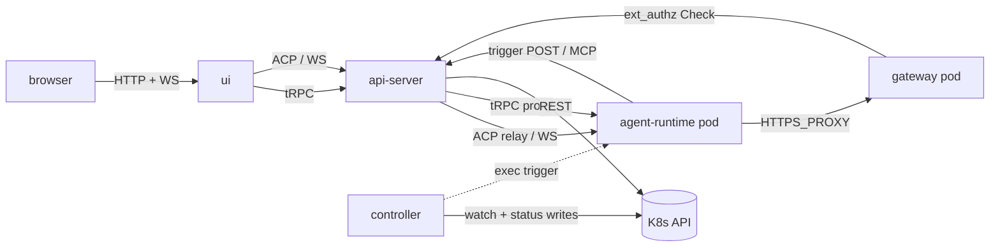

# Platform topology

Last verified: 2026-05-12

## Motivated by

- [ADR-001 — Ephemeral containers + persistent workspace volumes](../adrs/001-ephemeral-containers.md) — agent pods are stateless; state lives in PVCs
- [ADR-003 — Kubernetes from the start](../adrs/003-k8s-from-the-start.md) — k3s for local dev, K8s for production
- [ADR-004 — ACP over A2A](../adrs/004-acp-over-a2a.md) — Agent Client Protocol for client↔agent traffic
- [ADR-007 — ACP relay](../adrs/007-acp-relay.md) — all ACP traffic is proxied through the api-server
- [ADR-009 — Go for controller, TypeScript for api-server](../adrs/009-go-and-typescript.md) — language split and its rationale
- [ADR-012 — Runtime lifetime](../adrs/012-runtime-lifetime.md) — single-use spawn/hibernate model
- [ADR-022 — Harness API server](../adrs/022-harness-api-server.md) — separate port with a restricted, internal-only surface
- [ADR-023 — Harness-agnostic agent base image](../adrs/023-harness-agnostic-base-image.md) — fixed-path harness-script contract
- [ADR-037 — Remote terminal: split chat and terminal session modes](../adrs/037-remote-terminal.md) — sessions carry a mode; agent-runtime relays chat over ACP and terminal over a PTY
- [ADR-033 — Envoy-based credential gateway](../adrs/033-envoy-credential-gateway.md) — Envoy is the credential gateway; mounts owner-labelled K8s Secrets and injects credentials on the wire
- [ADR-038 — Paired agent and gateway pods](../adrs/038-paired-gateway-pod.md) — agent and gateway run in two paired pods per instance
- [ADR-041 — Istio ambient mesh](../adrs/041-istio-ambient-mesh.md) — SPIFFE identity for every internal hop; replaces the pair-key NetworkPolicy and the trusted `x-platform-instance` header

## Overview

Platform runs as four long-lived subsystems on Kubernetes: a Go **controller** that reconciles ConfigMap-declared resources, a TypeScript **api-server** that brokers user requests and relays agent traffic, per-instance paired **agent-runtime** + **gateway** pods that host the agent process and its egress proxy, and a React **ui** served by the api-server. The controller and api-server never talk to each other directly — they coordinate through the K8s API, using a `spec.yaml` / `status.yaml` split on each ConfigMap so that writes never contend.

## Diagram

## Components

### controller

A stateless Go reconciler built on client-go. It watches ConfigMaps labelled `platform.ai/type` (template, instance, schedule, fork), reconciles the StatefulSet, Service, NetworkPolicy, and per-agent Secret for each instance, runs the schedule loop, and delivers trigger files to agent pods via `exec` (see [ADR-008](../adrs/008-trigger-files.md)). The controller writes only `status.yaml` on owned ConfigMaps; it never writes `spec.yaml`. See [`packages/controller/`](../../packages/controller/).

### api-server

A TypeScript server that hosts the user-facing surface and the ACP relay. It runs two listeners ([ADR-022](../adrs/022-harness-api-server.md)):

- **Public port** — user-authenticated tRPC, REST (OAuth callbacks, health, version), and the ACP relay WebSocket. The `version` endpoint is unauthenticated and powers the CLI's compatibility-floor check ([cli.md](cli.md)).
- **Harness port** — an internal-only endpoint consumed by agent pods for trigger handoff and MCP tool calls. Not exposed outside the cluster and carries no user authentication.

The api-server proxies all ACP traffic to agent pods; clients never dial pods directly. It also wakes hibernated instances on demand before forwarding the first message of a session. Both the ACP relay and the tRPC proxy verify the user JWT and ownership at the public port and rewrite `Authorization` to the per-agent runtime token before forwarding — agent-runtime never sees user identity directly. See [security-and-credentials](security-and-credentials.md) and [`packages/api-server/`](../../packages/api-server/).

The public port also accepts streamed bundled file imports per instance and proxies them to the target agent-runtime without buffering — ownership-checked and size-capped at the proxy boundary.

### agent-runtime

The per-instance pod that runs the ACP WebSocket server and spawns the underlying agent binary via the harness-script contract ([ADR-023](../adrs/023-harness-agnostic-base-image.md), [ADR-037](../adrs/037-remote-terminal.md)). Its responsibilities are:

- Accept one ACP WebSocket connection (relayed from the api-server) and speak JSON-RPC 2.0 to the agent process. Chat-mode sessions spawn `/usr/local/bin/harness-chat` as the ACP subprocess.
- Accept terminal-mode WebSocket connections on `/api/terminal` (relayed from the api-server). Each session gets a PTY running `/usr/local/bin/harness-terminal`; agent-runtime relays a binary input/output/resize frame protocol both ways and serializes scrollback so a refresh within a 30 s grace window reattaches.
- Watch a well-known trigger directory and forward scheduled triggers to the api-server's harness port.
- Expose a scoped tRPC router (via the api-server's tRPC proxy) for in-pod file operations surfaced to the UI.
- Hold an SSE connection to the api-server's pod-files endpoint and materialize declarative file state under the agent's HOME — currently `~/.config/gh/hosts.yml` for granted GitHub Enterprise app connections, more producers might come. Refuses paths outside HOME (defense-in-depth) and skips the loop when `PLATFORM_POD_FILES_EVENTS_URL` is unset (forks).
- Accept bundled file imports on the harness port — extract the tarball to a staging directory on the per-instance PVC, then `rm`+`rename` each top-level entry into `<homeDir>/work` (top-level folders are atomic units; unrelated existing top-level entries in `work/` survive). One import per instance at a time; a boot sweeper reclaims staging dirs orphaned by crashes (see [persistence](persistence.md)).

The agent-runtime pod holds zero credential Secrets and has no admitted route to TCP 80/443 except its paired gateway pod ([ADR-038](../adrs/038-paired-gateway-pod.md)). Its `HTTPS_PROXY` value is the per-instance gateway Service DNS, but the value is decorative — Kubernetes admits no other route. See [`packages/agent-runtime/`](../../packages/agent-runtime/) and [`packages/agent-runtime-api/`](../../packages/agent-runtime-api/).

### gateway

A per-instance Envoy pod paired with the agent-runtime pod ([ADR-038](../adrs/038-paired-gateway-pod.md)). Mounts the owner's credential Secrets, the cert-manager-issued leaf TLS material, and the rendered Envoy bootstrap ConfigMap. Terminates the agent's egress TLS, injects credentials on the wire, and gates each credentialed request through the api-server's ext_authz handler. NetworkPolicy admits ingress only from the paired agent pod and egress only to upstream services, the api-server's ext_authz port, and DNS. See [security-and-credentials](security-and-credentials.md).

### ui

A React + Vite single-page app served by the api-server. It uses tRPC over HTTP for resource management and permission flows, and opens one ACP WebSocket per active session for bidirectional agent communication. Permission prompts, tool calls, and streaming output all flow over the same ACP connection. See [`packages/ui/`](../../packages/ui/).

## Protocols

| Edge | Protocol | Purpose |
|------|----------|---------|
| ui → api-server (`<rel>-apiserver`) | tRPC over HTTP | CRUD on templates, instances, schedules, sessions |
| ui → api-server | WebSocket (ACP, JSON-RPC 2.0) | Live chat session, permission prompts, streaming output |
| ui → api-server | WebSocket (binary terminal frames) | Live terminal session — input / output / resize / exit, see [ADR-037](../adrs/037-remote-terminal.md) |
| api-server → agent-runtime | WebSocket (ACP, JSON-RPC 2.0) | Chat-mode relay target — one hop, no fan-out |
| api-server → agent-runtime | WebSocket (binary terminal frames) | Terminal-mode relay target — one hop, single client per session |
| api-server → agent-runtime | HTTP (tRPC proxy) | In-pod file operations surfaced to the UI |
| ui → api-server → agent-runtime | HTTP (multipart, streamed) | Bundled file import — single streamed roundtrip, no buffering on the relay; per-file merge into `<homeDir>/work` |
| agent-runtime → api-server (`<rel>-apiserver-harness`, via paired gateway → Istio waypoint) | HTTP | MCP tool access, pod-files SSE, `/api/instances/:id/internal/trigger` (ADR-041) |
| gateway → api-server (`<rel>-extauthz-<id>`) | gRPC | HITL ext_authz Check; per-instance Service pinned by AuthorizationPolicy to the gateway's SA principal (ADR-041) |
| controller → K8s API | watch / list / write | Resource reconciliation and status writes |
| api-server → K8s API | REST | Resource CRUD, spec writes, pod wake |
| controller → agent-runtime | K8s `exec` | Atomic trigger-file delivery |

ACP frames are JSON-RPC 2.0, one logical message per WebSocket frame.

## K8s resource model

Platform models all of its domain state as ConfigMaps labelled `platform.ai/type` ([ADR-006](../adrs/006-configmaps-over-crds.md)). Each ConfigMap carries two keys:

- `spec.yaml` — user intent. Owned exclusively by the api-server.
- `status.yaml` — observed state and scheduler bookkeeping. Owned exclusively by the controller.

| `platform.ai/type` | Purpose |
|---|---|
| `agent` | Template: image, command, default env, injection rules |
| `agent-instance` | Instance desired state: template ref, skills, env overrides, secret refs |
| `agent-schedule` | Schedule: cron or RRULE, quiet hours, task payload, session mode |
| `agent-fork` | Forked run: parent instance ref + overrides |

For each `agent-instance`, the controller reconciles **two paired StatefulSets** (agent + gateway, both at replicas 0 when hibernated and 1 when running), **two pair-scoped Services** (agent's ACP and the gateway's `<instance>-gateway` proxy DNS), a **per-instance ServiceAccount** (in the agent ns), a **per-instance ext-authz Service** (`<release>-extauthz-<id>`, in the release ns), **three per-instance Istio AuthorizationPolicies** (gateway admission, harness path-prefix at the waypoint, ext-authz Service principal), and a per-instance Envoy bootstrap ConfigMap + leaf-TLS Certificate ([ADR-033](../adrs/033-envoy-credential-gateway.md), [ADR-038](../adrs/038-paired-gateway-pod.md), [ADR-041](../adrs/041-istio-ambient-mesh.md)). ConfigMaps are chosen over CRDs for the domain types so Platform installs without cluster-admin; the controller does need write access to ServiceAccounts and Istio AuthorizationPolicies. See [`deploy/helm/platform/templates/`](../../deploy/helm/platform/templates/) for the install layout.

## Invariants

- **Spec/status ownership.** Controller never writes `spec.yaml`; api-server never writes `status.yaml`. Write contention between the two is impossible by convention.
- **Relay-only ACP.** All ACP traffic is proxied through the api-server. Agent pods do not accept ACP connections from outside the cluster and the UI never dials pods directly.
- **Two-port api-server.** The public port is user-authenticated; the harness port is cluster-internal and has no user authentication. They do not share routes.
- **Credential isolation.** Agent pods never hold real upstream credentials. The paired gateway pod intercepts agent TLS using a per-instance leaf cert and injects the credential header from a K8s Secret mounted only on the gateway — the agent pod has no path to TCP 80/443 except through the paired gateway ([ADR-033](../adrs/033-envoy-credential-gateway.md), [ADR-038](../adrs/038-paired-gateway-pod.md)). See [security-and-credentials](security-and-credentials.md).
- **SPIFFE identity per hop.** Three mesh hops, each gated by a per-instance Istio AuthorizationPolicy: (1) agent → gateway on the CONNECT proxy port, (2) gateway → harness via the waypoint (all agent egress traverses the paired gateway pod's Envoy, including the harness call), (3) gateway → ext-authz on the per-instance ext-authz Service. The waypoint-fronted harness Service enforces principal == URL `:id`; per-instance ext-authz Services enforce principal == matching SA ([ADR-041](../adrs/041-istio-ambient-mesh.md)). For long-lived pairs both pods share the per-instance SA, so the gateway hop is identity-equivalent to the agent. No app-layer header conveys identity.
- **Atomic triggers.** Trigger files are delivered via write-temp + rename so the agent's trigger watcher never reads a partial file.
