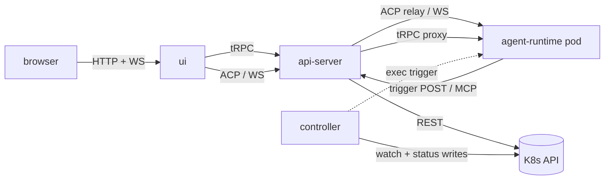

# Platform topology

Last verified: 2026-04-28

## Motivated by

- [ADR-001 — Ephemeral containers + persistent workspace volumes](../adrs/001-ephemeral-containers.md) — agent pods are stateless; state lives in PVCs
- [ADR-003 — Kubernetes from the start](../adrs/003-k8s-from-the-start.md) — k3s for local dev, K8s for production
- [ADR-004 — ACP over A2A](../adrs/004-acp-over-a2a.md) — Agent Client Protocol for client↔agent traffic
- [ADR-007 — ACP relay](../adrs/007-acp-relay.md) — all ACP traffic is proxied through the api-server
- [ADR-009 — Go for controller, TypeScript for api-server](../adrs/009-go-and-typescript.md) — language split and its rationale
- [ADR-012 — Runtime lifetime](../adrs/012-runtime-lifetime.md) — single-use spawn/hibernate model
- [ADR-022 — Harness API server](../adrs/022-harness-api-server.md) — separate port with a restricted, internal-only surface
- [ADR-023 — Harness-agnostic agent base image](../adrs/023-harness-agnostic-base-image.md) — `AGENT_COMMAND` contract
- [ADR-033 — Envoy-based credential gateway](../adrs/033-envoy-credential-gateway.md) — per-pod Envoy sidecar that mounts owner-labelled K8s Secrets and injects credentials on the wire

## Overview

Platform runs as four long-lived subsystems on Kubernetes: a Go **controller** that reconciles ConfigMap-declared resources, a TypeScript **api-server** that brokers user requests and relays agent traffic, per-instance **agent-runtime** pods that host the agent process, and a React **ui** served by the api-server. The controller and api-server never talk to each other directly — they coordinate through the K8s API, using a `spec.yaml` / `status.yaml` split on each ConfigMap so that writes never contend.

## Diagram

## Components

### controller

A stateless Go reconciler built on client-go. It watches ConfigMaps labelled `platform.ai/type` (template, instance, schedule, fork), reconciles the StatefulSet, Service, NetworkPolicy, and per-agent Secret for each instance, runs the schedule loop, and delivers trigger files to agent pods via `exec` (see [ADR-008](../adrs/008-trigger-files.md)). The controller writes only `status.yaml` on owned ConfigMaps; it never writes `spec.yaml`. See [`packages/controller/`](../../packages/controller/).

### api-server

A TypeScript server that hosts the user-facing surface and the ACP relay. It runs two listeners ([ADR-022](../adrs/022-harness-api-server.md)):

- **Public port** — user-authenticated tRPC, REST (OAuth callbacks, health), and the ACP relay WebSocket.
- **Harness port** — an internal-only endpoint consumed by agent pods for trigger handoff and MCP tool calls. Not exposed outside the cluster and carries no user authentication.

The api-server proxies all ACP traffic to agent pods; clients never dial pods directly. It also wakes hibernated instances on demand before forwarding the first message of a session. Both the ACP relay and the tRPC proxy verify the user JWT and ownership at the public port and rewrite `Authorization` to the per-agent runtime token before forwarding — agent-runtime never sees user identity directly. See [security-and-credentials](security-and-credentials.md) and [`packages/api-server/`](../../packages/api-server/).

### agent-runtime

The per-instance pod that runs the ACP WebSocket server and spawns the underlying agent binary via the `AGENT_COMMAND` contract ([ADR-023](../adrs/023-harness-agnostic-base-image.md)). Its responsibilities are:

- Accept one ACP WebSocket connection (relayed from the api-server) and speak JSON-RPC 2.0 to the agent process.
- Watch a well-known trigger directory and forward scheduled triggers to the api-server's harness port.
- Expose a scoped tRPC router (via the api-server's tRPC proxy) for in-pod file operations surfaced to the UI.
- Hold an SSE connection to the api-server's pod-files endpoint and materialize declarative file state under the agent's HOME — currently `~/.config/gh/hosts.yml` for granted GitHub Enterprise app connections, more producers might come. Refuses paths outside HOME (defense-in-depth) and skips the loop when `PLATFORM_POD_FILES_EVENTS_URL` is unset (forks).

See [`packages/agent-runtime/`](../../packages/agent-runtime/) and [`packages/agent-runtime-api/`](../../packages/agent-runtime-api/).

### ui

A React + Vite single-page app served by the api-server. It uses tRPC over HTTP for resource management and permission flows, and opens one ACP WebSocket per active session for bidirectional agent communication. Permission prompts, tool calls, and streaming output all flow over the same ACP connection. See [`packages/ui/`](../../packages/ui/).

## Protocols

| Edge | Protocol | Purpose |
|------|----------|---------|
| ui → api-server | tRPC over HTTP | CRUD on templates, instances, schedules, sessions |
| ui → api-server | WebSocket (ACP, JSON-RPC 2.0) | Live session, permission prompts, streaming output |
| api-server → agent-runtime | WebSocket (ACP, JSON-RPC 2.0) | Relay target — one hop, no fan-out |
| api-server → agent-runtime | HTTP (tRPC proxy) | In-pod file operations surfaced to the UI; the agent pod's NetworkPolicy admits this hop only from the api-server pod, so no in-process auth check is needed |
| agent-runtime → api-server | HTTP (harness port) | Trigger receipt + MCP tool access |
| controller → K8s API | watch / list / write | Resource reconciliation and status writes |
| api-server → K8s API | REST | Resource CRUD, spec writes, pod wake |
| controller → agent-runtime | K8s `exec` | Atomic trigger-file delivery |

ACP frames are JSON-RPC 2.0, one logical message per WebSocket frame.

## K8s resource model

Platform models all of its domain state as ConfigMaps labelled `platform.ai/type` ([ADR-006](../adrs/006-configmaps-over-crds.md)). Each ConfigMap carries two keys:

- `spec.yaml` — user intent. Owned exclusively by the api-server.
- `status.yaml` — observed state and scheduler bookkeeping. Owned exclusively by the controller.

| `platform.ai/type` | Purpose |
|---|---|
| `agent` | Template: image, command, default env, injection rules |
| `agent-instance` | Instance desired state: template ref, skills, env overrides, secret refs |
| `agent-schedule` | Schedule: cron or RRULE, quiet hours, task payload, session mode |
| `agent-fork` | Forked run: parent instance ref + overrides |

For each `agent-instance`, the controller reconciles a StatefulSet (replicas 0 when hibernated, 1 when running), a headless Service, a NetworkPolicy, and a per-instance Envoy bootstrap ConfigMap + leaf-TLS Certificate ([ADR-033](../adrs/033-envoy-credential-gateway.md)). ConfigMaps are chosen over CRDs so Platform installs without cluster-admin. See [`deploy/helm/platform/templates/`](../../deploy/helm/platform/templates/) for the install layout.

## Invariants

- **Spec/status ownership.** Controller never writes `spec.yaml`; api-server never writes `status.yaml`. Write contention between the two is impossible by convention.
- **Relay-only ACP.** All ACP traffic is proxied through the api-server. Agent pods do not accept ACP connections from outside the cluster and the UI never dials pods directly.
- **Two-port api-server.** The public port is user-authenticated; the harness port is cluster-internal and has no user authentication. They do not share routes.
- **Credential isolation.** Agent pods never hold real upstream credentials. An Envoy sidecar in the pod intercepts agent TLS using a per-instance leaf cert and injects the credential header from a K8s Secret mounted only into the sidecar — the agent container itself never sees the upstream credential ([ADR-033](../adrs/033-envoy-credential-gateway.md)). See [security-and-credentials](security-and-credentials.md).
- **Atomic triggers.** Trigger files are delivered via write-temp + rename so the agent's trigger watcher never reads a partial file.
