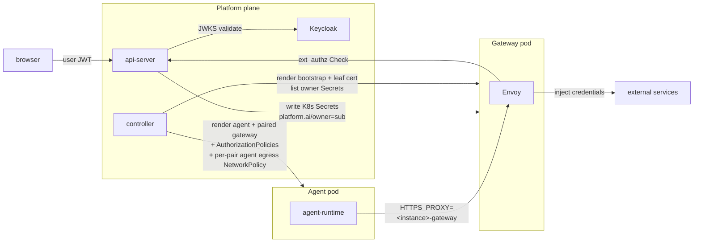

# Security and credentials

Last verified: 2026-05-11

## Motivated by

- [ADR-005 — Gateway pattern for credentials](../adrs/005-credential-gateway.md) — the agent never sees a real upstream token; a gateway injects them on the wire
- [ADR-015 — Multi-user authentication via Keycloak](../adrs/015-multi-user-auth.md) — Keycloak is the IdP; resources are owner-labelled
- [ADR-018 — Slack integration](../adrs/018-slack-integration.md) — identity linking and the per-instance `allowedUsers` gate that decides who can drive a thread
- [ADR-027 — Slack per-turn user impersonation](../adrs/027-slack-user-impersonation.md) — foreign repliers fork the instance into a per-turn paired pod whose gateway mounts the replier's K8s credential Secrets
- [ADR-033 — Envoy-based credential gateway](../adrs/033-envoy-credential-gateway.md) — Envoy mints per-instance leaf certs, MITMs egress, and injects credential headers
- [ADR-035 — HITL ext_authz](../adrs/035-unified-hitl-ux.md) — Envoy gates credentialed egress through an api-server ext_authz call
- [ADR-038 — Paired agent and gateway pods](../adrs/038-paired-gateway-pod.md) — agent and gateway run in two paired pods, with the credential boundary at the pod boundary
- [ADR-041 — Istio ambient mesh](../adrs/041-istio-ambient-mesh.md) — SPIFFE identity for every internal hop; supersedes ADR-038's NetworkPolicy mechanism, the `x-platform-instance` header, and the pod-IP resolver

## Overview

Three rules carry the security model:

1. **Agents never hold upstream credentials.** Real upstream tokens (GitHub,
   Anthropic, Slack, internal gateways) live in K8s Secrets labelled with the
   owner's `sub`. The Envoy proxy in the paired gateway pod injects them
   into outbound traffic on the wire — the agent pod never mounts Secret
   bytes.
2. **Identity flows from Keycloak.** Browser users authenticate against
   Keycloak; the api-server validates the JWT and stamps `platform.ai/owner` on
   every resource the user creates. Per-user credential isolation is the
   `platform.ai/owner` label on the K8s Secret — the controller's selector
   refuses to mount any other owner's Secret into a given owner's gateway pod.
3. **The trust line is SPIFFE workload identity.** Each instance runs as
   two paired pods (ADR-038) under one **per-instance ServiceAccount**.
   Fork pairs (ADR-027) get their **own** per-fork SA — distinct from
   the parent's — so a compromised fork can't impersonate the parent on
   the harness path. istiod stamps every pod with a SPIFFE workload
   cert whose SA name equals the instance (or fork) name. Three
   per-instance AuthorizationPolicies enforce the boundary
   cryptographically: the gateway Service ALLOWs only its own SA
   principal (replaces the pair-key NetworkPolicy from ADR-038); the
   api-server's harness waypoint ALLOWs that principal to
   `/api/instances/<id>/*`; the per-instance ext-authz Service ALLOWs
   only the matching SA. Per-fork policies layer narrowly on top —
   admitting the fork SA only to `/api/instances/<parent>/mcp` and to
   the parent's ext-authz Service. Identity no longer flows through
   pod IPs or the trusted `x-platform-instance` header — both are
   removed (ADR-041).

Workspace contents are explicitly outside the trust boundary — see the
security note on [persistence](persistence.md).

## Diagram

The credential boundary is the pod: K8s Secrets are mounted into the
gateway pod only, and the agent pod has no admitted route to TCP 80/443
other than its paired gateway. Enforcement is layered:

- **Mesh AuthorizationPolicy** (ADR-041) gates *ingress* on the gateway
  pod by SA principal, so another instance's agent cannot reach this
  gateway even if the pod IP is known.
- **Per-pair agent egress NetworkPolicy** (controller-rendered,
  `<id>-agent-egress`) restricts the agent pod's *egress* at the kernel
  layer to DNS, its paired gateway pod, and the ambient HBONE port.
  Without this, an agent process can ignore `HTTPS_PROXY` and dial
  external hosts directly, escaping Envoy's MITM, credential
  injection, and ext-authz HITL gates. The NetworkPolicy selects on
  `pair=<id>, role=agent`, so the gateway pod's own egress (which
  legitimately dials credentialed upstreams) stays unrestricted.

The agent pod has no service account token
(`automountServiceAccountToken: false`), and there is no co-located
sidecar to share a network or PID namespace with. See
[ADR-033 §Threat Model](../adrs/033-envoy-credential-gateway.md#threat-model)
and [ADR-038 §Threat Model](../adrs/038-paired-gateway-pod.md#threat-model).

## Identity

**Keycloak** is the only identity authority. It runs in-cluster as a Helm
subchart and is the OIDC provider for every authenticated surface. The
user agent flow:

1. Browser authenticates against Keycloak and obtains a JWT with audience
   `platform-api`.
2. UI sends the JWT to the api-server on every tRPC and ACP call. The
   api-server validates it against Keycloak's JWKS.
3. The api-server's `sub` claim becomes `platform.ai/owner=` on every
   resource the user creates (instance ConfigMap, K8s credential Secret,
   etc.).

There is no token exchange — credential storage is K8s-native and label-
scoped, so the api-server enforces ownership directly when reading and
writing.

## Resource ownership

Multi-tenancy is **soft** — a single Kubernetes namespace, with a
`platform.ai/owner` label on every owned resource carrying the authenticated
user's `sub`. The api-server is the sole writer of `spec.yaml` and stamps
the label on create; every list and get filters by it. There is no
namespace-per-user.

The controller picks credentials per-instance by listing K8s Secrets
labelled `platform.ai/owner=,platform.ai/managed-by=api-server` in the agent
namespace, then mounting the matching set into the paired gateway pod. Cross-
owner leakage is structurally prevented by the label selector — a missing
`platform.ai/owner` label is treated as no owner and never mounted.

## Credential storage

Each connected service produces one K8s Secret per `(owner, connection)`:

- **OAuth-issued tokens** (GitHub, MCP servers, Generic OAuth apps) — the
  api-server's `/api/oauth/callback` writes the access + refresh token
  pair, with an `platform.ai/host-pattern` annotation naming the upstream
  host the token belongs to. The refresh-token loop re-mints access
  tokens before expiry; the agent never sees the refresh token.
- **User-supplied secrets** (Anthropic API keys, generic API tokens) —
  the secrets module writes them with the same labels and annotations.

The Secret carries the SDS YAML Envoy reads via its `path_config_source`.
Only the gateway pod mounts the Secret; the agent pod does not. See
[`packages/api-server/src/modules/connections/infrastructure/k8s-connections-port.ts`](../../packages/api-server/src/modules/connections/infrastructure/k8s-connections-port.ts) and
[`packages/api-server/src/modules/secrets/infrastructure/k8s-secrets-port.ts`](../../packages/api-server/src/modules/secrets/infrastructure/k8s-secrets-port.ts).

## Envoy credential injection

The controller renders a per-instance `Envoy bootstrap ConfigMap` and a
cert-manager `Certificate` whose Secret holds the leaf TLS material the
gateway pod uses to terminate the agent's egress TLS. The leaf is
issued by a chart-managed `platform-mitm-ca-issuer` ClusterIssuer; the CA
cert is mounted into the agent at `/etc/platform/ca/ca.crt` (single-key
projection, `tls.key` stays in the gateway pod) so the agent's TLS
clients trust Envoy's intercept cert.

On the wire:

1. Agent sets `HTTPS_PROXY=http://<instance>-gateway:<envoyPort>`. The
   per-instance gateway Service routes the connection to the paired
   gateway pod; every egress arrives there as HTTP CONNECT.
2. Envoy's outer listener (bound on `0.0.0.0`, reach gated by
   NetworkPolicy) terminates the CONNECT and routes the inner stream
   into an internal listener that reads SNI.
3. Per-host filter chains terminate TLS with the leaf cert, run the
   credential injector to add the configured `Authorization` header, then
   forward to a per-credential `STRICT_DNS` cluster pinned to the
   credential's host (explicit upstream SNI + SAN-bound TLS validation).
   The agent's inner `Host` header has no influence on the upstream
   destination — the route-confusion exfiltration path from
   [ADR-033 §Threat Model](../adrs/033-envoy-credential-gateway.md#threat-model)
   is structurally closed. Allow-only chains (path-rule promoted, no
   credential) keep using the dynamic forward proxy — they have no
   credential to misroute.
4. The default chain (SNI miss) does TCP passthrough — the request reaches
   the upstream unchanged.

Hosts the api-server has issued a credential for surface as L7 chains (SNI
match, header injection); hosts with no credential surface as L4
passthrough chains.

## HITL ext_authz

Each credentialed request goes through an ext_authz Check call against
the api-server. ADR-041: identity is the **per-instance ext-authz
Service** the gateway pod's Envoy was configured to dial
(`<release>-extauthz-<id>`); the AuthorizationPolicy on each Service
ALLOWs only the matching SA principal, so by the time a Check arrives
the calling instance is already proven cryptographically. The handler
parses the instance ID from the gRPC `:authority`, looks up the matching
egress rule, and either allows the request, denies it, or holds it open
while the user makes a verdict in the inbox (ADR-035).
`failure_mode_allow: false` — a blocked Check fails closed: agent gets
403, no inbox prompt. The pod-IP resolver and the `x-platform-instance`
header are gone.

The HTTP filter on TLS-terminated chains sees method/path; the network
filter on the catch-all chain sees SNI only.

## Per-turn fork pods (Slack foreign replier)

When a user other than the instance owner replies in a Slack thread,
the api-server emits a fork ConfigMap that the controller materialises
into a per-turn paired pod set: a fork agent Job and a fork gateway Pod
(ADR-038). The fork's gateway pod mounts the **replier's** K8s credential
Secrets — selected by `platform.ai/owner=<replier-sub>`, not the instance
owner's `sub`. The credential boundary is preserved: the fork pair runs
the replier's credentials, never the parent instance owner's. The fork
agent's `agent-platform.ai/instance` label still points at the parent
instance so traffic resolves under the parent's egress rules; the fork's
own pair key (`agent-platform.ai/pair`) isolates it from the parent
instance's pair. See [ADR-027](../adrs/027-slack-user-impersonation.md)
and [ADR-038](../adrs/038-paired-gateway-pod.md).

## Mesh identity (ADR-041)

Per-instance pair isolation, harness-port admission, and ext-authz
caller identification all flow through the same SPIFFE primitive:

- **Per-instance ServiceAccount** in the agent namespace, name ==
  instance ID. Both pods of the long-lived pair run as this SA. Fork
  pairs (ADR-027) get their **own** per-fork SA — distinct from the
  parent's — paired with narrow per-fork AuthorizationPolicies, so a
  compromised fork cannot reach the parent's full
  `/api/instances/<parent>/*` surface. `automountServiceAccountToken`
  stays false; istiod issues the workload cert independent of SA-token
  mounts.
- **Agent → gateway** (CONNECT proxy port) is admitted by an
  AuthorizationPolicy keyed on the SA the pair runs as. Both pods
  share the SA so the rule is "self-talk only". Replaces ADR-038's
  pair-key NetworkPolicy.
- **Gateway → api-server harness.** All agent egress (including the
  harness call) flows through the paired gateway pod's Envoy, so what
  reaches the mesh is gateway → harness.
  The harness Service is `<rel>-apiserver-harness`, carrying
  `istio.io/use-waypoint`; Istio synthesises a waypoint Gateway pod
  in front of it. A per-instance AuthorizationPolicy on the waypoint
  ALLOWs the SA principal to `/api/instances/<id>/*`; handlers can
  treat URL `:id` as authenticated. For forks, an additional per-fork
  policy admits the fork SA only to `/api/instances/<parent>/mcp` —
  pod-files SSE and `/internal/trigger` stay parent-only.
- **Gateway → api-server ext-authz** routes through a per-instance
  Service `<rel>-extauthz-<id>` rendered by the controller alongside
  each instance. The AuthorizationPolicy on each Service ALLOWs only
  the matching SA principal (plus per-fork ALLOWs that admit fork
  SAs to the parent's Service so the parent owner's HITL rules stay
  the gate). The destination Service is cryptographically pinned to
  the calling instance; the api-server derives instance ID from the
  gRPC `:authority`.
- **Pod-level DENY AuthorizationPolicy** on the api-server pod
  rejects anything that isn't either the waypoint's SA (harness) or a
  per-instance SA from the agent namespace (ext-authz), closing the
  direct pod-IP bypass.

NetworkPolicy retracts to coarse perimeter only — cluster-edge ingress
and a per-pair *agent egress* policy (`<id>-agent-egress`, controller-
rendered alongside the gateway-admission AuthorizationPolicy) that
locks the agent pod's L3/L4 egress to its paired gateway plus DNS and
ambient HBONE. The pair-pinning here is structural defence-in-depth on
top of mesh AuthorizationPolicy: the AuthorizationPolicy on each
gateway pod still cryptographically denies traffic from a non-matching
SA, but the NetworkPolicy is what keeps the agent process from
side-stepping `HTTPS_PROXY` and reaching external hosts that the mesh
doesn't see. The fine-grained pair-key *ingress* policies from
ADR-038 are gone — Istio AuthorizationPolicy owns that boundary now.
