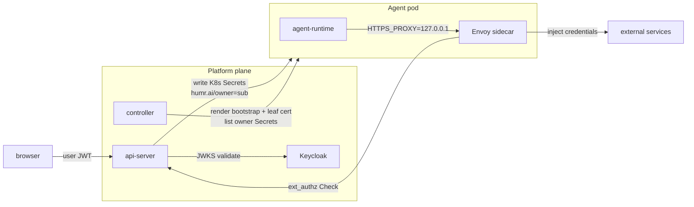

# Security and credentials

Last verified: 2026-05-04

## Motivated by

- [ADR-005 — Gateway pattern for credentials](../adrs/005-credential-gateway.md) — the agent never sees a real upstream token; a gateway injects them on the wire
- [ADR-015 — Multi-user authentication via Keycloak](../adrs/015-multi-user-auth.md) — Keycloak is the IdP; resources are owner-labelled
- [ADR-018 — Slack integration](../adrs/018-slack-integration.md) — identity linking and the per-instance `allowedUsers` gate that decides who can drive a thread
- [ADR-027 — Slack per-turn user impersonation](../adrs/027-slack-user-impersonation.md) — foreign repliers fork the instance into a per-turn Job whose Envoy sidecar mounts the replier's K8s credential Secrets
- [ADR-033 — Envoy-based credential gateway](../adrs/033-envoy-credential-gateway.md) — Envoy sidecar mints per-instance leaf certs, MITMs egress, and injects credential headers
- [ADR-035 — HITL ext_authz](../adrs/035-hitl-ext-authz.md) — Envoy gates credentialed egress through an api-server ext_authz call

## Overview

Three rules carry the security model:

1. **Agents never hold upstream credentials.** Real upstream tokens (GitHub,
   Anthropic, Slack, internal gateways) live in K8s Secrets labelled with the
   owner's `sub`. The Envoy sidecar in the agent pod injects them into
   outbound traffic on the wire — the agent container never sees Secret
   bytes.
2. **Identity flows from Keycloak.** Browser users authenticate against
   Keycloak; the api-server validates the JWT and stamps `humr.ai/owner` on
   every resource the user creates. Per-user credential isolation is the
   `humr.ai/owner` label on the K8s Secret — the controller's selector
   refuses to mount any other owner's Secret into a given owner's pod.
3. **The trust line is the agent pod's network egress.** Everything outside
   the pod is the platform; everything inside the pod is least-privileged.
   NetworkPolicy keeps the pod off the K8s API, off arbitrary in-cluster
   peers, and forces all 80/443 egress through the Envoy sidecar on
   `127.0.0.1`. Envoy then enforces what each grant actually permits on the
   wire and gates each credentialed request through the ext_authz handler.

Workspace contents are explicitly outside the trust boundary — see the
security note on [persistence](persistence.md).

## Diagram

The credential boundary is the container: K8s Secrets are mounted into the
Envoy sidecar only. The agent's process namespace is isolated from the
sidecar's (`shareProcessNamespace: false`), and the agent has no service
account token (`automountServiceAccountToken: false`) — Secret-read RBAC
that would otherwise bypass the volume-mount scope is unavailable. See
[ADR-033 §Threat Model](../adrs/033-envoy-credential-gateway.md#threat-model).

## Identity

**Keycloak** is the only identity authority. It runs in-cluster as a Helm
subchart and is the OIDC provider for every authenticated surface. The
user agent flow:

1. Browser authenticates against Keycloak and obtains a JWT with audience
   `humr-api`.
2. UI sends the JWT to the api-server on every tRPC and ACP call. The
   api-server validates it against Keycloak's JWKS.
3. The api-server's `sub` claim becomes `humr.ai/owner=` on every
   resource the user creates (instance ConfigMap, K8s credential Secret,
   etc.).

There is no token exchange — credential storage is K8s-native and label-
scoped, so the api-server enforces ownership directly when reading and
writing.

## Resource ownership

Multi-tenancy is **soft** — a single Kubernetes namespace, with a
`humr.ai/owner` label on every owned resource carrying the authenticated
user's `sub`. The api-server is the sole writer of `spec.yaml` and stamps
the label on create; every list and get filters by it. There is no
namespace-per-user.

The controller picks credentials per-instance by listing K8s Secrets
labelled `humr.ai/owner=,humr.ai/managed-by=api-server` in the agent
namespace, then mounting the matching set into the Envoy sidecar. Cross-
owner leakage is structurally prevented by the label selector — a missing
`humr.ai/owner` label is treated as no owner and never mounted.

## Credential storage

Each connected service produces one K8s Secret per `(owner, connection)`:

- **OAuth-issued tokens** (GitHub, MCP servers, Generic OAuth apps) — the
  api-server's `/api/oauth/callback` writes the access + refresh token
  pair, with an `humr.ai/host-pattern` annotation naming the upstream
  host the token belongs to. The refresh-token loop re-mints access
  tokens before expiry; the agent never sees the refresh token.
- **User-supplied secrets** (Anthropic API keys, generic API tokens) —
  the secrets module writes them with the same labels and annotations.

The Secret carries the SDS YAML the Envoy sidecar reads via its
`path_config_source`. Only the Envoy sidecar mounts the Secret; the agent
container does not. See [`packages/api-server/src/modules/connections/infrastructure/k8s-connections-port.ts`](../../packages/api-server/src/modules/connections/infrastructure/k8s-connections-port.ts) and
[`packages/api-server/src/modules/secrets/infrastructure/k8s-secrets-port.ts`](../../packages/api-server/src/modules/secrets/infrastructure/k8s-secrets-port.ts).

## Envoy credential injection

The controller renders a per-instance `Envoy bootstrap ConfigMap` and a
cert-manager `Certificate` whose Secret holds the leaf TLS material the
Envoy sidecar uses to terminate the agent's egress TLS. The leaf is
issued by a chart-managed `humr-mitm-ca-issuer` ClusterIssuer; the CA
cert is mounted into the agent at `/etc/humr/ca/ca.crt` so its TLS
clients trust the sidecar.

On the wire:

1. Agent sets `HTTPS_PROXY=http://127.0.0.1:<envoyPort>`. Every egress
   arrives as HTTP CONNECT.
2. Envoy's outer listener terminates the CONNECT and routes the inner
   stream into an internal listener that reads SNI.
3. Per-host filter chains terminate TLS with the leaf cert, run the
   credential injector to add the configured `Authorization` header, then
   re-originate upstream TLS via the dynamic forward proxy.
4. The default chain (SNI miss) does TCP passthrough — the request reaches
   the upstream unchanged.

Hosts the api-server has issued a credential for surface as L7 chains (SNI
match, header injection); hosts with no credential surface as L4
passthrough chains.

## HITL ext_authz

Each credentialed request goes through an ext_authz Check call against
the api-server. The handler resolves the source pod IP to an instance,
looks up the matching egress rule, and either allows the request,
denies it, or holds it open while the user makes a verdict in the inbox
(ADR-035). `failure_mode_allow: false` — a blocked Check fails closed:
agent gets 403, no inbox prompt.

NetworkPolicy admits ext_authz traffic only from sidecar pods to the
api-server's gRPC listener. The HTTP filter on TLS-terminated chains
sees method/path; the network filter on the catch-all chain sees SNI
only.

## Per-turn fork pods (Slack foreign replier)

When a user other than the instance owner replies in a Slack thread,
the api-server emits a fork ConfigMap that the controller materialises
into a per-turn Job. The fork pod's Envoy sidecar mounts the
**replier's** K8s credential Secrets — selected by `humr.ai/owner=<replier-sub>`,
not the instance owner's `sub`. The credential boundary is preserved:
the fork pod runs the replier's credentials, never the parent instance
owner's. See [ADR-027](../adrs/027-slack-user-impersonation.md).

## Network policy

Each agent pod gets a NetworkPolicy that:

- Permits open egress on TCP 80/443 (the sidecar reaches arbitrary
  upstreams; ADR-033 §Decision keeps the first-cut allowlist permissive).
- Permits gRPC egress to the api-server's ext_authz port (the HITL gate).
- Permits egress to the api-server's harness port (MCP, triggers).
- Permits DNS.
- Admits ingress on the agent's ACP/tRPC port only from the api-server pod;
  the kernel-level peer match is the auth boundary on that hop.

The credential gateway lives inside the agent pod (the Envoy sidecar);
there is no cross-namespace gateway pod for the agent to reach.
