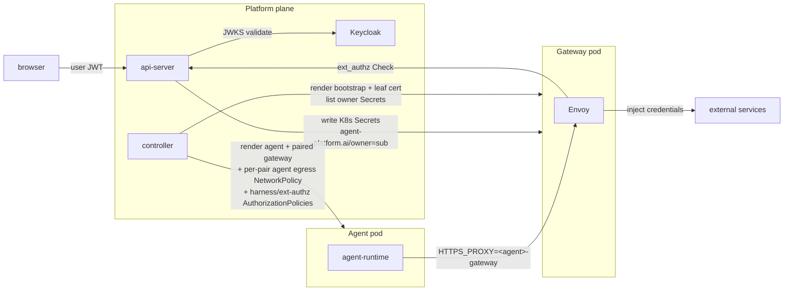

# Security and credentials

Last verified: 2026-07-06

## Overview

Three rules carry the security model:

1. **Agents never hold upstream credentials.** Real upstream tokens (GitHub,
   Anthropic, Slack, internal gateways) live in K8s Secrets labelled with the
   owner's `sub`. The Envoy proxy in the paired gateway pod injects them
   into outbound traffic on the wire — the agent pod never mounts Secret
   bytes.
2. **Identity flows from Keycloak.** Browser users authenticate against
   Keycloak; the api-server validates the JWT and stamps `agent-platform.ai/owner` on
   every resource the user creates. Per-user credential isolation is the
   `agent-platform.ai/owner` label on the K8s Secret — the controller's selector
   refuses to mount any other owner's Secret into a given owner's gateway pod.
3. **Two boundaries, layered.** The agent → gateway hop is gated at the
   *kernel* by a per-pair NetworkPolicy;
   the gateway → api-server hops (harness and ext-authz) are gated at
   the *mesh* by per-Agent Istio AuthorizationPolicies on the
   gateway pod's SPIFFE principal.
   The agent pod opts out of ambient mesh (`istio.io/dataplane-mode:
   none`) so the kernel sees real destinations rather than HBONE
   tunnelled to ztunnel; its only admitted intra-cluster destination
   is the paired gateway pod on the Envoy proxy port. The gateway pod
   stays in ambient; istiod stamps it with a SPIFFE workload cert whose
   SA name equals the Agent (or fork) name. Two per-Agent
   AuthorizationPolicies enforce the gateway-originated boundary
   cryptographically: the api-server's harness waypoint ALLOWs the
   gateway principal to `/api/agents/<id>/*`; the per-Agent
   ext-authz Service ALLOWs only the matching SA. Fork pairs
   get their **own** per-fork SA — distinct from the parent's — so a
   compromised fork can't impersonate the parent on the harness path;
   per-fork policies layer narrowly on top, admitting the fork's
   gateway SA only to `/api/agents/<parent>/mcp` and to the
   parent's ext-authz Service.

Workspace contents are explicitly outside the trust boundary — see the
security note on [persistence](persistence.md).

## Diagram

The credential boundary is the pod: K8s Secrets are mounted into the
gateway pod only, and the agent pod has no admitted route to TCP 80/443
other than its paired gateway. Enforcement is layered:

- **Per-pair agent egress NetworkPolicy** (controller-rendered,
  `<id>-agent-egress`) is the sole gate on the agent → paired gateway
  hop. The agent pod opts out of ambient mesh, so the kernel sees real
  destination IPs rather than HBONE tunnelled to ztunnel; the policy
  admits exactly DNS and the paired gateway pod's Envoy port. HBONE
  15008 is not admitted — the agent never speaks it.
- **Agent ingress NetworkPolicy** (chart-rendered,
  `agent-ingress-platform-only`) admits ingress to the agent port only
  from the api-server (ACP/tRPC relay) and the controller (idle-checker
  busy-probe). agent-runtime serves unauthenticated on the assumption
  that this kernel gate is the auth boundary; kubelet probes are
  node-originated and unaffected.
- **Gateway Envoy ext_authz** gates everything the gateway
  forwards on behalf of the agent — external upstreams via the HITL
  rule model, and the harness path is special-cased to pass through.
  This is the destination-side egress gate; no NetworkPolicies on
  Postgres / Redis / Keycloak / the harness or ext-authz Services are
  needed because the agent has no admitted route to any of them.
- **Mesh AuthorizationPolicy** gates the gateway-originated
  hops by the gateway pod's SPIFFE principal: harness via the
  api-server's waypoint, ext-authz on the per-Agent Service. The
  agent has no SPIFFE identity in this model.

The agent pod has no service account token
(`automountServiceAccountToken: false`), and there is no co-located
sidecar to share a network or PID namespace with.

## Identity

**Keycloak** is the only identity authority. It runs in-cluster as a Helm
subchart and is the OIDC provider for every authenticated surface. The
user agent flow:

1. Browser authenticates against Keycloak and obtains a JWT with audience
   `platform-api`.
2. UI sends the JWT to the api-server on every tRPC and ACP call. The
   api-server validates it against Keycloak's JWKS.
3. The api-server's `sub` claim becomes `agent-platform.ai/owner=` on every
   resource the user creates (Agent CR, K8s credential Secret,
   etc.).

There is no token exchange — credential storage is K8s-native and label-
scoped, so the api-server enforces ownership directly when reading and
writing.

For headless / CI use, the CLI accepts a long-lived **API key** in the
same `Authorization: Bearer` slot, distinguished by a `pk_` prefix. API
keys carry the owner's `sub`, a subset of permission scopes, and an
optional agent allowlist; the bearer middleware dispatches by prefix and
produces the same downstream authenticated-principal shape — sub, scopes,
agent binding, and an optional key id. API keys cannot mint or revoke
other API keys — the management surface rejects any request whose
principal was authenticated via a key, so exfiltrated keys cannot
escalate.

## Keycloak event logging

Keycloak is also an audit event source. It emits login and admin events
to pod stdout via its built-in `jboss-logging` event listener, so they
ride the same cluster log pipeline as every other pod log out to the
external log service. The listener's level is set through Keycloak's
per-listener SPI knobs rather than a broad `org.keycloak` log-category
override: successes surface at `info`, errors at `warn`. Production pods
emit structured JSON; local dev overrides the console format to plain
text for a readable `cluster:logs`.

Persistence is split by event class:

- **Login events** (LOGIN, LOGOUT, LOGIN_ERROR, token refresh, account
  changes, …) are *not* written to the Keycloak database. The listener
  fires independently of DB-store gating, so the events still reach
  stdout; the external log service is the source of truth for the
  authentication audit trail, and Postgres is spared the high-volume
  write.
- **Admin events** (any change made through the admin REST API or
  console) fire on the same listener, so their metadata — who acted, on
  which resource, from where — reaches stdout and the external log
  service alongside login events. That metadata is also recorded to
  Postgres (low volume), but the full request body is *not*
  (`adminEventsDetailsEnabled` is off): stored bodies would otherwise
  capture sensitive payloads — plaintext credentials on user-create /
  user-update flows — and Keycloak retains admin events indefinitely with
  no built-in expiration. The log line never carries the request body, so
  the external log pipeline, not the Keycloak database, is the audit
  source of truth.

The event knobs, log format, and realm import live in the Keycloak Helm
values under [`deploy/helm/platform/`](../../deploy/helm/platform/).

## Resource ownership

Multi-tenancy is **soft** — a single Kubernetes namespace, with a
`agent-platform.ai/owner` label on every owned resource carrying the authenticated
user's `sub`. The api-server is the sole writer of resource spec and stamps
the label on create; every list and get filters by it. There is no
namespace-per-user.

The controller picks credentials per-Agent by listing K8s Secrets
labelled `agent-platform.ai/owner=,agent-platform.ai/managed-by=api-server` in the agent
namespace, then mounting the matching set into the paired gateway pod. Cross-
owner leakage is structurally prevented by the label selector — a missing
`agent-platform.ai/owner` label is treated as no owner and never mounted.

## Credential storage

Each connected service produces one K8s Secret per `(owner, connection)`:

- **OAuth-issued tokens** (GitHub, MCP servers, Generic OAuth apps) — the
  api-server's `/api/oauth/callback` writes the access + refresh token
  pair plus a structured **host list** describing every wire position
  the token should be injected on. The refresh-token loop re-mints
  access tokens before expiry; the agent never sees the refresh token.
- **User-supplied secrets** (Anthropic API keys, generic API tokens) —
  the Connections subsystem writes them as a **header Connection** per
  credential, built from its template and stored with the same labels and
  annotations: one per-Connection Secret carrying the credential value plus
  the placeholder SDS the gateway reads.
- **GitHub personal access tokens** — a PAT is one **`github-pat`
  Connection** whose template re-bakes, from the bare PAT, the three host
  injections it needs into a single per-Connection Secret:
  `api.github.com` as `Authorization: Bearer <PAT>`, `github.com` as
  `Authorization: Basic base64("x-access-token:" + PAT)` for `git clone`
  over HTTPS, and `raw.githubusercontent.com` as `Bearer` for raw-file
  fetches — plus a `GH_TOKEN` env contribution for the `gh` CLI. (This is
  the multi-host-injection shape described next, with the `Basic`-encoded
  half generated by the template rather than typed by the user.)

**Multi-host connections.** A single OAuth connection can inject the
same token on more than one host with **different auth schemes per
host**, all from one K8s Secret. The Secret carries a JSON
`agent-platform.ai/injection-hosts` annotation listing each
`{host, headerName?, valueFormat?, encoding?, pathPattern?}` tuple; the
controller fans the Secret into one Envoy filter chain per host —
entries that share a host stack into that chain as an ordered list of
credential injectors (see *Multiple injection steps per host* below) —
mounting the Secret once and reading one SDS file per injection step
inside it. The same list drives the egress allowlist (one
`connection:<id>` rule per host) — there is no second source of truth.

GitHub.com is the motivating case ([issue #219](https://github.com/dam-agents/dam/issues/219)):
the same OAuth token must reach `api.github.com` as
`Authorization: Bearer …`, `github.com` as
`Authorization: Basic base64("x-access-token:<token>")` (so `git clone`
of private repos works without a credential helper), and
`raw.githubusercontent.com` as `Bearer` again (raw-file fetches).

The Secret carries the SDS YAML Envoy reads via its `path_config_source`.
Only the gateway pod mounts the Secret; the agent pod does not. See
[`packages/api-server/src/modules/connections/infrastructure/`](../../packages/api-server/src/modules/connections/infrastructure/) and
[`packages/api-server/src/modules/connections/domain/connection-sds.ts`](../../packages/api-server/src/modules/connections/domain/connection-sds.ts).

## Image pull credentials

Pulling the agent's container image from a private registry uses a
**structurally separate** credential class from the egress credentials
above. It does not ride the Envoy path at all:

- **The kubelet consumes it, not Envoy.** It is a
  `kubernetes.io/dockerconfigjson` Secret referenced from the pod spec's
  `imagePullSecrets`; the kubelet reads it at pod creation to authenticate
  the image pull. It is never mounted into the gateway pod and never
  projected into the agent container — like egress credentials, the agent
  never holds the bytes, but here that is a property of *where the Secret
  is consumed* rather than of Envoy injection. A foreign-replier fork
  pulls the parent's private image with it without ever seeing it.
- **Scope is the Agent, not the owner.** Egress credentials are
  owner-scoped and reusable across every Agent that owner runs; a pull
  credential is agent-scoped — one Secret per Agent (still carrying the
  creator's `agent-platform.ai/owner` for tenancy), created with the Agent and
  torn down with it. There is no cross-agent reuse.
- **Per-agent precedence over the install-wide default.** An operator may
  configure an install-wide default pull secret applied to every agent
  pod. When an Agent carries its own pull-secret ref the controller lists
  it *first* on the pod's `imagePullSecrets`, ahead of the install-wide
  default, which is retained as a fallback — override, not replace. The
  same ordering applies to fork Jobs.

The api-server builds the Secret from structured `{server, username,
password}` input and writes it before the Agent record, rolling it back if
that create fails. Teardown is a delete-time cleanup hook with a
label-scoped orphan sweep as backstop; lifetime detail lives on
[persistence](persistence.md). The credential is validated only at pull
time — a bad credential surfaces as an image-pull failure on the pod, not
a create-time error.

Scope is long-lived static credentials (registry PAT, robot account, basic
auth, a GCP Artifact Registry JSON key as the password). Short-lived or
dynamically-minted registry tokens (e.g. ECR) are out of scope.

## Platform database roles

The credentials above are *upstream* secrets the platform injects on behalf of
agents. The platform's own backing store has a separate credential boundary: the
bundled Postgres splits application connection identities from DBA authority.
Three roles, not one:

- **`platform_apiserver`** / **`platform_keycloak`** — `NOSUPERUSER` owners of
  the `platform` and `keycloak` databases respectively, each the only role its
  service connects as. `CONNECT` is revoked from `PUBLIC` and granted only to
  the owning role, so a leaked api-server credential can neither read Keycloak's
  database nor escalate (no `CREATE ROLE`, no `ALTER SYSTEM`, no RLS bypass) —
  it can only do DDL/DML within the `platform` database it already owns.
- **`platform`** — the lone `SUPERUSER`, used only for DBA work. It is the
  image's bootstrap superuser, because Postgres forbids demoting that role and
  so it must be the role that is *allowed* to keep SUPERUSER, not an app role.
  An existing single-role cluster already bootstrapped under this name, so it is
  kept in place rather than renamed (the bootstrap role can be neither demoted
  nor renamed while connected as itself). A `log_statement = 'all'` per-role
  default puts every statement an admin session issues into the pod log for the
  cluster collector, while routine app traffic stays out of the audit stream
  (the global default is `ddl`). The admin role name is configurable
  (`postgres.adminUser`).

The admin credential lives in the same `platform-postgres-secrets` Secret and
must be treated as high-value. The statement audit is best-effort, not enforced
— a superuser session can `SET log_statement` mid-session. Operational details
(fresh install, existing-cluster migration) are in the
[runbook](../notes/postgres-role-operations.md).

## Envoy credential injection

The controller renders a per-Agent `Envoy bootstrap ConfigMap` and a
cert-manager `Certificate` whose Secret holds the leaf TLS material the
gateway pod uses to terminate the agent's egress TLS. The leaf is
issued by a chart-managed `platform-mitm-ca-issuer` ClusterIssuer; the CA
cert is mounted into the agent at `/etc/platform/ca/ca.crt` (single-key
projection, `tls.key` stays in the gateway pod) so the agent's TLS
clients trust Envoy's intercept cert.

On the wire:

1. Agent sets `HTTPS_PROXY=http://<agent>-gateway:<envoyPort>`. The
   per-Agent gateway Service routes the connection to the paired
   gateway pod; every egress arrives there as HTTP CONNECT.
2. Envoy's outer listener (bound on `0.0.0.0`, reach gated by
   NetworkPolicy) terminates the CONNECT and routes the inner stream
   into an internal listener that reads SNI.
3. Per-host filter chains terminate TLS with the leaf cert, run the
   credential injector(s) to add the configured header(s) (or rewrite
   `?<param>=<value>` into the URL — see below), then forward to a
   per-chain `STRICT_DNS` cluster pinned to the host (explicit upstream
   SNI + SAN-bound TLS validation). The agent's inner `Host` header has
   no influence on the upstream destination — the route-confusion
   exfiltration path is structurally closed. Allow-only chains
   (path-rule promoted, no
   credential) keep using the dynamic forward proxy — they have no
   credential to misroute.
4. The default chain (SNI miss) does TCP passthrough — the request reaches
   the upstream unchanged.

Hosts the api-server has issued a credential for surface as L7 chains (SNI
match, header injection); hosts with no credential surface as L4
passthrough chains.

A referenced SDS file missing from the mounted Secret is a fatal Envoy
boot error, so the controller verifies each credential's SDS key against
the Secret's data at render time and degrades that host to an allow-only
chain (logged as a warning) rather than emit an unbootable bootstrap.
Requests to the host then go out uncredentialed — failing upstream auth
for that host only — instead of crash-looping the whole gateway. Stale
Secrets written by since-replaced code paths are the known trigger.

A host's L7 chain can opt into HTTP/2 so credential injection also covers
gRPC request streams (e.g. Modal); hosts default to HTTP/1.1 unchanged.

**Multiple injection steps per host.** A single host can carry more than
one credential — either two different credentials (e.g. an API key and a
tenant ID on distinct headers) or the same credential injected into both
a header and a URL query parameter (e.g. Bob shell's `/key/info?key=…`
endpoint). The controller groups Secrets by `hostPattern` into one L7
chain with an ordered list of `credential_injector` filters; each step
must use a unique header name, and steps marked with `queryParamName`
get a follow-up Lua filter that moves the (bare, percent-encoded) value
into the named URL query parameter and strips the carrier header so it
never reaches the upstream.

## HITL ext_authz

Each credentialed request goes through an ext_authz Check call against
the api-server. Identity is the **per-Agent ext-authz
Service** the gateway pod's Envoy was configured to dial
(`<release>-extauthz-<id>`); the AuthorizationPolicy on each Service
ALLOWs only the matching SA principal, so by the time a Check arrives
the calling Agent is already proven cryptographically. The handler
parses the Agent ID from the gRPC `:authority`, looks up the matching
egress rule, and either allows the request, denies it, or holds it open
while the user makes a verdict in the inbox.
`failure_mode_allow: false` — a blocked Check fails closed: agent gets
403, no inbox prompt. The pod-IP resolver and the `x-platform-agent`
header are gone.

The HTTP filter on TLS-terminated chains sees method/path; the network
filter on the catch-all chain sees SNI only.

## Per-turn fork pods (Slack foreign replier)

Who may drive a thread at all is decided upstream: channel-side
identities are linked to platform users, and the per-Agent
`allowedUsers` gate admits or rejects each replier.

When a user other than the Agent owner replies in a Slack thread,
the api-server creates a Fork CR that the controller materialises
into a per-turn paired pod set: a fork agent Job and a fork gateway
Pod. The fork's gateway pod mounts the **replier's** K8s credential
Secrets — selected by `agent-platform.ai/owner=<replier-sub>`, not the Agent
owner's `sub`. The credential boundary is preserved: the fork pair runs
the replier's credentials, never the parent Agent owner's. The fork
agent's `agent-platform.ai/agent` label still points at the parent
Agent so traffic resolves under the parent's egress rules; the fork's
own pair key (`agent-platform.ai/pair`) isolates it from the parent
Agent's pair.

## `dam-run` executor pods

The in-pod `dam-run` CLI runs a command in a fresh ephemeral pod (a
`Run`; see [agent-lifecycle](agent-lifecycle.md#run-executors-dam-run)).
It adds **no new privilege to the agent pod**: `dam-run` only dials the
api-server harness port the agent can already reach, pinned to the
agent's own SA at the waypoint, so an agent can spawn executors only for
itself. The executor holds no credential bytes and has no SA, gateway,
cert, or AuthorizationPolicy of its own — one egress NetworkPolicy routes
it through the parent's existing gateway, so its egress boundary is
exactly the parent's: same credentials, same ext-authz/HITL gate. That
identity reaches the parent's full harness surface, runs included, so
recursion is bounded by a per-agent concurrent-run cap in the api-server
relay rather than structurally — a deliberate trade for dropping the
per-run gateway and its mesh identity.

## Intra-cluster identity and admission

The agent and the gateway are gated by different mechanisms — they live
on opposite sides of the credential boundary, so the threat models
differ:

- **Per-Agent ServiceAccount** in the agent namespace, name ==
  Agent ID. Both pods of the long-lived pair run as this SA, but
  only the *gateway* pod is a mesh participant — istiod stamps it with
  a SPIFFE workload cert. The agent pod opts out of ambient
  (`istio.io/dataplane-mode: none`) and carries no SPIFFE identity.
  Fork pairs get their **own** per-fork SA — distinct from
  the parent's — paired with narrow per-fork AuthorizationPolicies, so
  a compromised fork cannot reach the parent's full
  `/api/agents/<parent>/*` surface. `automountServiceAccountToken`
  stays false on both pods; the gateway's SPIFFE cert is independent
  of SA-token mounts.
- **Agent → paired gateway** is gated at the kernel by the per-pair
  `<id>-agent-egress` NetworkPolicy. One egress rule: the paired
  gateway pod (`pair=<id>, role=gateway`) on the Envoy proxy port.
  DNS is not admitted — the agent addresses its gateway by ClusterIP,
  and name resolution for external hosts happens in the gateway, so
  anything in the pod that tries to resolve names directly fails
  closed. HBONE
  15008 is not admitted; the agent has no ztunnel and never speaks
  HBONE. Pair pinning is structural — the policy's pod-selector is
  the gateway pod itself, so a compromised agent has no admitted
  IP-and-port combination to reach anything else in the cluster.
- **api-server / controller → agent** is gated at the kernel by the
  chart-rendered `agent-ingress-platform-only` NetworkPolicy. The agent
  port admits ingress only from api-server pods (ACP/tRPC relay — the
  api-server has verified the user JWT and agent ownership before
  forwarding) and controller pods (idle-checker busy-probe). Everything
  else, gateway pods included, is dropped; the policy selects
  `role=agent`, so fork pods are covered too.
- **Gateway → api-server harness.** All agent egress (including the
  harness call) flows through the paired gateway pod's Envoy, so what
  reaches the mesh is gateway → harness. The harness Service is
  `<rel>-apiserver-harness`, carrying `istio.io/use-waypoint`; Istio
  synthesises a waypoint Gateway pod in front of it. A per-Agent
  AuthorizationPolicy on the waypoint ALLOWs the gateway's SA
  principal to `/api/agents/<id>/*`; handlers can treat URL `:id`
  as authenticated. For forks, an additional per-fork policy admits
  the fork *gateway*'s SA only to `/api/agents/<parent>/mcp` —
  the runtime channel stays parent-only.
- **Gateway → api-server ext-authz** routes through a per-Agent
  Service `<rel>-extauthz-<id>` rendered by the controller alongside
  each Agent. The AuthorizationPolicy on each Service ALLOWs only
  the matching SA principal (plus per-fork ALLOWs that admit fork
  SAs to the parent's Service so the parent owner's HITL rules stay
  the gate). The destination Service is cryptographically pinned to
  the calling Agent; the api-server derives Agent ID from the
  gRPC `:authority`.
- **Pod-level DENY AuthorizationPolicy** on the api-server pod rejects
  anything that isn't either the waypoint's SA (harness) or a
  per-Agent SA from the agent namespace (ext-authz), closing the
  direct pod-IP bypass.

NetworkPolicy is the security boundary for the agent's egress; mesh
AuthorizationPolicy is the security boundary for the gateway's egress
to api-server endpoints. Each pod's gate matches its threat model:
the agent runs untrusted code and is held at the kernel layer; the
gateway is platform-controlled and its identity flows through the
mesh.

## Dev cluster: SVID rotation resilience

A dev-cluster constraint, not an architectural property. The local
k3s/lima `cluster:install` ([`deploy/tasks.toml`](../../deploy/tasks.toml))
pins `DEFAULT_WORKLOAD_CERT_TTL=720h` on istiod so workload SVIDs
outlive a typical dev cluster's lifetime, and installs a
`ztunnel-cert-watchdog` CronJob in `istio-system` that scans recent
ztunnel logs every 10 min and rolls `ds/ztunnel` if it sees
`certificate expired` / `AlertReceived(CertificateExpired)`. Together
these absorb the race where lima VM suspend/resume on a sleeping host
laptop slips past the default 24h rotation window and stalls every
mesh hop — see [issue #283](https://github.com/dam-agents/dam/issues/283).
Production deployments configure mesh PKI separately and don't get
either knob.
