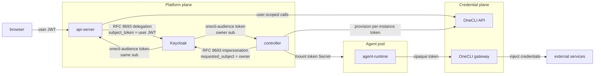
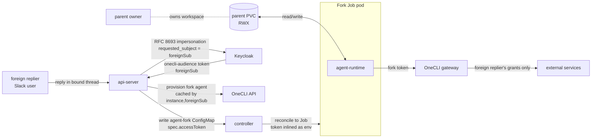

# Security and credentials

Last verified: 2026-04-29

## Motivated by

- [ADR-005 — Gateway pattern for credentials](../adrs/005-credential-gateway.md) — the agent never sees a real upstream token; a gateway injects them on the wire
- [ADR-010 — OneCLI deployment](../adrs/010-onecli-deployment.md) — OneCLI is the credential gateway; runs as a single Deployment with two Services, MITMs agent traffic with a cluster-issued CA
- [ADR-015 — Multi-user authentication via Keycloak + OneCLI fork with token exchange](../adrs/015-multi-user-auth.md) — Keycloak is the IdP; api-server exchanges user JWTs for OneCLI-scoped tokens (RFC 8693); resources are owner-labelled
- [ADR-018 — Slack integration](../adrs/018-slack-integration.md) — identity linking and the per-instance `allowedUsers` gate that decides who can drive a thread; foreign-replier detection runs against this list
- [ADR-024 — Connector-declared envs and per-agent overrides](../adrs/024-connector-declared-envs.md) — env composition at pod start; the credential owner declares the env names, not the platform
- [ADR-027 — Slack per-turn user impersonation](../adrs/027-slack-user-impersonation.md) — foreign repliers fork the instance into a per-turn Job; foreign-registration tokens are minted by the api-server and inlined into the fork ConfigMap
- [ADR-028 — Configurable injection on generic secrets](../adrs/028-generic-secret-injection-config.md) — generic secrets carry their own host/path/header injection rules
- [ADR-033 — Envoy-based credential gateway](../adrs/033-envoy-credential-gateway.md) — replaces OneCLI with an Envoy sidecar; rolling out behind a per-instance experimental flag

## Overview

Three rules carry the security model:

1. **Agents never hold upstream credentials.** The only token an agent pod has is a delegated **OneCLI access token** scoped to the user and the instance. Real upstream tokens (GitHub, Anthropic, Slack, internal gateways) live inside OneCLI and are injected into outbound traffic on the wire.
2. **Identity flows from Keycloak through token exchange.** Browser users authenticate against Keycloak; the api-server exchanges the user's JWT (RFC 8693) for a OneCLI-scoped token before calling OneCLI on the user's behalf. OneCLI enforces per-user scoping itself — it does not trust the api-server's word for who the caller is.
3. **The trust line is the agent pod's network egress.** Everything outside the pod is the platform; everything inside the pod is least-privileged. NetworkPolicy keeps the pod off the K8s API, off OneCLI's admin port, and off any host without an explicit grant. The MITM gateway then enforces what each grant actually permits on the wire.

Workspace contents are explicitly outside the trust boundary — see the security note on [persistence](persistence.md).

## Diagram

Both edges into Keycloak are RFC 8693 exchanges with different grants — delegation needs an existing user JWT, impersonation does not — but in both cases OneCLI receives a Keycloak-signed token bearing the owning user's `sub`. Neither the api-server nor the controller asserts identity directly.

## Identity

**Keycloak** is the only identity authority. It runs in-cluster as a Helm subchart and is the OIDC provider for every authenticated surface. The user agent flow:

1. Browser authenticates against Keycloak and obtains a JWT with audience `humr-api`.
2. UI sends the JWT to the api-server on every tRPC and ACP call. The api-server validates it against Keycloak's JWKS.
3. When the api-server needs to call OneCLI on the user's behalf, it performs an **RFC 8693 token exchange** at Keycloak's token endpoint, presenting the user's JWT as `subject_token` and asking for audience `onecli`. Keycloak issues a new token with the *same* `sub` — this is delegation (carry an existing identity to a new audience), not impersonation. OneCLI validates the exchanged token itself — it scopes every read and write to the `sub` claim and does not trust the calling api-server to assert who the user is.

The api-server caches exchanged tokens to avoid a Keycloak round-trip on every request; cache lifetime is bounded by the exchanged token's expiry.

OneCLI's own dashboard is not exposed to users. Credential management is a tRPC surface on the api-server, which proxies to OneCLI's API with the exchanged token. This keeps OneCLI an implementation detail and lets the api-server own the OAuth callback dance for external services like GitHub and Google.

## Resource ownership

Multi-tenancy is **soft** — a single Kubernetes namespace, with a `humr.ai/owner` label on every owned resource carrying the authenticated user's `sub`. The api-server is the sole writer of `spec.yaml` and stamps the label on create; every list and get filters by it. There is no namespace-per-user.

| Resource | Ownership |
|---|---|
| `agent-instance` ConfigMap, owned StatefulSet/Service/NetworkPolicy/Secret | Per-user (`humr.ai/owner`) |
| `agent-schedule` ConfigMap | Per-user |
| `agent-fork` ConfigMap | Per-user (foreign replier, not the parent instance owner) |
| `agent` ConfigMap (template) | Shared, no owner label |
| Channel bindings, identity links, allow-list rows in Postgres | Per-user, by `sub` |
| Credentials, app connections, policy rules in OneCLI | Per-user, scoped by `sub` claim on the exchanged token |

Templates are deliberately team-level: they describe what an agent image *can* do, not who runs it.

The auth allow-list is a separate gate. Keycloak issues tokens to anyone in the configured realm; the api-server enforces a per-deployment allow-list of `sub`s on its public port and rejects users who are not on it. Postgres holds the list — see [persistence](persistence.md).

## Identity linking

A platform user is one Keycloak `sub`. A channel user (Slack `U…`, Telegram chat id) is a separate identity issued by an external system. Bridging the two is what makes a Slack mention from `U05ABC` resolve to a specific Humr user with their own credentials and resources.

Identity links live in Postgres, owned by the api-server. Each link binds a channel-typed external id (`{channel: "slack", workspaceId, userId}`) to a Humr `sub`. The link is established interactively — the Channel Worker prompts the user, the user authenticates via Keycloak in a browser, and the resulting `sub` is bound to the channel id under the user's confirmation. After that, every channel-driven prompt for that channel id runs as that Humr user: same allow-list check, same OneCLI scoping, same `humr.ai/owner` filtering on resources.

A user who has not linked their channel identity gets no platform access from that channel. The Channel Worker is not a privileged identity — it carries the channel-side id forward, the api-server resolves it against the link table, and a missing link is a hard reject. Channel-routing details (Channel Bindings, Threads, outbound reply addressing) live on [channels](channels.md).

## Credential plane

The credential plane runs on **two tracks today.** OneCLI is the default — described in this section in full — and is the path every instance takes unless opted out. ADR-033 introduces a per-pod **Envoy sidecar** as the replacement and is wired in behind a per-instance flag (`experimentalCredentialInjector`); the experimental path is summarized at the end of this section. Both tracks honor the same gateway pattern from [ADR-005](../adrs/005-credential-gateway.md): the agent never sees an upstream token, and outbound calls are matched against the owner's grants on the wire.

OneCLI is the platform's credential gateway ([ADR-005](../adrs/005-credential-gateway.md), [ADR-010](../adrs/010-onecli-deployment.md)). It runs as one Deployment with two Services on the same pod: a **gateway port** that agent pods proxy through, and an **admin port** that hosts OneCLI's API and dashboard. Only the api-server and controller can reach the admin port; agent pods cannot. PostgreSQL is OneCLI's internal dependency and is reachable only from the OneCLI pod itself.

### MITM with a cluster-issued CA

cert-manager issues a self-signed ECDSA CA in PKCS8 format. The CA cert is mounted into every agent pod as `SSL_CERT_FILE`. OneCLI's gateway terminates the agent's outbound TLS, inspects the request, optionally injects a credential, and re-establishes TLS to the real upstream. Because the agent trusts the cert-manager CA, the MITM is transparent to the harness — an `https://api.github.com/...` call from the agent goes through OneCLI without code changes.

### What gets injected

Each stored secret carries a host pattern (and optionally a path prefix per [ADR-028](../adrs/028-generic-secret-injection-config.md)) and an injection rule: which header to write and how to format the value. When an agent's outbound request matches a secret it has access to, OneCLI rewrites the named header before forwarding. The agent never sees the plaintext token.

Two secret shapes coexist:

- **Generic secrets.** User-declared `{ hostPattern, pathPattern?, injectionConfig? }`. Default injection is `Authorization: Bearer {value}`; users override `headerName` and `valueFormat` for providers that deviate (`x-api-key`, `RITS_API_KEY`, `Token {value}`, etc.). This is what makes Humr provider-agnostic — adding support for a new internal gateway is a user action, not a platform PR.
- **Anthropic secrets.** Special-cased because the auth shape (OAuth vs API key) and env names are not user-tunable. The tRPC router rejects `hostPattern`, `pathPattern`, or `injectionConfig` on Anthropic secrets.

### App connections

OAuth-style integrations (GitHub, Google, …) live in OneCLI's app registry — a hardcoded list of providers, each declaring the env names it needs ([ADR-024](../adrs/024-connector-declared-envs.md)). The api-server drives the OAuth callback dance and stores the resulting token via OneCLI's API. The provider, not the platform, is the source of truth for env names; the Configure Agent UI populates the agent's editable env list at grant time using the connection's `envMappings` and removes those entries on ungrant when still untouched.

Some connections also need *files* in the pod (e.g. the GitHub Enterprise host entry in `~/.config/gh/hosts.yml`). For those, humr ships a separate file-push mechanism: `agent-runtime` itself holds an SSE connection to the api-server and merges declared file fragments into the agent's HOME on the PVC without rolling the pod ([ADR-034](../adrs/034-pod-files-push.md)). The agent harness never sees a real upstream credential — the runtime writes the same `humr:sentinel` placeholder used in env vars, and the gateway swaps it on outbound requests.

Pod env at start is the composition of platform defaults, connector-declared envs, template envs, agent-level envs, and instance-level envs — last occurrence wins. Only `PORT` is on the server-enforced protected-name list today. The credential-routing envs the platform sets (`HTTPS_PROXY`, `HTTP_PROXY`, `SSL_CERT_FILE`, `NODE_EXTRA_CA_CERTS`, `ONECLI_ACCESS_TOKEN`) can be shadowed by user-supplied envs in name, but not in effect: any value an instance owner substitutes either points at a host the network boundary won't let the pod reach, or breaks TLS to the gateway, or makes the gateway reject the request — the call fails closed rather than escaping the trust boundary. Extending the protected list to cover these envs is a small follow-up that would prevent accidental self-foot-shoots and harden against any future NetworkPolicy weakening; tracking it as a known gap. Editing any env takes effect on the next pod restart; the StatefulSet rolls automatically when agent envs change.

### Human-in-the-loop

OneCLI does not yet support HITL approval mid-request — the gateway either has a matching grant or it doesn't. ADR-005 calls HITL out as a future requirement; ADR-010 keeps the door open to replacing OneCLI with an in-house gateway if upstream HITL doesn't land. There is no enforcement point at which a user can approve a single outbound call today; granular control is per-secret (host/path/header) at provisioning time, not per-request.

### Experimental: Envoy credential injector

[ADR-033](../adrs/033-envoy-credential-gateway.md) replaces OneCLI with a per-pod Envoy sidecar. The full migration is gated behind a per-instance opt-in flag (`experimentalCredentialInjector`); off-by-default instances keep the OneCLI path described above unchanged. When the flag is on for an instance:

- The agent container's egress is proxied to a sidecar `envoy` container on `127.0.0.1` (`HTTP_PROXY` / `HTTPS_PROXY`). There is no `ONECLI_ACCESS_TOKEN` and no cross-namespace traffic to the OneCLI gateway.
- The agent container has **no** mounts of any credential `Secret` and runs with `automountServiceAccountToken: false` — the credential boundary lives at the container, not the pod.
- TLS interception happens at the sidecar with a **per-instance leaf certificate**: cert-manager issues a leaf signed by the cluster-wide MITM CA, with SANs covering exactly the host patterns of the owner's credential `Secret`s; the controller renders a `Certificate` resource on each reconcile, and Envoy mounts the resulting `Secret` for TLS termination. The agent still trusts the cluster CA via `SSL_CERT_FILE`, so MITM is transparent — the same trust pattern as the OneCLI path, just with per-instance leaves rather than a shared gateway cert.
- The owner's user-typed credentials (generic + Anthropic) are written to per-`(owner, connection)` K8s `Secret`s by the api-server when the user creates them. Each `Secret` carries a single `sds.yaml` key — a v3 SDS `DiscoveryResponse` wrapping the formatted credential as `inline_string` — and is mounted into the sidecar at `/etc/envoy/credentials/<name>/sds.yaml`. Envoy's `path_config_source` validates these on startup, so the SDS shape is not optional. Header name and value-format substitution are baked into the SDS string at write time (Envoy's `generic` injected_credentials source has no upstream prefix template — see [envoyproxy/envoy#37001](https://github.com/envoyproxy/envoy/issues/37001)). Existing OneCLI-only secrets are not migrated; the experimental sidecar only sees secrets created after the flag was introduced.
- The Envoy bootstrap config is rendered into a per-instance ConfigMap by the controller; topology changes (route edits, new credentials, header config, leaf-cert SAN list) trigger a pod roll. Credential-value updates flow through kubelet's `Secret` volume sync and Envoy's SDS file watch without a restart.
- NetworkPolicy drops the OneCLI peer and allows direct egress on TCP 443/80 from the sidecar (the gateway again decides per-host whether a credential is injected).
- The OneCLI `GH_TOKEN=humr:sentinel` is **not** set on this path. Tooling can read `HUMR_GH_TOKEN_AVAILABLE` (`"true"`/`"false"`) from the agent env or the `humr.ai/gh-token-available` pod annotation to detect whether a GitHub credential Secret was attached, instead of failing on a 401 mid-request.

OAuth app connections, HITL `ext_authz`, refresh-token loop, and `gVisor`/RuntimeClass enforcement are out of scope for the first slice and tracked as follow-ups.

## Per-instance access token and pod identity

The per-instance access token is what scopes a pod's outbound traffic to a specific user's grants. The provisioning sequence:

1. Reconcile reads the `agent-instance` ConfigMap and its `humr.ai/owner` label.
2. Controller obtains a service-account token from Keycloak via `client_credentials`.
3. Controller exchanges that token at Keycloak's RFC 8693 endpoint with `requested_subject = owner` — Keycloak issues an OIDC token whose `sub` is the agent's owner, signed by Keycloak. This is the "impersonation" hop, and it works only because the controller's Keycloak client is authorized to impersonate users.
4. Controller calls OneCLI's `CreateAgent` with that impersonating token. OneCLI validates the token, sees the user's `sub`, and returns an **opaque, OneCLI-issued access token** bound to that user and that agent name.
5. Controller writes the opaque token into a per-instance Secret keyed `access-token`.
6. The StatefulSet pod template references it via `SecretKeyRef`, exposing `ONECLI_ACCESS_TOKEN` to the agent process.
7. The pod's HTTP client is configured to send all upstream requests through the OneCLI gateway with that token as HTTP Basic auth (`http://x:$ONECLI_ACCESS_TOKEN@<gateway>`); combined with the cert-manager CA mounted at `SSL_CERT_FILE`, the agent transparently talks to the gateway as if it were the upstream.

The opaque token is not a JWT — it carries no claims the agent could decode or replay against Keycloak. OneCLI keeps the user binding internally and applies the user's grants on every request the gateway sees with that token.

Effectively, **the OneCLI access token *is* the pod's identity to the credential plane.** The pod has no service-account credentials to talk to the K8s API, no Keycloak credentials of its own, and no upstream credentials. Every real-world capability the agent has is mediated by the gateway, and every grant the gateway considers is the *owner's* grant — not the controller's, not the api-server's.

The same OneCLI access token authenticates three trust boundaries:

1. **Outbound egress to upstreams.** The pod's HTTP client sends every external request through the OneCLI gateway with the token as HTTP Basic auth (above).
2. **Inbound from the agent to the api-server harness port.** Trigger handoff and MCP tool calls are authenticated by SHA-256 hashing the Bearer and matching against the agent ConfigMap's `status.yaml.accessTokenHash` — see [channels § Auth without an admin login](channels.md#auth-without-an-admin-login).
3. **Inbound to agent-runtime from the api-server.** Agent-runtime's tRPC surface is fully protected and only accepts the OneCLI access token as Bearer. The api-server's per-instance tRPC proxy validates the user's JWT, enforces the `humr.ai/owner` label match, then rewrites `Authorization` from the user JWT to the OneCLI access token before forwarding. Agent-runtime never sees user JWTs and never interprets user identity; the api-server is the single ownership-enforcement point on that edge.

Reusing one token across all three surfaces means there is no separate "agent-runtime credential" to provision, rotate, or leak. The api-server holds both the user JWT (briefly, per request) and the OneCLI access token (looked up per instance) only where ownership has just been verified.

Token lifetime tracks the instance: the Secret is created on first reconcile and deleted alongside the instance. There is **no rotation cadence and no server-side expiry** — the controller mints once and never re-mints unless the Secret has been removed (e.g. manual deletion). The token is opaque and API-key-like; deleting the OneCLI agent is the only revocation path. The implications are called out explicitly in the threat model below.

## Network boundary

NetworkPolicy is reconciled per instance by the controller as a **strict allow-list of pod selectors** — not a CIDR-based or grant-aware policy. Three rules total:

- **OneCLI pods** in the release namespace, on the gateway and web ports.
- **api-server pods**, on the harness port (trigger receipt and MCP tool access — see [platform-topology](platform-topology.md)).
- **DNS** on UDP/TCP 53 and 5353 (no peer restriction on this rule).

There is no rule for direct internet egress. The agent pod cannot open a TCP connection to an arbitrary external host — every outbound HTTPS call is structurally forced through the OneCLI gateway, where the gateway then decides per host (and optionally per path, [ADR-028](../adrs/028-generic-secret-injection-config.md)) whether to inject credentials and forward upstream.

This makes NetworkPolicy and the gateway complementary: NetworkPolicy enforces "the gateway is the only egress hop that can reach the internet"; the gateway enforces "and only for hosts you have a grant for." Together they close the loop. The DNS rule is intentionally permissive on the peer (any DNS server reachable, not just CoreDNS) so name resolution works for OneCLI and ad-hoc lookups; this leaves a narrow data-exfiltration channel via DNS queries to attacker-controlled resolvers, which is accepted as low-bandwidth and out of scope for the current model.

## Forks

A **Fork** is an ephemeral, per-turn execution environment that runs under a **Foreign Replier's** identity (see [agent-lifecycle § Forks](agent-lifecycle.md#forks)). It is automatic and Slack-driven only — when a member of the instance's `allowedUsers` who is *not* the owner replies in a bound thread, the api-server emits `ForeignReplyReceived` and a saga opens a Fork for that turn. There is no UI action that creates a fork. The minted credential — a **Foreign Registration**, keyed by `(instance, foreignSub)` — is what makes the fork run with the replier's grants instead of the owner's.

Unlike the per-instance access token, the Foreign Registration is provisioned by the **api-server's Connections module**, not the controller, and is not stored in a K8s Secret. The token is minted lazily on the first fork request for a `(instance, foreignSub)` pair, cached in-memory in the api-server process, and inlined directly into the `agent-fork` ConfigMap's `spec.yaml`. The controller reads it from the spec and plugs it into the Job's pod env.

Two boundaries are deliberately mismatched: the **data** boundary is permissive (the fork can read whatever the parent wrote to disk, because RWX cross-user mounts are how Humr supports running a derivative against someone else's workspace) but the **credential** boundary is strict (the fork can only call upstreams via the foreign replier's own OneCLI grants). A fork can therefore read parent state but cannot exfiltrate it through any upstream the replier hasn't been granted.

The Foreign Registration cache is **process memory in the api-server, with no TTL** — eviction is manual and the cache is lost on api-server restart. The first fork request after a restart re-mints (idempotent — OneCLI returns the existing fork agent on `409`), so the worst case is a one-impersonation-exchange round-trip on cold path, not a correctness failure. Foreign-Registration tokens are opaque, identical in shape to the per-instance access token, and survive only as long as the agent-fork ConfigMap and its Job — both deleted at turn completion.

## Threat model

What the agent **cannot** do, structurally:

- **Exfiltrate upstream tokens.** No upstream token ever enters the pod. A compromised harness can read `SSL_CERT_FILE` and the OneCLI access token; neither lets it talk to GitHub/Anthropic/Slack outside OneCLI's grants. The OneCLI access token is scoped to that user and instance and is useless on a different pod.
- **Reach the K8s API or impersonate the controller.** No service account, blocked at NetworkPolicy.
- **Pivot to other users.** Per-user scoping in OneCLI is enforced by the exchanged token's `sub` claim; the api-server cannot lie about user identity to OneCLI. K8s resources are owner-labelled and api-server-filtered.
- **Reuse credentials beyond their granted scope.** Secrets are matched by host (and optionally path) at the gateway. A grant for `api.github.com/repos/foo/*` does not let a request to `api.github.com/repos/bar/*` succeed.
- **Persist a backdoor across hibernation through the OS.** Container filesystem outside the persisted mounts is reset on each pod start.

What the agent **can** do, deliberately:

- Read and write its workspace and `$HOME`. The PVC is plain disk to the agent process. Workspace residue is adversarial input on the *next* turn (see [persistence § Security boundary](persistence.md#security-boundary)).
- Make any outbound HTTP call that NetworkPolicy doesn't block — but without a matching OneCLI grant the call goes out without injected credentials and fails at the upstream.
- Spend time and tokens on the user's LLM budget. Cost is not a security boundary.

What an attacker outside the cluster needs in order to act as a user:

- A Keycloak-issued JWT for that user, which requires Keycloak credentials or session, plus the api-server's allow-list entry for that `sub`. Compromising the api-server alone does not let an attacker mint tokens for arbitrary users — the api-server only does delegation (it must already hold the user's JWT). The controller is the more sensitive component here, because its Keycloak client is authorized to impersonate any user (`requested_subject` is unrestricted within the realm); a controller compromise is a key-to-the-kingdom on the credential plane.

Accepted risks (within scope, but not currently mitigated):

- **Indefinite token validity.** OneCLI access tokens — both per-instance and Foreign Registration — are opaque API-key-like strings with no server-side expiry. The controller mints once on first reconcile and never re-mints unless the Secret is removed; there is no proactive rotation. A leaked token is valid until the OneCLI agent is explicitly deleted and recreated (manual operator action). Acceptable today because the token's blast radius is bounded by the user's existing OneCLI grants, the gateway is the only place it works, and the pod that holds it is already inside the trust boundary it grants access to. A future rotation mechanism (e.g. periodic re-mint on Secret rotation, owner-change-triggered re-mint) would close this gap; tracking it as a known limit, not an open issue.

What is **not** in the threat model:

- Defense against the LLM provider itself reading prompts and outputs. That is a procurement decision (which provider, which contract), not a platform control.
- Sandboxing of code the agent executes inside the workspace. The platform contains blast radius via NetworkPolicy and the credential gateway; it does not prevent a compromised agent from corrupting its own workspace or burning compute.
