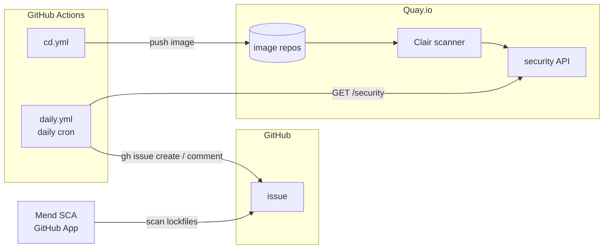

# Security scanning

Last verified: 2026-05-19

Motivated by: operational policy, not an architectural decision — no ADR.

## Overview

Two scanners find vulnerabilities, one poller turns them into GitHub issues,
and two more tools cover source-level and direct-dependency gaps:

| Scanner       | What it scans                                                                 | Where alerts surface                                         |
|---------------|-------------------------------------------------------------------------------|--------------------------------------------------------------|
| Quay.io Clair | Built container images — OS packages, language deps, Red Hat base layer CVEs  | GitHub issue via `daily.yml` (`security` + `vulnerability`)  |
| Mend SCA      | Repo lockfiles — npm and Go transitive dependency CVEs                        | GitHub issue (auto-filed by Mend App, same labels)           |
| CodeQL        | Our Go and TypeScript source (SAST)                                           | GitHub **Security → Code scanning** tab                      |
| Dependabot    | Direct dependency advisories (mostly redundant to Mend, kept as safety net)   | GitHub **Security → Dependabot** tab; auto-filed PRs         |

GitHub **secret scanning** complements the above by blocking credential commits
at push time.

## Pipeline



### Quay Clair + daily.yml

[`cd.yml`](../../.github/workflows/cd.yml) pushes images to Quay on every
`main` push and `v*` tag. Quay's built-in Clair scanner runs automatically and
rescans whenever its CVE database updates — so a CVE disclosed *after* a
release still produces a finding. Images use hardened Red Hat base layers, so
Clair also catches CVEs in OS-level packages from upstream.

[`daily.yml`](../../.github/workflows/daily.yml) polls Quay once a day and
turns findings into GitHub issues. One matrix job per image repository:

1. Resolves the `latest` tag to a manifest digest via Quay's tag API.
2. Fetches the Clair scan for that manifest. Exits with a notice if the scan
   isn't ready yet.
3. Flattens findings into `(CVE, package, version, severity, fixed_by)`
   tuples, deduped by `(CVE, package)`. No severity filter — everything
   surfaces.
4. For each finding, searches open issues for the same CVE + repo name. Adds
   a "still present" comment to existing issues; creates new ones with
   `security` + `vulnerability` labels.

We poll instead of receiving a Quay webhook because Quay's webhook body
template has no header field, so it can't carry the bearer token
`repository_dispatch` requires. Polling keeps auth one-way (CI → Quay).

### Mend SCA

Mend runs as a GitHub App, configured via
[`renovate.json`](../../renovate.json): all routine package updates are
disabled, only `vulnerabilityAlerts` is enabled. Mend scans the full
transitive dependency tree in lockfiles and auto-files GitHub issues for CVEs
it finds.

## Dependency remediation

When a scanner flags a transitive npm dependency, the fix is typically a
`pnpm.overrides` entry (the vulnerable package isn't in our `package.json`).
Scope the override to the vulnerable range so it self-expires:

```jsonc
"pnpm": {
  "overrides": {
    "protobufjs@<7.5.8": "7.5.8"
  }
}
```

When multiple major versions of the same package exist in the tree (e.g.
`brace-expansion` 2.x and 5.x), use an exact version selector to avoid
overriding the wrong line.

`minimumReleaseAge` in `pnpm-workspace.yaml` rejects packages published within
7 days as a supply-chain defence. Security fixes sometimes land inside that
window — add those to `minimumReleaseAgeExclude`. The `common:check:lockfile-age`
mise task enforces the same constraint independently and reads the same
exclusion list.

## Remediation flow

1. Issue lands in the inbox.
2. Identify the source: base image (rebuild), dependency (bump / override), or our code (patch).
3. Merge the fix; the next scan + poll cycle stops commenting on the issue.
4. Close the issue once a poll cycle goes quiet. Closed issues don't dedupe — if the CVE reappears, a fresh issue is opened.
5. **No fix available?** Document risk acceptance in the issue, apply `accepted-risk`, leave open until upstream patches.

## Setup

External state the pipeline needs:

1. **Quay org `dam-agents`** — public-tier (free Clair). One repo per image, all public.
2. **Robot account** with Write across the org:
   ```sh
   gh secret set QUAY_USERNAME --body 'dam-agents+platform_ci'
   gh secret set QUAY_PASSWORD < ~/quay-robot-token.txt
   ```
3. **Mend Renovate** GitHub App — installed on the repo; no credentials to store.

Repo-level toggles in **Settings → Code security**: Dependabot alerts **on**,
Dependabot security updates **on**, secret scanning + push protection **on**,
CodeQL default setup **on** (Go + JavaScript/TypeScript).

## What this does NOT cover

- **Runtime container scanning** (Falco, kube-bench). We rely on image scans pre-deploy.
- **Kubernetes manifest hardening** (kubesec, polaris). Helm linting in CI doesn't include SAST-style policy.
- **Supply-chain provenance** (cosign, SLSA, SBOM). Tracked as future work.
- **Agent workspace contents.** Per the [persistence security note](persistence.md), workspace residue is adversarial input — scanners cover the platform, not user-generated content.

[quay-scan]: https://docs.projectquay.io/use_quay.html#security-scanning
