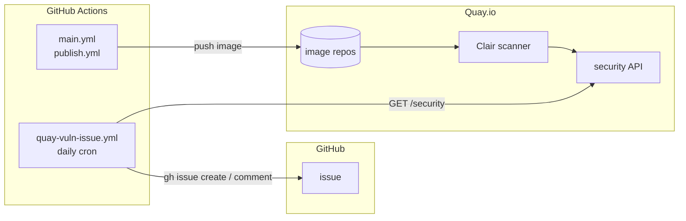

# Security scanning

Last verified: 2026-05-06

Motivated by: operational policy, not an architectural decision — no ADR.
Image scanning, source SAST, and dependency advisory follow industry-standard
shapes; the choices here are off-the-shelf integrations, not load-bearing
decisions worth a separate record.

## Overview

Three scanners cover three different surfaces of the same supply chain:

| Layer         | Scanner                | What it catches                                                                  | Where alerts surface                                          | Triage owner       |
|---------------|------------------------|----------------------------------------------------------------------------------|---------------------------------------------------------------|--------------------|
| Built images  | Quay.io Clair          | CVEs in OS packages and language deps baked into the image (apt, pip, npm, etc.) | Auto-filed GitHub issue (`security`, `vulnerability` labels)  | Security oncall    |
| Our source    | CodeQL                 | SAST findings in our Go and TypeScript code                                      | GitHub **Security → Code scanning** tab                       | PR author / review |
| Declared deps | Dependabot             | Vulnerable npm / Go / GitHub Actions / Docker base versions                      | Auto-filed PR; alert in **Security → Dependabot** tab         | PR author          |

GitHub **secret scanning** is auto-enabled on public repos and complements the
above by blocking accidental credential commits at push time. No config in this
repo; alerts surface in the Security tab.

## Pipeline



We poll instead of receiving a webhook because Quay's webhook notifications
have a body template but no header field, so they can't carry the bearer
token GitHub's `repository_dispatch` requires. Polling keeps the auth shape
one-way (CI → Quay) and removes the need for a fine-grained PAT stored in
Quay's UI.

Quay rescans existing images whenever its CVE database updates, so a CVE
disclosed *after* a release still produces a finding — which is the whole
reason for moving off ghcr.io ([free Clair scanning is the killer feature][quay-scan]).
The poll runs daily, so there's up to ~24h between Clair finding a CVE and
an issue being filed. Tune the `cron:` line in
[`quay-vuln-issue.yml`](../../.github/workflows/quay-vuln-issue.yml) if that
window is too wide.

## Workflows in this repo

- [`.github/workflows/main.yml`](../../.github/workflows/main.yml) and [`publish.yml`](../../.github/workflows/publish.yml) — push to `quay.io/dam-agents/<component>`.
- [`.github/workflows/quay-vuln-issue.yml`](../../.github/workflows/quay-vuln-issue.yml) — daily poller; for each image's `latest` tag, hits Quay's security API, dedupes by `(repository, CVE, package)`, opens new issues or comments existing ones.

CodeQL runs from GitHub's **default setup** (configured in repo Settings, no
workflow file) — it picks Go and JavaScript/TypeScript automatically, runs on
push and PR to default + protected branches, and weekly. Findings show up
under **Security → Code scanning** the same way they would with a workflow.

There is no `dependabot.yml`. Dependabot alerts and security PRs are repo-level
toggles (Settings → Code security), not config-file driven; non-security
version bumps are explicitly opted out of so the repo doesn't drown in churn.

## Manual one-time setup

The pipeline needs only two pieces of state outside the repo:

1. **Quay org `dam-agents`** — public-tier (free Clair scanning). One repo per image, all public:
   `api-server`, `claude-code`, `code-guardian`, `controller`, `google-workspace-agent`,
   `pi-agent`, `platform-base`, `ui` (plus `charts` for the Helm OCI chart, no scan needed).
2. **Robot account** with Write across the org. Credentials stored as repo secrets:
   ```sh
   gh secret set QUAY_USERNAME --body 'dam-agents+platform_ci'
   gh secret set QUAY_PASSWORD < ~/quay-robot-token.txt
   ```

The poller uses the default `GITHUB_TOKEN` for issue writes — no PAT, no
Quay webhook, no header config. (We tried; Quay webhooks don't expose a
header field, which made `repository_dispatch` infeasible.)

Repo-level toggles to flip in **Settings → Code security**:

- Dependabot alerts: **on**
- Dependabot security updates: **on**
- Secret scanning + push protection: **on**
- CodeQL default setup: **on** (Go + JavaScript/TypeScript).

## Remediation flow

1. Issue or PR lands in the inbox.
2. The owner identifies the source: a base image (rebuild), a dependency (bump), or our own code (patch).
3. Merge the fix; the next image build's Quay scan reports the CVE gone, and the next daily poll stops commenting on the open issue.
4. Close the issue once a poll cycle goes quiet. If the same CVE reappears later (regression, or new image with the old base), the next poll opens a fresh issue — closed issues don't dedupe.
5. **No fix available?** Document the risk acceptance in the issue: which versions are affected, why an immediate workaround isn't possible, and what monitoring catches exploitation. Apply the `accepted-risk` label and leave open until upstream ships a patch.

## What this does NOT cover

Out of scope today, listed so the gap is visible:

- **Runtime container scanning** (Falco, kube-bench at the cluster level). Catches drift after deploy; we rely on the image scan being the authoritative source pre-deploy.
- **Kubernetes manifest hardening** (kubesec, polaris). Helm chart linting in CI is a `mise run helm:check:lint` away but doesn't include SAST-style policy.
- **Supply-chain provenance** (cosign signing, SLSA attestations, SBOM). Quay supports cosign verification but we don't sign yet. Tracked in the security model as future work.
- **Agent workspace contents.** Per the [persistence security note](persistence.md), workspace residue is adversarial input on the next turn — the scanners here cover the platform, not user-generated content inside an instance.

[quay-scan]: https://docs.projectquay.io/use_quay.html#security-scanning
