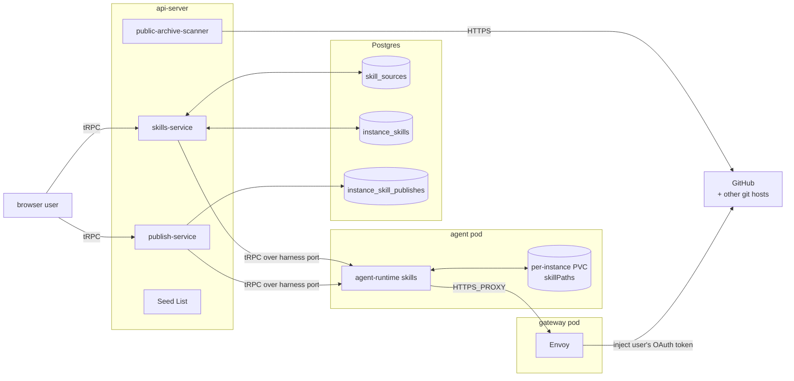
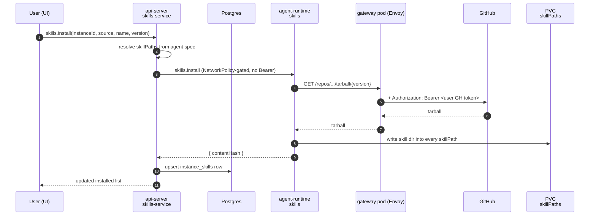
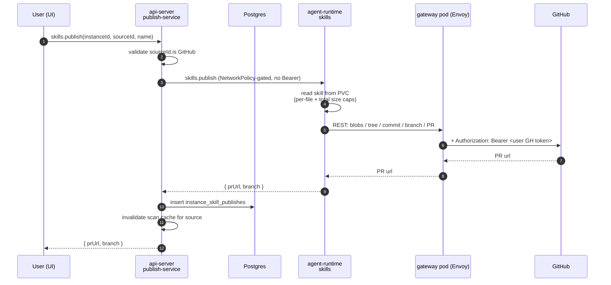

# Skills

Last verified: 2026-05-06

## Motivated by

- [ADR-030 — Skills: connectable sources and install](../adrs/030-skills-marketplace.md) — Platform owns skill *transport*, not skill format; sources are external git repos, not a Platform-hosted catalog
- [ADR-023 — Harness-agnostic agent base image](../adrs/023-harness-agnostic-base-image.md) — `skillPaths` is a per-template knob; the controller stays harness-agnostic
- [ADR-005 — Gateway pattern for credentials](../adrs/005-credential-gateway.md) — agent-runtime makes GitHub calls without holding credentials; the gateway pod injects `Authorization` on the wire from the owner's K8s Secret
- [ADR-024 — Connector-declared envs and per-agent overrides](../adrs/024-connector-declared-envs.md) — env composition rules for agent pods
- [ADR-033 — Envoy-based credential gateway](../adrs/033-envoy-credential-gateway.md) — Envoy performs the credential swap
- [ADR-038 — Paired agent and gateway pods](../adrs/038-paired-gateway-pod.md) — Envoy lives in a paired gateway pod, not a sidecar

## Overview

A **skill** is a directory containing a `SKILL.md` manifest (YAML frontmatter — `name`, `description`) plus supporting files. Platform does not interpret skills; it **transports** them between external git repositories and the per-instance PVC, where the harness reads them from configured paths.

The subsystem splits cleanly across two bounded contexts ([`tseng/vocabulary.md`](../../tseng/vocabulary.md)):

- **api-server side** — owns the catalog: which sources are connected, which skills are installed where, and what was published from which instance. All of it is api-server-only Application State and lives in Postgres or in api-server config. The api-server never touches a pod's filesystem directly.
- **agent-runtime side** — owns the pod-local files: scanning a source, materializing a skill into the configured paths, walking the disk to enumerate local skills, and publishing a local skill upstream. It never reasons about catalogs, drift, or which user owns what.

The two contexts share the agent-runtime as the only path that reaches a pod, and the paired gateway pod as the only path that reaches GitHub with credentials. Everything else is a tRPC call between them.

## Diagram

The api-server scans **public** GitHub catalogs directly (no credentials needed) and falls back to agent-runtime for everything else. agent-runtime is the only component that talks to GitHub with credentials, and it does so without holding any: the request leaves the agent pod through the paired gateway pod, where Envoy injects the owner's GitHub token from a K8s Secret on the wire ([security-and-credentials](security-and-credentials.md)).

## Concepts

### Skill Source

A connection to an external git repository, addressable by id. Three kinds, all merged into a single list at read time and badged in the UI:

- **User source** — a row in Postgres (`skill_sources`), owner-scoped. Created and deleted by the user via tRPC.
- **System source** — a Helm-declared platform-wide entry from `skills.skillSources` ([`deploy/helm/platform/values.yaml`](../../deploy/helm/platform/values.yaml)). Loaded into api-server config from the `SKILL_SOURCES_SEED` env at boot, never persisted to Postgres. Marked `system: true` and protected from deletion. Badged "Platform".
- **Template source** — declared on a template's `spec.skillSources`. Surfaced read-only on every instance derived from that template. Badged "Agent".

Listing dedupes on `gitUrl` with first-wins precedence: user → template → system. A user creating a custom source for the same URL shadows the system entry; deleting the user row exposes the system entry again.

### Skill, Installed Skill Ref, Local Skill

A **Scanned Skill** is what an api-server scan returns from a Source: `(name, description, version, contentHash)`, where `version` is the source's HEAD commit SHA and `contentHash` is a deterministic SHA-256 over the skill directory.

An **Installed Skill Ref** is a row in `instance_skills` keyed `(instanceId, source, name)` recording which Scanned Skill is installed at which Version on which Instance. The on-disk directory at the configured Skill Paths is the source of truth for "what is installed" — the Postgres row is a declarative record that self-heals on each `state` query.

A **Local Skill** is a directory present in some Skill Path on the pod, regardless of how it got there. The reconciled `state` view splits Locals into:

- **Installed** — also tracked in `instance_skills`. Drift surfaces when its Postgres `contentHash` differs from the upstream scan's `contentHash`.
- **Standalone** — on disk but not tracked. Authored in place via the Files panel. May carry a "Published" badge if it has a matching `instance_skill_publishes` row.

A **Skill Publish Record** (`instance_skill_publishes`) is the explicit log of a successful publish: skillName, sourceId, prUrl, plus the source name and gitUrl denormalized so the record stays usable after the source is renamed or deleted. This is what drives the "Published" badge — replacing a name-match heuristic that produced false positives.

### Skill Path

An absolute on-pod directory the harness reads skills from. Resolved per instance via a precedence chain at install time: the agent's own `spec.skillPaths` (copied from the template at agent creation) wins over the template's `spec.skillPaths`, which wins over the cross-harness default `/home/agent/.agents/skills/`. Claude-Code-derived templates override to `/home/agent/.claude/skills/`.

Install writes the skill directory into **every** configured Skill Path; uninstall removes it from all of them. Scanning the disk for Local Skills walks every path in order and dedupes by directory name (first found wins).

## Subsystems

### api-server skills service

Lives in [`packages/api-server/src/modules/skills/`](../../packages/api-server/src/modules/skills/). Owns:

- The **Skill Source catalogue** — CRUD on user sources, merging in system seeds and template sources, dedupe and badge resolution.
- The **scan cache** — per-`gitUrl`, 5-minute TTL, invalidated on `sources.refresh` or after a successful publish to that source.
- **Public-archive scanning** — for `github.com` URLs, downloads `archive/HEAD.tar.gz` directly from GitHub, walks for `SKILL.md`, parses frontmatter, computes `contentHash`. No credentials required. This is the path that lets the catalog UI render even when no instance is running.
- **Private / non-GitHub fallback** — falls through to the agent-runtime `skills.scan` over the harness port. Requires a running instance because the credential path needs the paired gateway pod; the api-server has none.
- **Install / uninstall orchestration** — calls agent-runtime over its harness-port tRPC and on success upserts the `instance_skills` row with the returned `contentHash`. The api-server is the only pod whose NetworkPolicy can reach the agent's tRPC listener; no Bearer token is sent.
- **Publish orchestration** ([`publish-service`](../../packages/api-server/src/modules/skills/services/publish-service.ts)) — validates that the source is a GitHub URL (only host that supports publish), calls agent-runtime, and on success writes the `instance_skill_publishes` row and invalidates the scan cache for that source.
- **Reconciled `state` view** — joins live `listLocal` from agent-runtime with the `instance_skills` rows, drops ghost rows whose directories were deleted out-of-band (and persists the cleanup), and folds in the `instance_skill_publishes` rows.
- **MCP tools** — five tools registered on the per-instance MCP endpoint ([`mcp-endpoint.ts`](../../packages/api-server/src/apps/harness-api-server/mcp-endpoint.ts)): `list_skill_sources`, `list_skills_in_source`, `install_skill`, `uninstall_skill`, `publish_skill`. `instanceId` is bound by the verified MCP session token, not user input — agents cannot spoof which instance they're acting on.
- **Cleanup saga** — subscribes to `InstanceDeleted` and deletes both `instance_skills` and `instance_skill_publishes` rows for the deleted instance. User-owned `skill_sources` are unaffected; they outlive any single instance.

### agent-runtime skills service

Lives in [`packages/agent-runtime/src/modules/skills/`](../../packages/agent-runtime/src/modules/skills/). Exposes a Bearer-authenticated tRPC surface (`install`, `uninstall`, `publish`, `scan`, `listLocal`) over the harness port; the api-server is the only caller.

Three responsibilities:

- **Install** — fetches the source at the requested `version`. For GitHub URLs, uses the REST tarball endpoint (anonymous first, retry authenticated on 404 to distinguish "not found" from "private"); for everything else, shallow-clones via `git`. The paired gateway pod injects the owner's GitHub token on the wire when the request hits `api.github.com`. Resolves the skill directory inside the fetch (`skills/<name>/` then top-level `<name>/`), copies it into every configured Skill Path, and returns the deterministic `contentHash`.
- **Scan** — same fetch path; walks for `SKILL.md`, parses frontmatter, and returns `(name, description, version, contentHash)` for each.
- **Publish** — REST-only. Reads the local skill from disk (size-capped per file and per skill), creates blobs + tree + commit + branch + PR via the GitHub REST API, with author `Platform <platform-publish@users.noreply.github.com>`. Branch naming: `platform/publish-<name>-<timestamp>`. There is no `git push`.

Boot-time wiring runs `gh auth setup-git` once before the tRPC server starts, so a private-repo `git clone` invoked from inside the pod also routes through `gh` (and therefore through the gateway pod's credential injector) instead of stalling on a username prompt.

### Credential injection on the wire

Agent-runtime never holds a real GitHub token. The paired gateway pod performs the swap:

1. The agent pod's `HTTPS_PROXY` is `http://<instance>-gateway:<envoy-port>` — the per-instance gateway Service DNS ([ADR-038](../adrs/038-paired-gateway-pod.md)). The agent pod's NetworkPolicy admits no other route to TCP 80/443, so credential injection is enforced by the cluster, not by the agent honoring an env var. `SSL_CERT_FILE` points at the cluster-issued MITM CA so TLS termination on the gateway succeeds ([security-and-credentials](security-and-credentials.md)).
2. Envoy's host-specific filter chain for `api.github.com` injects `Authorization: Bearer <user's GitHub OAuth token>` from a K8s Secret mounted only on the gateway pod (labelled `platform.ai/owner=` and `platform.ai/connection=github` or similar), then re-originates upstream TLS to the real host.
3. agent-runtime makes its API calls without authenticating — Envoy supplies the credential.

If the user has not connected GitHub, no Secret exists and the request leaves authenticated only when the agent has supplied its own token. The agent runtime exposes `PLATFORM_GH_TOKEN_AVAILABLE=true|false` so wrapper scripts can short-circuit instead of making a 401-eliciting request first.

The same path lets `git clone` of a private repo work without any credential being mounted into the agent pod.

## Flows

### Install

Public-source installs work identically except Envoy's filter chain has no credential to inject (no token swap, anonymous archive download).

### Publish

GitHub errors (missing scope, repo not found) surface to agent-runtime as the upstream's HTTP response; the api-server forwards them verbatim into the tRPC error so the UI can render the right CTA.

### Listing & scan

`skills.sources.list(instanceId?)` merges the three Source kinds and returns `canPublish: true` only for GitHub URLs.

`skills.listSkills(sourceId, instanceId?)` resolves the source and dispatches:

- **Public GitHub** → `public-archive-scanner` from the api-server, served from the per-`gitUrl` cache when fresh. No instance required.
- **Anything else** → agent-runtime `skills.scan`. Requires a running instance and surfaces a clear error if `instanceId` is missing.

The cache is invalidated on `sources.refresh` and after every successful publish to that source — the latter so a freshly-merged PR shows up on the next list.

### Reconciled state

`skills.state(instanceId)` is the single read the UI uses to render the Skills panel. It composes:

- `listLocal` from agent-runtime — what's actually on disk, deduped across Skill Paths.
- The `instance_skills` rows for the instance.
- The `instance_skill_publishes` rows for the instance.

Then it drops "ghost" rows (`instance_skills` rows whose directory has been deleted out-of-band, e.g. via the file panel) and persists the cleanup. The Postgres rows stop drifting from the filesystem without requiring a separate reconciler — every read is the reconciler.

## Persistence touchpoints

Skills are entirely an **Application State** subsystem ([persistence](persistence.md)). Three Postgres tables in [`packages/db/src/schema.ts`](../../packages/db/src/schema.ts):

| Table | Key | Owner |
|---|---|---|
| `skill_sources` | `(id)`, unique on `(owner, gitUrl)` | per-user |
| `instance_skills` | `(instanceId, source, name)` | per-instance |
| `instance_skill_publishes` | `(id)`, indexed by `instanceId` | per-instance |

System and template sources do **not** persist — system sources come from `SKILL_SOURCES_SEED`, template sources from the template's `spec.skillSources`. Both are computed at request time.

The on-pod state lives on the per-instance PVC under the configured Skill Paths. PVC reclamation on instance deletion ([persistence § Lifetime](persistence.md#lifetime)) takes care of the file-side cleanup; the Skills cleanup saga handles the row-side. User-owned `skill_sources` survive instance deletion — they are catalog connections, not instance state.

## Invariants

- **Filesystem is authoritative for installed state.** `instance_skills` is a declarative record that self-heals on every `state` read. A skill removed via the Files panel disappears from the UI without any explicit uninstall.
- **api-server never touches the pod filesystem.** Every disk-touching operation goes through agent-runtime over its tRPC port; the agent pod's NetworkPolicy admits ingress only from the api-server pod, so no in-process auth is needed on that hop.
- **agent-runtime never holds a GitHub credential.** Every authenticated GitHub call leaves the agent unauthenticated; Envoy in the paired gateway pod injects `Authorization: Bearer <user OAuth token>` from the owner's K8s Secret on the wire. A compromised agent pod cannot exfiltrate the user's GitHub token because the token is never mounted into the agent pod — only the gateway pod, and the agent pod's NetworkPolicy admits no route to GitHub other than through that gateway.
- **Publish is REST-only.** No `git push` on the publish path. `git` is used only for cloning non-GitHub sources during install/scan, and that path also routes through the gateway pod's credential injector via `gh auth setup-git`.
- **MCP `instanceId` is server-bound.** The per-instance MCP endpoint authenticates the agent against the agent ConfigMap's `accessTokenHash` ([channels § Auth without an admin login](channels.md#auth-without-an-admin-login)) and pins the `instanceId` from the verified token, not from tool input.
