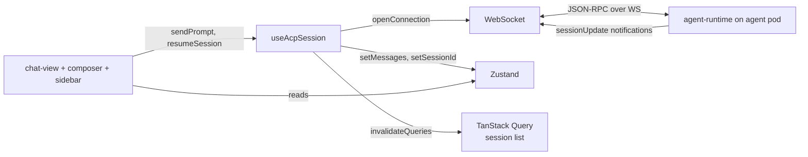
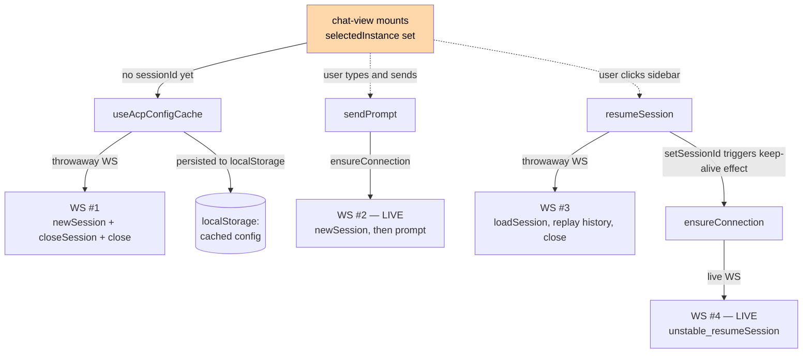
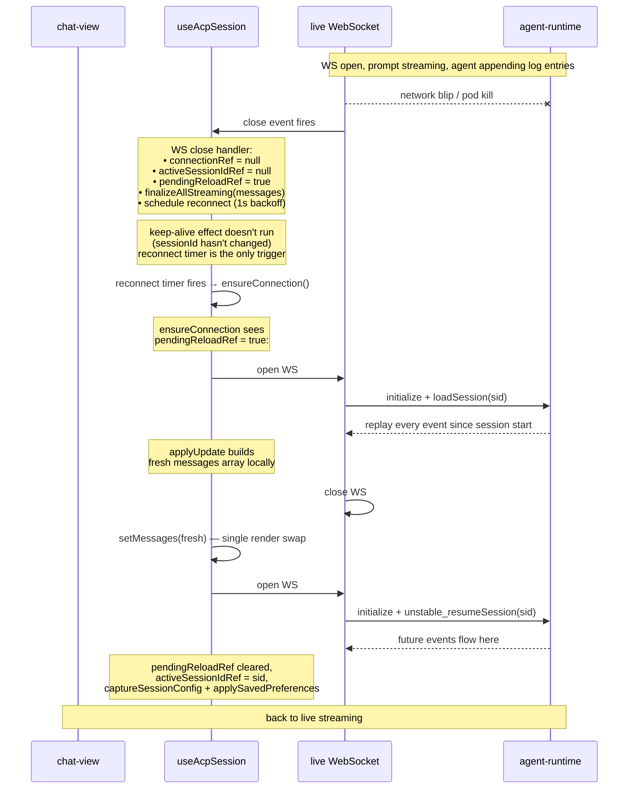
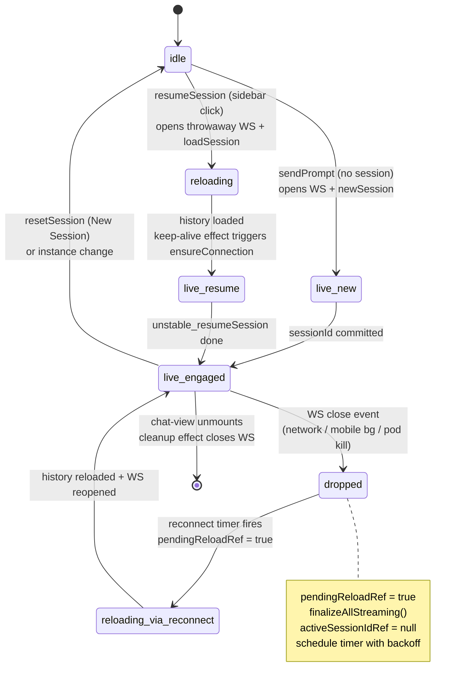

# Chat domain — WebSocket lifecycle + step-04 architecture

Companion to [`chat.md`](chat.md). Walks through how the chat session WebSocket
works today, calls out the implicit state machine, and proposes the module
shape for the full step-04 split.

---

## Players



The **WebSocket** is one-per-active-chat. The **agent-runtime** lives inside
the agent pod and speaks ACP (the `@agentclientprotocol/sdk` JSON-RPC
protocol). The browser's `ClientSideConnection` from the SDK wraps the WS
into request/response calls (`newSession`, `prompt`, `cancel`, …) plus a
stream of server-pushed `sessionUpdate` notifications.

## Three reasons a WS gets opened



Three throwaway-WS uses (config bootstrap, history replay) and two paths to a
live WS (first send, sidebar resume). Each WS goes through the same
`openConnection` glue in [`modules/acp/acp.ts`](../../../../packages/ui/src/modules/acp/acp.ts):
open browser `WebSocket`, wrap into `ReadableStream`/`WritableStream`, hand to
`ClientSideConnection`, return.

The live WS, once open, listens via `addEventListener("close", …)` for
unexpected closes (mobile bg, network blip, agent pod restart). That's where
the reconnect choreography starts.

## What lives on the WS while it's "live"

Three concurrent message channels share one socket, multiplexed by JSON-RPC
IDs:

1. **Client→server requests** the SDK initiates: `initialize`, `newSession`,
   `unstable_resumeSession`, `prompt`, `cancel`, `setSessionMode`, …
2. **Server→client `sessionUpdate` notifications** — streamed tokens,
   tool-call lifecycle, mode changes, the synthetic `platform/turnEnded` from our
   runtime extension.
3. **Server→client `requestPermission` calls** — when the agent wants
   approval before a tool runs. `acp.ts` parks them as a pending promise in
   the Zustand `permissions` slice; the user's click resolves it.

## Unexpected disconnect mid-stream — the trickiest flow



The **two-WS dance on reconnect** is the trick:
`unstable_resumeSession` only attaches the channel for *future* events; the
gap between drop and reconnect would otherwise be lost. `loadSession` replays
from the beginning — but if you call it on a live socket the runtime
broadcasts every replayed event to that same channel, and the live update
handler applies them on top of the existing projection, doubling everything.
Hence: throwaway socket → local replay → swap → reconnect.

## The implicit state machine today

Inferred from the refs and effects in `useAcpSession`:



That `dropped → reloading_via_reconnect` transition is what the
`pendingReloadRef` flag encodes today — set in the WS close handler and
consumed 50 lines later in `ensureConnection`.

---

## Pain points

The orchestrator carries 9 refs and 5 effects that together model an implicit
state machine. Reading any single callback tells you a fragment, not the
lifecycle.

- `pendingReloadRef` is set in the WS close handler, consumed 50 lines later
  in `ensureConnection`.
- `loadHistoryIntoRef` and `reconnectFnRef` exist purely to break circular
  deps — symptoms of a wrong dependency graph, not real circularity.
- `connectionRef` / `activeSessionIdRef` / `ensureConnectionInFlight` together
  encode "is the WS live and engaged with the right session", but no single
  function names that question.
- `setMessages(finalizeAllStreaming)` is called from three places (WS close,
  `stopAgent`, `resetSession`) — same operation, three different reasons.
- Three independent triggers funnel into `ensureConnection`: keep-alive
  effect, reconnect timer, sendPrompt. The promise dedup ref handles
  concurrency, but the choreography is implicit.
- The lifecycle is essentially untestable — every assertion needs a real
  WebSocket.

## Proposal

Replace the 9-ref soup with an **explicit FSM** for the connection
lifecycle, and pull every other concern out into its own hook around it. The
orchestrator becomes a thin compose layer (~80 lines) whose only job is
wiring.

### Module shape

```
modules/sessions/hooks/
├── use-acp-session.ts             # thin orchestrator, public surface
├── use-acp-connection.ts          # NEW: FSM driver + ensureLive()
├── use-acp-session-engagement.ts  # NEW: newSession vs resumeSession decision
├── use-acp-history.ts             # NEW: loadHistory via throwaway WS
├── use-acp-prompt.ts              # NEW: sendPrompt + stopAgent + persist-once
├── use-acp-config-cache.ts        # (exists) config + prefs + bootstrap
└── use-acp-update-handler.ts      # (exists) update→projection factory

modules/acp/
├── connection-state-machine.ts    # NEW: pure reducer, no React
├── acp.ts                         # (exists) WS + SDK wiring
├── session-projection.ts          # (exists) update reducer
└── utils.ts                       # (exists) error helpers, prompt blocks
```

### The state machine — the centerpiece

> **Note:** the 7-state shape below is the *target* design, not what's
> implemented today. The current `useAcpConnection` exports four states
> (`idle | live | reloading | reconnecting`) — `connecting` and `engaging`
> still live as in-flight refs, and `closed` is implicit (unmount). The
> remaining collapse-into-FSM work is tracked under the post-step-04 plan.

```ts
type ConnectionState =
  | "idle"          // no instance/session selected
  | "connecting"    // WS open in flight
  | "engaging"      // WS open, newSession/resumeSession in flight
  | "live"          // WS open, session bound, ready
  | "reloading"     // live WS died with active session — replaying history
  | "reconnecting"  // backoff timer or retry WS open
  | "closed";       // unmount/instance change
```

Transitions are pure — defined in `acp/connection-state-machine.ts`,
unit-testable without a WebSocket. Side effects (open WS, close WS, call SDK,
schedule timer) live in a runner inside `useAcpConnection`.

The state replaces every ref-as-flag in the current code:

| Today | After |
|---|---|
| `pendingReloadRef` | `state === "reloading"` |
| `connectionRef + activeSessionIdRef + ensureConnectionInFlight` | `state === "live"` plus the live conn handle in the runner's closure |
| `reconnectFnRef + reconnectAttemptRef + reconnectTimerRef` | encoded in the `reconnecting` state's effect runner |

`useAcpConnection` exposes a tiny surface:

```ts
interface UseAcpConnectionResult {
  state: ConnectionState;             // for UI badges + log panel
  ensureLive(): Promise<ClientSideConnection | null>;
  reset(): void;                      // hard close (instance/session change)
}
```

### Each peripheral hook owns one thing

- **`useAcpHistory`** — one method, `loadHistory(sid): Promise<Message[]>`.
  The throwaway-WS pattern lives here, well-commented. Future server-side
  cursor APIs become a one-file change.
- **`useAcpSessionEngagement`** — given a live conn, engage with the session
  (newSession or resume), capture config, apply prefs, expose
  `engagedSessionIdRef`. Renamed from the misleading `activeSessionIdRef` and
  documented as connection-state, not session-state.
- **`useAcpPrompt`** — `sendPrompt`, `stopAgent`, `persistedSessionsRef`
  (which only this hook reads).
- **`useAcpConfigCache` / `useAcpUpdateHandler`** — already extracted.

### Wins

| Pain | After |
|---|---|
| 9 refs encoding lifecycle | 1 enum + the runner's closure |
| Late-bound refs to break cycles | Hooks have a directed dep graph |
| `setMessages(finalizeAllStreaming)` in 3 places | One: the `live → reloading` transition's side effect |
| Lifecycle untestable | FSM reducer is pure, full unit coverage |
| Implicit "what state are we in?" | `state` is exported; chat-view can render "Reconnecting…" / "Reloading conversation…" badges |

### Future fixes this unblocks

- **Streaming-error recovery** — add a `degraded` state with one-click retry
  of the last prompt, no context lost.
- **Server cursor** — when the runtime grows "events since X", history
  reload becomes a one-file change (`useAcpHistory`).
- **StrictMode race-free** — every effect cleanup aborts its in-flight
  phase; today the cleanup is split across multiple effects.

### Risks

- ~7 small files instead of 1 large one. Cognitive load shifts from
  tangled-but-local to small-but-distributed. The orchestrator's job is
  making wiring obvious.
- Re-deriving every transition has subtle behavior-shift risk (timing of
  side effects). Needs Playwright coverage of: cold open, sidebar resume,
  send prompt, mid-stream network drop, mobile bg/fg swap, StrictMode
  double-mount.

### Implementation order — one commit per step

1. Extract `useAcpHistory` — smallest, isolated.
2. Extract `useAcpPrompt` — depends on `ensureConnection` passed in.
3. Extract `useAcpSessionEngagement`.
4. Build the FSM in `acp/connection-state-machine.ts` (pure, tested in
   isolation).
5. Build `useAcpConnection` — runs the FSM with the side-effect runner.
6. Slim `useAcpSession` to the compose layer.
