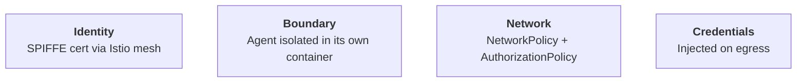
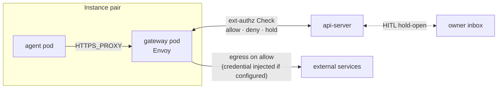

# Security overview

How Platform isolates agents from each other, from the cluster, and
from the credentials they use to reach external services.

## Layers of defense

- **Identity.** Every workload runs as a per-instance Kubernetes
ServiceAccount, and istiod stamps that SA into a SPIFFE workload
certificate as the pod joins the Istio ambient mesh. Admission across
the mesh is decided on the certificate's SA principal, not on IP or
port — a peer instance can resolve the address, but the
AuthorizationPolicy denies the call before it lands.

- **Boundary.** The agent runs in its own container, with its own
kernel namespaces, its own filesystem, and no shared address space.
The pod hosts only that one container — no co-located sidecar to
share a namespace with. `automountServiceAccountToken` is false on
the pod (a pod-level setting in Kubernetes), so there is no
Kubernetes API token sitting in the agent's filesystem; istiod
issues the workload cert independently.

- **Network.** Multiple layers restrict where the agent can talk. At
the kernel, a Kubernetes NetworkPolicy locks the agent pod's L3/L4
egress to a narrow allow-list — DNS, the Istio ambient data path, and
the single sibling gateway pod it is paired with. At the mesh, Istio
AuthorizationPolicies key on the per-instance ServiceAccount: peer-pod
admission is gated at L4, and the harness path on the api-server is
gated at L7. And every egress request through the sibling pod runs
through an ext-authz check at the api-server before being forwarded.

- **Credentials.** Real upstream tokens never reach the agent. They
live in Kubernetes Secrets mounted into a sibling gateway pod. For hosts
where a credential is configured, the sibling pod adds the credential
header on the wire after the ext-authz check has authorized the
request — for everything else, traffic passes through unchanged.

## Security boundary

The container is the security boundary. Everything inside it — the
agent process, any tools it spawns, any content it reads — is
treated as untrusted. The agent pod hosts a single agent container,
and the controls above all live outside it (in the mesh, in the
kernel's network stack, in a sibling pod that holds the credentials),
so that a compromised agent cannot reach beyond what its network and
identity allow. Some of those controls are written at the pod level
rather than per-container — NetworkPolicy and
`automountServiceAccountToken` are pod-scoped, because that's the
granularity Kubernetes exposes — but with one container per agent
pod, the two coincide.

By default, containers run on the cluster's container runtime —
typically runc — which shares a kernel with the node. The four
controls above stand regardless, but a kernel-level escape from the
agent's container reaches the node directly, and from there anything
co-located on it.

For deployments where that risk matters, the cluster operator should
run Platform's pods under a stronger runtime — [gVisor](https://gvisor.dev/)
or [Kata Containers](https://katacontainers.io/) — via a Kubernetes
RuntimeClass. Platform itself does not pin a RuntimeClass; the
choice of substrate sits with whoever operates the cluster. See
[security-model § Execution](security-model.md#execution) for the
longer framing.

## Authorization flow

Every internal hop carries a SPIFFE identity stamped by istiod, and
every admission is gated on it.

Three AuthorizationPolicies per instance gate admission
cryptographically: gateway admission, the harness path on the
api-server, and the per-instance ext-authz Service. Each is keyed on
the per-instance ServiceAccount, so peer instances are denied at the
mesh — they can resolve the address but the call never lands.

Layered above that, every egress request through the gateway runs
through a second gate. Envoy makes a gRPC ext-authz Check to the
api-server before forwarding the request, with the calling instance
proven cryptographically by the ServiceAccount on the connection. The
api-server matches the request against the instance's egress rules
and answers allow, deny, or hold-open. A held-open Check waits while
the owner approves or denies the egress from the inbox in the UI; if
the verdict is deny — or none arrives — the Check fails closed and
the agent gets a 403. For hosts where a credential is configured,
Envoy injects the credential header after the Check allows, just
before the request leaves the cluster.

## Threats and mitigations

| Threat | Mitigation |
|---|---|
| Agent steals an upstream token | Credentials live only in the gateway pod; Envoy injects them on the wire and the agent sees no real token |
| Agent escalates via its ServiceAccount token | `automountServiceAccountToken: false` on both pods — istiod issues the workload cert without a mounted SA-token |
| Agent reaches a peer instance's gateway | Per-instance AuthorizationPolicy denies traffic from any non-matching ServiceAccount |
| Agent bypasses the proxy to call external hosts directly | Per-pair agent-egress NetworkPolicy restricts L3/L4 egress to DNS, the paired gateway, and the ambient mesh |
| Route-confusion exfil through the gateway | Per-host Envoy filter chains pinned to each credential's host, with SAN-bound upstream TLS validation |
| Direct pod-IP bypass of the api-server | Pod-level DENY AuthorizationPolicy admits only the waypoint's SA (harness) or a per-instance SA (ext-authz) |

## See also

- [security-and-credentials](../architecture/security-and-credentials.md) — current-state architecture details
- [security-model](security-model.md) — narrative framing of the three risks: execution, credentials, confidentiality
