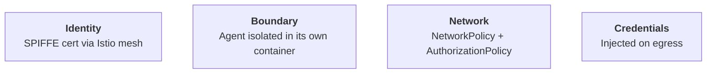
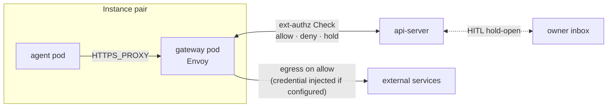

# Security overview

How Platform keeps an AI agent from doing damage — to other agents, to
the cluster it runs on, or to the accounts it's allowed to use.

The starting assumption is that the agent is **untrusted**. It runs
code and makes web requests on its own; we have to plan for the case
where it goes off the rails and tries to leak a password, contact a
server it shouldn't, or attack something running nearby. So we build
real walls around it, and we never assume good behaviour.

## Layers of defense

- **Identity.** Some calls go *back into* the platform on the agent's
behalf — the gateway pod talks to the api-server's harness (the
channel the agent's LLM uses) and to a per-instance `ext-authz`
service that approves outgoing requests. Both of those have to be
authorized: only the gateway from the matching instance is allowed
in. Istio's identity service (`istiod`) gives each gateway pod a
digital ID card — a SPIFFE certificate, signed by the cluster and
impossible to forge. The doors on those api-server endpoints check
the ID and admit only the right one, so one instance can never call
another instance's harness or ext-authz.

- **Boundary.** The agent runs in its own container — a sealed room
with its own filesystem and its own kernel namespaces, sharing nothing
with anyone else. We put exactly one container in each pod, so the
agent has no roommate it could share memory or a network namespace
with. The pod also has no Kubernetes login token mounted
(`automountServiceAccountToken: false`): even if the agent tries to
ask Kubernetes "what else is around?", it has no credentials to do so.
The SPIFFE ID is delivered another way that doesn't put a token on
disk.

- **Network.** Several locks restrict where the agent can talk. At the
kernel — the part of the OS that decides which network packets are
allowed out — a Kubernetes NetworkPolicy lets the agent's pod reach
exactly one place: the sibling **gateway pod** we paired it with. The
rule pins to that specific pod by label (`pair=<id>, role=gateway`),
so even other instances' gateways are out of reach. No peer pods, no
internet directly, and no DNS — the controller injects a hostAliases
entry into the pod so `HTTPS_PROXY` can resolve the gateway's name
without ever doing a DNS lookup, which closes a sneaky exfil channel
where the agent could smuggle data out in DNS queries. As a backup of
the same lock, a privileged init container writes a matching
`iptables` rule inside the pod; if NetworkPolicy enforcement ever
broke, this second layer would still hold. Every outgoing request the
gateway pod then forwards on the agent's behalf runs through an
`ext-authz` check at the api-server before leaving the cluster.

- **Credentials.** Real upstream passwords (API keys, OAuth tokens)
never reach the agent. They live in Kubernetes Secrets that only the
gateway pod can read. When the agent wants to call something like
GitHub, the request goes through the gateway pod. For hosts where a
credential is configured, the gateway adds the credential header onto
the wire after the `ext-authz` check has approved the call — for
everything else, traffic passes through unchanged.

## Security boundary

The container is the wall. Everything inside it — the agent process,
any tools it starts, any content it reads — is treated as untrusted.
The agent pod hosts a single agent container, and the controls above
all live *outside* it: in the mesh, in the kernel's network stack, in
the sibling gateway pod that holds the credentials. A compromised
agent can't reach any of them. A few of these controls technically
apply to the pod rather than to the container itself (Kubernetes only
lets you set NetworkPolicy and the token-mount option at the pod
level), but because we only put one container in each pod, the pod
and the container coincide.

By default the container runs on the cluster's normal container
runtime — usually `runc` — which shares a kernel with the host
machine. The four controls above all still stand, but if an attacker
ever broke out of the container into the kernel, they'd be on the host
directly. That's a known, hard problem in the container world — the
runc container-escape CVEs disclosed in November 2025 and the "Copy
Fail" Linux-kernel LPE in April 2026 are recent examples.

If you're running Platform somewhere where that risk matters, the
cluster operator should swap in a stronger runtime —
[gVisor](https://gvisor.dev/), which intercepts the container's system
calls, or [Kata Containers](https://katacontainers.io/), which gives
each pod its own lightweight virtual machine. The choice is set with
a Kubernetes RuntimeClass. Platform itself doesn't force a choice;
that decision belongs to whoever operates the cluster. See
[security-model § Execution](security-model.md#execution) for the
longer framing.

## Authorization flow

Every internal hop carries a SPIFFE ID stamped by `istiod`, and every
door checks it.

Two AuthorizationPolicies sit at the doors that matter: the harness
path on the api-server, and the per-instance `ext-authz` service.
Each one only admits the gateway whose SPIFFE ID belongs to the right
instance, so one instance can never call another instance's harness
or ext-authz — the address resolves, but the call never lands. The
gateway pod itself has no AuthorizationPolicy in front of it; the
agent's NetworkPolicy is the only gate on the agent → gateway hop.

On top of that, every outgoing request through the gateway runs
through a second gate. Envoy (the program running inside the gateway
pod) makes a gRPC `ext-authz` Check to the api-server before
forwarding the request, with the calling instance proven
cryptographically by the ServiceAccount on the connection. The
api-server looks the request up against the instance's egress rules
and answers one of three things:

- **Allow** — forward the request and, if a credential is configured
  for the destination host, stamp it on just before it leaves.
- **Deny** — refuse. The agent gets a 403.
- **Hold-open** — pause the Check while the owner approves or denies
  it from the inbox in the UI. If the verdict is deny, or no answer
  arrives, the Check fails closed and the agent still gets a 403.

## Threats and mitigations

| Threat | Mitigation |
|---|---|
| Agent steals an upstream token | Tokens live only in the gateway pod; Envoy injects them on the wire and the agent never sees a real one |
| Agent escalates via its ServiceAccount token | `automountServiceAccountToken: false` on both pods — `istiod` issues the SPIFFE workload cert without a mounted SA-token |
| Agent reaches a peer instance's gateway | Per-pair NetworkPolicy pins admission to the paired gateway pod by label; no other instance's gateway is reachable from the agent at the kernel |
| Gateway calls a peer instance's harness or `ext-authz` | AuthorizationPolicies on each api-server endpoint only admit the matching instance's gateway SPIFFE principal |
| Agent bypasses the proxy to call external hosts directly | Per-pair agent-egress NetworkPolicy admits only the paired gateway pod; a kernel `iptables` rule inside the pod enforces the same shape independently |
| Agent exfiltrates data through cluster DNS | The agent has no DNS egress at all; the controller injects a hostAliases entry so `HTTPS_PROXY` resolves the gateway Service without a lookup |
| Route-confusion exfil through the gateway | Per-host Envoy filter chains pinned to each credential's host, with SAN-bound upstream TLS validation |
| Direct pod-IP bypass of the api-server | Pod-level DENY AuthorizationPolicy admits only the waypoint's SA (harness) or a per-instance SA (`ext-authz`) |
| Agent escapes the container into the host kernel (the late-2025 runc CVEs; Linux kernel LPEs like "Copy Fail") | Not closed by any control above — all four layers run on top of the host kernel. Only a runtime that doesn't share that kernel fully mitigates: gVisor intercepts the container's syscalls in userspace; Kata Containers gives each pod its own lightweight VM. The cluster operator opts in via RuntimeClass — see [Security boundary](#security-boundary) above |

## See also

- [security-and-credentials](../architecture/security-and-credentials.md) — the technical details of how this is wired today
- [security-model](security-model.md) — the longer story behind the three big risks: execution, credentials, confidentiality
